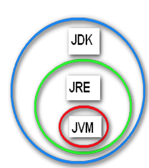

# 1. 学习方法

## 1.1 活下来


## 1.2 走多远


## 1.3 一席之地


# 2. 环境搭建

https://baijiahao.baidu.com/s?id=1728796922128666400&wfr=spider&for=pc

java语言之父是詹姆斯·高斯林。Java是Sun Microsystems于1995年推出的高级编程语言。


## 2.1 下载jdk

### 注册Oracle账号

https://profile.oracle.com/myprofile/account/create-account.jspx


### 登录Oracle账号

https://login.oracle.com/mysso/signon.jsp


### 下载jdk

https://www.oracle.com/java/technologies/downloads/


同意协议，下载：


## 2.2 卸载jdk

### 控制面板

进入控制面板：


### 卸载jdk


选择Java 进行卸载：


## 2.3 安装jdk

### 安装注意事项

- 非中文，非空格目录 【默认安装 即可】
- 注意：需要安装 jdk 【java 源代码编译环境】  jre 【java 运行环境】
- 不干扰当前目录【其他文件，修改、删除文件及目录】

### 安装


### 系统bug 

内部错误61003


 ***请注意：重启后，卸载 JDK ，重新安装 JDK ！！！***

### 验证


## 2.4 配置环境变量

### 为什么要配置

- 每次执行 javac.exe  java.exe命令 ，需要进入 jdk的安装目录

- 如果我想在 其他目录【比如：D： E：等等】执行呢？

  

### 会话级别


注意：在cmd 命令行窗口中 ctrl+c  为强制终止正在运行的程序！！！

复制：   选中 回车    

粘贴：   鼠标右键


注意： 会话级别，只能当前会话有效！！！ 新的会话，会话关闭即无效！！！

### 系统/用户级别


注意：

- 最新的备份，最新的简历！！！
- 已经开启的会话，该配置无效，必须重启会话！！！

# 3. 编写第一个Java

## 三步走


### 名词解释

#### JDK

​	Java Development Kit（Java开发工具包）

#### JRE

​	Java Runtime Environment（Java运行时环境）

#### JVM

​	Java Virtual Machine（Java虚拟机）

​	Java的跨平台就是通过在不同的平台安装相应的JVM来实现的。


​	

​	JDK、JRE、JVM的关系：




## 3.1 编写源代码

原则： 结构固定，内容多变

【自上而下，从外到内】

### 创建文件：

HelloWorld.java

### 写代码

#### 类结构

```java
class Hello{
  
}
```

#### main入口

```java
public static void main(String[] args){
  
}
```

#### 控制台输出

```java
System.out.println("hello Java , I'm coming !!!") ;
```

注意： ； 【口诀：结构性语句可以省略；   功能性语句必须使用；】

### public

#### 二义性

HelloWorld.java

```java
class Hello{
  
}
```

HelloWorld2.java

```java
class Hello{
  
}
```


#### 使用public约束


## 3.2 编译代码

语法： javac Hello.java

通配符： javac H*.java

​                javac *.java

​                javac *

编译文件：*.java --> *.class


### bug：找不到文件


解决：

- 方法一：文件夹 选项查看

  

- 方法二：文件另存为：

  

- 方法三：通过命令：

  

  

## 3.3 运行class


### bug : 找不到main


### bug: 没有输出


```java
class Hello{
   public static void main(String[] args){
    
   }
}
```

## 3.4 大家来找茬

### Q1：

源文件名为 HelloWorld.java

```java
public class helloWorld {
	public static void  main (String[ ] args){  
		System.out.println("我的第一个Java程序！");
	}
}
```

### Q2:

```java
public class HelloWorld {  
	public static void main (String[ ] args){  
		system.out.println("我的第一个Java小程序！");
	}
}
```

### Q3:

```java
public class HelloWorld {  
	public static void main (String[ ] args){  
		System.out.println("我的第一个Java程序！")
	}
}
```

### Q4:

```java
public class HelloWorld {  
	public static void main (String[ ] args){  
		System.out.println(我的第一个Java程序！);
	}
}
```


# 4. JVM

## 4.1 不同OS的JVM


## 4.2 C对比Java

加一层解决问题：


## 4.3 JVM三大任务

1. 加载代码

   类加载器【加载*.class文件，按需加载】

2. 校验代码

   字节码校验器 【校验class文件的语法】

3. 执行代码

   解释执行器【把class翻译成机器语言 0 1】

## 4.4 JIT【系统API优先】

- 什么是JIT ？

  JIT是 just in  time，即时编译技术。使用该技术，能够加速Java程序的执行速度。

- JIT编译过程

  当JIT编译启用时（默认是启用的），JVM读入 *.class文件后，将其发给JIT编译器。JIT编译器将字节码编译成本机机器代码，如下图：


# 5. 转义字符

## 5.1 print/println

```java
System.out.print("hello Java , I'm coming !!!") ;
System.out.println("hello Java , I'm coming !!!") ;
```

## 5.2 转义

```
如果想输入"aaa"与"bbb"之间来3个换行，如何实现？
System.out.println("aaa") ;
System.out.println() ;
System.out.println() ;
System.out.println() ;
System.out.println("bbb") ;

代码冗余：不易维护？
```

| 转义符  | 说明   |
| ---- | ---- |
| \n   | 换行符  |
| \t   | tab符 |

# 6. 作业

## 练习： 

 要求:  在控制台输出商品价目表。使用\t和\n进行显示格式的控制

  1 .效果如下：


2. 效果如下：


2. 效果如下：


## 总结：

要求：【根据上课内容，进行回忆来制作】使用思维导图  进行今日所学进行知识梳理和总结！！！


## 反馈：

邮件地址：  zhangcf@wanho.net

注意：请使用真实姓名，不要使用艺名！！！

1. 作业运行效果及源码。
2. 总结的思维导图。
3. 有任何意见及建议，请直接写邮件内容【这样更加直接】。

