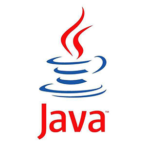
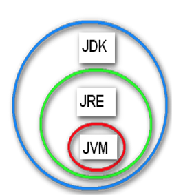

# Java基础，主讲：汤小洋 

## 一、Java简介

### 1. 什么是程序

​	为了让计算机执行某些操作或解决某个问题而编写的一系列有序指令的集合，就是计算机程序

​	编写程序的工具就是计算机语言，Java是目前应用最广泛的编程语言。

### 2. Java介绍

#### 2.1 发展

​	创始人：James Gosling 詹姆斯·高斯林

​	图标logo：一杯冒着热气的咖啡

 

​	发展历程：

- 1995 诞生，Sun公司

- 1996 JDK 1.0

- 2004 JDK 1.5，也称为JDK5

- 2006 JDK6

- 2009.4.20 被Oracle公司收购

- 2011 JDK7

- 2014 JDK8 **（推荐）**

- 2017.9 JDK9  Oracle宣布每六个月发布一个新版本（每年的3月和9月）

- 2018.3 JDK10

- 2018.9 JDK11  长期支持版本

- ...

- 2021.3 JDK16

  
  
  
  
  

#### 2.2 平台

​	Java平台有三个版本：

- Java SE

  Java Platform Standard Edition 标准版，包含Java语言的基础核心

  用于开发桌面应用程序，如QQ、迅雷、记事本、计算器等

- Java EE

  Java Platform Enterprise Edition 企业版，以前也称为J2EE，包含Java SE

  用于开发企业应用程序，如Web网站、分布式应用

- Java ME

  Java Platform Micro Edition 微缩版/移动版

  用于开发移动设备和嵌入式设备的应用，如手机游戏

#### 2.3 特点

- 跨平台：write once,run anywhere
- 安全的：安全机制，防止恶意代码的攻击
- 简单的：语法简洁，去除不常用的功能
- 健壮的：可靠性高，更具健壮性
- 面向对象：面向对象的程序设计语言

### 3. 名词解释

#### 3.2 JDK

​	Java Development Kit（Java开发工具包）

#### 3.3 JRE

​	Java Runtime Environment（Java运行时环境）

#### 3.1 JVM

​	Java Virtual Machine（Java虚拟机）

​	Java的跨平台就是通过在不同的平台安装相应的JVM来实现的。


​	

​	JDK、JRE、JVM的关系：



## 二、安装Java环境

### 1. 下载并安装

​	分平台、版本：

- Windows、Linux、Mac
- 32位、64位

​	使用jdk-8u151-windows-x64.zip，直接解压缩

### 2. 配置环境变量

​	右击计算机——属性——高级系统设置——高级——环境变量：

- JAVA_HOME 

  新建一个JAVA_HOME，配置JDK安装的位置 

  `D:\software\jdk1.8.0_171.jdk`

- CLASSPATH  

  新建一个CLASSPATH，配置类库文件的位置，即lib目录的位置

  `.;%JAVA_HOME%\lib` 

  **注：点号表示当前位置，路径之间要以分号隔开** 

- PATH

  修改PATH，在最前面添加JDK命令文件的位置，即bin目录的位置

  `%JAVA_HOME%\bin;`

​        验证：

```shell
java -version
javac -version
```

## 三、第一个Java程序

### 1. 使用记事本开发

​	步骤：

1. 编写源代码

   源代码文件以`.java`结尾

2. 将源代码编译为字节码

   字节码文件以`.class`结尾

   使用javac命令，执行：`javac hello.java`

3. 运行字节码

   使用java命令，执行：`java hello`

​        注：显示文件后缀名，双击计算机——>组织——>文件夹和搜索选项——>查看——>去掉“隐藏已知文件类型的扩展名”：

### 2. 基本用法

#### 2.1 输出信息

​	System.out.println() 输出后换行

​	System.out.print() 输出后不换行

#### 2.2 转义符

​	反斜杠 \  表示转义符

​	该字符可以与后面相邻的一个字符组成一个新的含义，如：

- `\n`   表示换行
- `\t`   表示制表符Tab
- `\"`  表示双引号
- `\\` 表示反斜杠

#### 2.3 注释

​	用来标注解释的内容，不会被执行

​	三种类型：

- 单行注释，以`//`开头

- 多行注释，以`/*`开头，以`*/`结尾

- 文档注释，以`/**`开头，以`*/`结尾

  可以结合javadoc命令提取文档注释的内容，生成API文档

  执行：`javadoc HelloWorld.java`

#### 2.4 编码规范

​        要求：

- 类名必须与文件名相同，通常采用所有单词首字母大写的形式，称为帕斯卡命名法
- 语句必须以分号结尾
- 标点符号必须为英文符号
- 大小写敏感，即区分大小写

​        建议：

- 所有命名不建议使用中文、空格、特殊字符等，不要以数字开头	
- 一行只写一条语句
- { }的使用及位置
- 合理的代码缩进

### 3. 使用Eclipse开发

​	Eclipse是一个开源的基于Java的集成开发环境（IDE：Integrated Development Environment）工具，提高开发效率

#### 3.1 基本使用

​	步骤：

1. 创建Java项目

   File——>New——>Java Project

2. 创建包

   右击src——>New——>Package

3. 创建源代码文件并编写

   右击包——>New——>Class

   **注：Eclipse会自动将源代码编译成字节码（生成的字节码文件在项目的bin目录下）**

4. 运行程序 

   右击——>Run As——>Java Application

#### 3.2 常用设置

- 修改字体
  Window——>Preferences——>搜索font——>Colors and Fonts——>Basic——>Text Font	

- 修改字符集

  Window——>Preferences——>搜索encoding——Workspace——>Text file encoding：UTF-8	

- 显示Console控制台

  Window——>Show View——>Console

- 配置SVN

  右击——>Import——>SVN——>从SVN检出项目——>创建新的资源位置：`https://ip地址/svn/资源库名`

### 4. 基础知识

#### 4.1 容量单位

​	bit 位（比特），简写b，计算机存储信息的最小单位

​	byte 字节，简写B，1B = 8b 

​	1KB = 1024B（千字节） 

​	1MB = 1024KB（兆字节）

​	1GB = 1024MB（吉字节）

​	1TB = 1024GB（太字节）

​	1PB = 1024TB

​	1EB = 1024PB

#### 4.2 字符集

​	计算机底层使用的是二进制，所有数据在计算机底层都是以二进制形式保存的

- 将字符转换为二进制码的过程，称为编码
- 将二进制码转换为字符的过程，称为解码
- 编码和解码时所采用的规则，称为字符集Charset

​    常见的字符集：

- ASCII

  美国的编码，使用7位来对美国常用的字符进行编码，包含128个字符

- ISO-8859-1

  欧洲的编码，使用8位，包含256个字符

- GB2312、GBK
  国标码，中国的编码（Windows系统默认使用GBK）

- Unicode
  万国码，是一种国际标准编码，包含世界上所有的语言和符号，为每个字符设定了唯一的编码

  有多种实现：UTF-8（最常用）、UTF-16、UTF-32

- 中文乱码
  编写程序时，由于字符集设置不对 或 编码解码时使用了不一致的字符集，会导致出现中文乱码的问题   

   

## 四、变量和数据类型

### 1. 变量

​	值可以变化的量，称为变量，用来存储程序运行时的数据

​	变量的三要素：变量名、变量类型、变量值

​    变量存在的意义就是方便管理内存空间

​	变量的命名规范：

- 只能由数字、字母、下划线、美元符$组成，但不能以数字开头
- 建议使用英文单词    
- 通常采用第一个单词首字母小写，其他单词首字母大写的形式，称为骆驼命名法/驼峰命名法
- 不能使用Java的关键字，如public、class、static、void、int、double、float、this、if、for等  
- 

### 2. 数据类型

#### 2.1 常用类型

| 类型    | 含义          | 长度              | 说明                                                         |
| ------- | ------------- | ----------------- | ------------------------------------------------------------ |
| byte    | 整数          | 占1个字节         | 字节型，取值范围为[-128,127]，即`负2的7次方` 到 `2的7次方-1` |
| short   | 整数          | 占2个字节         | 短整型，取值范围为[-32768,32767]，即`负2的15次方` 到 `2的15次方-1` |
| int     | 整数  integer | 占4个字节         | 整数型，取值范围为[-2147483648,2147483647]，约21亿**（常用）** |
| long    | 整数          | 占8个字节         | 长整型，取值范围为：2的63次方，需要以l或L结尾                |
| float   | 小数          | 占4个字节，单精度 | 需要以f或F结尾                                               |
| double  | 小数          | 占8个字节，双精度 | 默认会将小数作为double类型处理**（常用）**                   |
| char    | 字符          | 占2个字节         | 表示单个字符，需要使用单引号引起来                           |
| boolean | 布尔          | 占1个字节         | 表示真或假，值只能为true或false                              |
| String  | 字符串        |                   | 表示一串字符，需要使用双引号引起来                           |

注：Java中有八种基本数据类型：byte、short、int、long、float、double、char、boolean，

String表示字符串类型，属于引用数据类型，不属于基本数据类型。

#### 2.2 类型转换

​	两种类型：

- 自动类型转换

  条件：

  ​	1.数据类型要兼容

  ​	2.目标类型要大于源类型，如int--->double

- 强制类型转换

  语法：`­(目标数据类型)数据`  

  可能会导致数据丢失，损失精度​	

### 3. 获取用户输入

​	使用Scanner获取用户输入的数据

​	步骤：

1. 导入Scanner
2. 创建一个Scanner
3. 使用Scanner获取输入的数据	

## 五. 运算符

### 1. 运算符分类

​	算术运算符、关系运算符、赋值运算符、逻辑运算符、条件运算符、位运算符

#### 1.1 算术运算符

| 运算符 | 含义            |
| ------ | --------------- |
| +      | 加              |
| -      | 减              |
| *      | 乘              |
| /      | 除              |
| %      | 取余，求模      |
| ++     | 自增，对原值加1 |
| --     | 自减，对原值减1 |

前缀自增自减和后缀自增自减的区别：

- 前缀自增自减

  先进行自增或自减运算，然后再执行表达式

- 后缀自增自减

  先执行表达式，然后再进行自增或自减运算

#### 1.2 关系运算符

也称为比较运算符，用来做比较运算，比较的结果是boolean类型

| 运算符 | 含义     |
| ------ | -------- |
| >      | 大于     |
| <      | 小于     |
| >=     | 大于等于 |
| <=     | 小于等于 |
| ==     | 等于     |
| !=     | 不等于   |

#### 1.3 赋值运算符

| 运算符 | 含义     |
| ------ | -------- |
| =      | 简单赋值 |
| +=     | 加法赋值 |
| -=     | 减法赋值 |
| *=     | 乘法赋值 |
| /=     | 除法赋值 |
| %=     | 求模赋值 |

#### 1.4 逻辑运算符

| 运算符 | 含义         |
| ------ | ------------ |
| &&     | 逻辑与，并且 |
| \|\|   | 逻辑或，或者 |
| !      | 逻辑非，取反 |

#### 1.5 条件运算符

​	也称为三目运算符

​        语法：`条件 ? 表达式1 : 表达式2`

​	当条件为true时执行表达式1，当条件为false时执行表达式2

#### 1.6 运算符优先级

​	从高到低的顺序：

1. 小括号( )
2. 一元运算：自增++、自减--、非!
3. 乘*、除/、取余%
4. 加+、减-
5. 关系运算：>、<、>=、<=
6. 相等运算： ==、!=
7. 逻辑与&&
8. 逻辑或||
9. 赋值运算：=、+=等

​        注：当运算符较多时，建议使用小括号控制运算的顺序

### 2. 进制

#### 2.1 简介

​	进制就是进位计数制，是一种带进位的计数方法，即逢几进一（有不带进位的计数方法，如唱票时常用的“正”字计数法）

​	生活中的进制：十进制、七进制、十二进制、二十四进制、六十进制、二进制（1公斤等于2斤）、十六进制（半斤八两：古代1斤等于16两）

#### 2.2 常用进制

| 进制种类 | 单词                 | 范围                                    | 引导符号                   | 示例 |
| -------- | -------------------- | --------------------------------------- | -------------------------- | ---- |
| 十进制   | decimal  [ˈdesɪml]   | 由0-9组成，共10个，逢十进一             | 无，Java中整数默认为十进制 | 10   |
| 二进制   | binary [ˈbaɪnəri]    | 由0-1组成，共2个，逢二进一              | 0b或0B                     | 0b10 |
| 八进制   | octonary ['ɒktənərɪ] | 由0-7组成，共8个，逢八进一              | 0                          | 010  |
| 十六进制 | hex [heks]           | 由0-9、a-f或A-F组成，共16个，逢十六进一 | 0x或0X                     | 0x10 |

#### 2.3 进制转换

​	十进制转换为其他进制：除基取余
​	其他进制转换为十进制：按权相加

#### 2.4 二进制

​	计算机底层使用的是二进制，所有数据在计算机底层都是以二进制形式保存的

​	二进制数分为两种：

- 无符号二进制，只能存储正整数

- 有符号二进制，可以存储正数或负数，最高位为符号位，0表示正数，1表示负数

  正数5表示为`00000000 00000000 00000000 00000101`

  负数-5表示为`10000000 00000000 00000000 00000101`

​	二进制中的原码、补码、反码

- 原码

  原始二进制值

- 反码

   正数：反码和原码相同，如5的反码为`00000000 00000000 00000000 00000101`

   负数：符号位不变，其余各位取反，即0变为1，1变为0，如-5的反码为`11111111 11111111 11111111 11111010`

- 补码

   正数：补码和原码相同，如5的反码为`00000000 00000000 00000000 00000101`

   负数：反码+1，如-5的补码为`11111111 11111111 11111111 11111011`

   **计算机内部是使用补码来存储和表示值的**

#### 2.5 位运算符

​	主要针对二进制的位进行运算，需要将值转换为二进制后进行按位运算

| 运算符 | 含义               |
| ------ | ------------------ |
| &      | 按位与             |
| \|     | 按位或             |
| ~      | 按位非             |
| ^      | 异或               |
| <<     | 左移               |
| >>     | 右移               |
| >>>    | 无符号右移（了解） |

​	位运算符与逻辑运算符的区别：

- 逻辑运算符是针对布尔值进行运算
- 位运算符是针对二进制数的位进行运算

## 六、选择结构

### 1. 简介

​	程序结构有三种：顺序结构、选择结构、循环结构

​	根据条件进行判断，从而执行不同的操作，称为选择结构（分支结构），其实就是条件判断

​	选择结构的类型：if、switch

### 2. 两种选择结构

#### 2.1 if结构

​	分为：单分支结构、二分支结构、多分支结构、嵌套if结构

​	语法：

```java
if(条件1){
	代码块1 
}else if(条件2){
    代码块2
}else if(条件3){
    代码块3
}
...
else{
 	代码块n   
}
```

#### 2.2 switch结构	

​	用来进行等值判断

​	语法：

```java
switch (表达式) {  //表达式为要判断的内容
    case 常量1:
        代码块1
        break;
    case 常量 2:
        代码块2
        break;
    …

   	default:  //当所有常量都无法匹配时会执行default语句
        语句;
}
```

​	switch表达式的值可以是整数、字符型或字符串类型（**JDK6及以前不支持字符串类型**）

### 3. 两者的区别

- switch结构

    只能进行等值的判断，且只能为整型、字符型或字符串类型的变量

- if结构

    没有限制，适合某个连续区间的判断

## 七、循环结构

### 1. 简介

​	重复性的执行某个操作，就是循环，称为循环结构

​	循环结构的类型：while、do...while、for

### 2. 三种循环结构

#### 2.1 while结构

​	语法：

```java
while(条件){
	代码块
}
```

​	特点：先判断，再执行，只要条件成立就不停的执行

#### 2.2 do...while结构

​	语法：

```java
do{
    代码块
}while(条件);
```

​	特点：先执行，再判断，循环操作至少会执行一次

#### 2.3 for结构 

​	语法：

```java
for(初始化;条件;迭代){
    代码块
}
```

#### 3.4 总结

​	循环次数确定时一般使用for循环

​	循环次数不确定时一般使用while和do-while循环

### 3. 循环控制

​	break：跳出整个循环，执行循环之后的代码，一般与if一起使用

​	continue：跳出本次循环，执行下一次循环（本次尚未执行完的代码不再执行）

### 4. 二重循环

​	一个循环中嵌套着另一个循环，称为二重循环，各种循环可以相互嵌套

​	外层循环变量变化一次，内层循环变量要变化一遍

