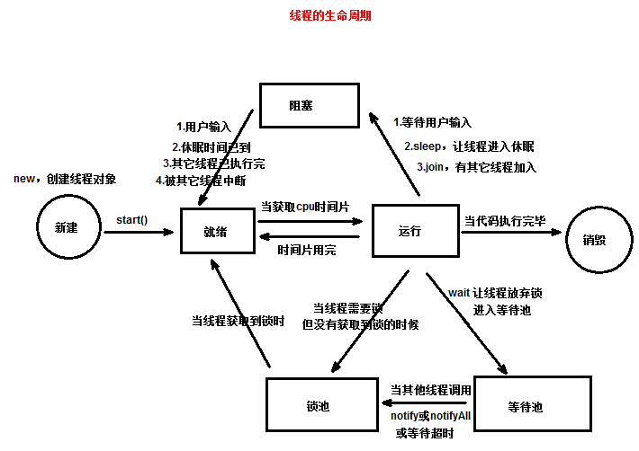
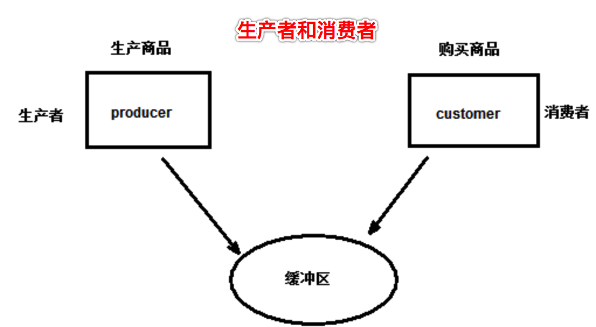
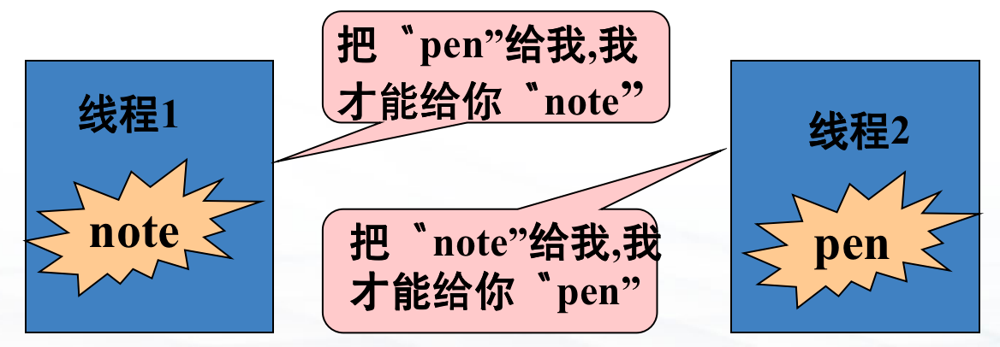

# 线程，主讲：汤小洋

## 一、简介

### 1. 进程

​	进程：在操作系统中独立运行的程序，每运行一个应用程序就对应着一个进程 process,比如运行qq

​	多进程：在操作系统中可以同时运行多个程序，例如同时运行QQ、 迅雷、Word等

### 2. 线程

​	线程：是进程内部的一个执行单元，用来执行应用程序中的一个功能 thread

​	多线程：在一个应用程序中可以同时执行多个功能，例如迅雷中同时执行的多个下载任务就是多线程

​	特性：

- 一个进程中可以包含多个线程，且至少有一个线程
- 一个线程必须属于某个进程，进程是线程的容器
- 一个进程中的多个线程共享该进程的所有资源

### 3. CPU时间片

​	对于单核CPU，在某个特定时间点只能处理一个程序

​	CPU分配给各个程序的时间，称为时间片，即该进程允许运行的时间（时间很短）

- 从表面上看各个程序是同时运行的，实际上CPU在同一时间点只能执行一个程序
- 只是CPU在很短的时间内，在不同程序间切换，轮流执行每个程序，执行速度很快，所以感觉上像是同时在运行

## 二、创建线程

​	两种方式：

- 继承Thread类
- 实现Runnable接口

### 1. 继承Thread类

​	步骤：

1. 定义一个类，继承自Thread类，重写run()方法

   ```java
   /*
    * JVM启动时会创建一个主线程，用来执行main方法，也称为main线程
    * 要想实现多线程，需要在主线程中创建新的线程
    * 注：实际上，Java程序在启动时至少会启动两个线程：main线程、垃圾回收线程
    */
   class MyThread extends Thread {
   	public MyThread(String name){
   		 // 调用父类带参的构造方法，指定线程名
   	}
   		// 在run方法中写线程要执行的代码
   	public void run() {
   		for (int i = 1; i <= 1000; i++) {
   			System.out.println( getName() + "---------" + i); // 调用getName()获取线程名
   		}
   	}
   }
   ```

   

2. 创建该类的实例，即创建一个线程

3. 调用start()方法，启动线程（不能直接调用run()方法）

   ```java
   public class Test01_继承Thread类 {
   	public static void main(String[] args) {
   		// 创建线程
   		MyThread t1 = new MyThread("线程1"); // 自定义线程的默认名称为：Thread-编号，编号从0开始
   		// 启动线程
   		t1.start(); // 线程并不一定立即执行，要获取到CPU时间片才会执行
   		
   	
   }
   ```

   

​        注：Eclipse控制台默认有输出大小的限制，修改：右击Console——>Preferences——>取消勾选Limit console output


### 2. 实现Runnable接口

​	步骤：

1. 定义一个类，实现Runnable接口，实现run()方法
2. 创建实现类的实例
3. 创建Thread类的一个实例，将上一步中实现类的实例传入
4. 调用start()方法，启动线程

### 3. 两种方式的对比

​	继承Thread类

- 线程执行的代码放在Thread类的子类的run方法中
- 无法再继承其他类

​        实现Runnable接口（推荐）

- 线程执行的代码放在Runnable接口的实现类的run方法中
- 可以继承其他类，避免单继承的局限性
- 适合多个相同程序代码的线程去处理同一个资源
- 增加程序的健壮性

## 三、线程的生命周期

### 1. 生命周期



### 2. 相关方法

| 方法名    | 作用                                                         | 说明     |
| --------- | ------------------------------------------------------------ | -------- |
| start     | 启动线程，线程进入就绪状态（可运行状态）                     |          |
| sleep     | 休眠线程，线程从执行状态进入阻塞状态                         | 静态方法 |
| yield     | 暂停执行线程，线程从执行状态进入就绪状态                     | 静态方法 |
| join      | 暂停执行线程，等待另一个线程执行完毕后再执行，线程从执行状态进入阻塞状态 |          |
| interrupt | 中断线程的休眠或等待状态                                     |          |

## 四、线程安全问题

### 1. 简介

​	多个线程同时访问共享数据时可能会出现问题，称为线程安全问题

- 当多线程访问共享数据时，由于CPU的切换，导致一个线程只执行了关键代码的一部分，还没执行完
- 此时另一个线程参与进来，导致共享数据发生异常

​        解决：线程同步机制synchronized + 锁

- 被synchronized包围的代码块，称为同步代码块
- 被synchronized修饰的方法，称为同步方法
- 锁，也称为对象锁，每个对象都自带一个锁(标识)，且不同对象的锁是不一样的（锁是对象自身的一部分）

​        执行过程：

- 当线程要执行***同步代码块或同步方法***时，必须获取特定对象的锁才行
- 且一旦对象的锁被获取，则该对象就不再拥有锁，直到线程执行完 同步代码块或同步方法 后才会释放对象的锁
- 如果线程无法获取特定对象上的锁，则线程会进入*该对象*的锁池中等待，直到锁被归还对象，此时**需要该锁**的线程进行竞争

​         线程同步的优缺点：

- 优点：解决了线程安全的问题，使代码块在某一时刻只能被一个线程访问

- 缺点：由于需要进行锁的判断，消耗资源，效率变低

  ```java
  package code16_线程.test06_线程安全;
  
  public class Ticket implements Runnable{
  	int num = 100;
  	public void run() {
  		System.out.println(Thread.currentThread().getName()+"正在提供服务！！！");
  		while(true){
  			// 同步代码块，保护共享数据的安全
  			synchronized(this){ // 多个线程必须使用同一把锁，此处可以写this
  				if(num>0){				
                    try {
  					Thread.sleep(10);
  				} catch (InterruptedException e) {
  				e.printStackTrace();
  				}
  				System.out.println(Thread.currentThread().getName()+"---------售出车票："+num);
  				num--;
  				}
  		}
  		}
  	}
  ```

  

### 2. 解决

​	两种方式：同步代码块、同步方法

## 五、线程间的通信

### 1. 锁池和等待池

​	每个对象都自带一个锁池和等待池

​	锁池：

- 当线程执行synchronized块时如果无法获取特定对象上的锁，此时会进入*该对象*的**锁池**
- 当锁被归还给该对象时，锁池中的多个线程会竞争获取该对象的锁
- 获取对象锁的线程将执行synchronized代码块，执行完毕后会释放锁

​        等待池：

- 当线程获取对象的锁后，可以调用`wait()`方法放弃锁，此时会进入*该对象*的**等待池**
- 当*其他线程*调用*该对象*的`notify()`或`notifyAll()`方法时，等待池中的线程会被唤醒，会进入该对象的锁池
- 当线程获取对象的锁后，将从它上次调用wait()方法后的位置开始继续运行

### 2. 相关方法

| 方法名    | 作用                                     | 说明                                         |
| --------- | ---------------------------------------- | -------------------------------------------- |
| wait      | 使线程放弃对象锁，线程进入等待池         | 可以设置等待的超时时间，超时后线程会自动唤醒 |
| notify    | 随机唤醒等待池中的一个线程，线程进入锁池 | 唤醒的是特定对象的等待池中的线程             |
| nofityAll | 唤醒等待池中的所有线程                   |                                              |

​	注意：

- 这三个方法都只能在synchronized块中使用，即只有获取了锁的线程才能调用
- 等待和唤醒必须使用的是同一把锁

## 六、生产者-消费者问题(面试常问)


​	生产者-消费者问题是多线程同步的一个经典问题，即并发协作的问题

​	所谓生产者-消费者问题，实际上主要是包含了两种线程：生产者线程、消费者线程

​	生产者线程

- 生产商品并放入缓冲区（商品池）
- 当缓冲区满时，生产者不可再生产商品

​        消费者线程：

- 从缓冲区中取出商品
- 当缓冲区为空时，消费者不可再取出商品

​        **注：生产者和消费者使用的是同一个缓冲区** 



##  七、死锁

​	不同的线程分别占用对方需要的资源不放弃，都在等待对方放弃自己需要的资源，就形成了线程的死锁

​	死锁情况下，所有线程都无法运行，整个程序处于阻塞状态，且不可恢复。



## 八、线程单例

​	为每个线程提供一个实例

- 同一线程获取的是相同的一个实例
- 不同线程获取的是不同的实例

​        Java中提供了一个ThreadLocal，直接提供了线程单例的解决方案 

- 用于管理变量，提供了线程局部变量
- 它为变量在每个线程中都存储了一个本地的副本

## 九、线程池

### 1. 简介

​	传统获取线程的方式存在的问题：

- 每次需要线程执行任务时都要创建线程，执行结束后需要销毁线程，耗时、效率低
- 当并发的线程数量很多时，服务器性能会受到很大影响，安全性和稳定性相对较差	
- 为了防止资源不足，需要限制执行线程的数量，同时尽可能减少创建和销毁线程的次数

​    使用线程池技术：

- **线程池是预先创建线程的一种技术，使线程得到复用**

- 原理：

    1）创建一个线程池ThreadPool，在该线程池创建时，预先创建一定数量的线程，放入池中

    2）这些线程都是处于睡眠状态，即均为启动，不消耗 CPU

    3）当需要线程执行任务时直接从线程池中分配一个空闲线程，消除了创建线程所带来的延迟

    4）执行结束后会将线程归还给线程池，线程可以被重复使用

- 线程池负责管理工作线程，包含一个等待执行的任务队列。线程池的任务队列是一个Runnable集合，工作线程负责从任务队列中取出并执行Runnable对象，即执行任务

### 2. 常用线程池

​	配置一个线程池是比较复杂的，一般多是使用Executors类提供的静态方法来创建线程池

- newFixedThreadPool
    创建一个固定大小的线程池。即控制最大线程并发数，超过这个并发数的线程将在队列中等待。
- newCachedThreadPool
    创建一个可缓存的线程池。线程池大小完全依赖于JVM能够创建的最大线程大小，当线程池的大小超过了处理任务所需要的线程时会回收部分空闲（60秒不执行任务）的线程，当任务数增加时又可以智能的添加新线程来处理任务。
- newScheduledThreadPool
    创建一个固定大小的线程池。此线程池支持定时以及周期性执行任务的需求。


