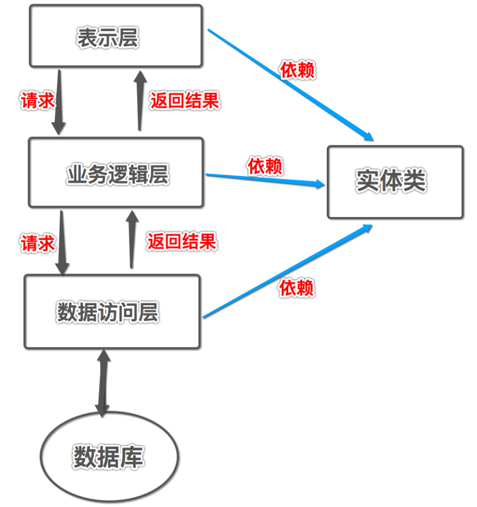

# JDBC，主讲：汤小洋

##  一、简介

### 1. JDBC是什么

​	Java Database Connectivity 是Java程序访问数据库的方式

- 提供了一套用于访问数据库的接口（API），其独立于特定的数据库
- 不同的数据库产品，实现方式和通信协议都是不一样的
- 由数据库厂商对接口进行实现，然后以`jar包`的形式提供实现类，这个jar包称为 数据库的驱动包

​        注：jar包就是一个以`.jar`结尾的文件，其中包含了一些已经写好的类和接口，只需要将jar包引入到项目中，就可以直接使用jar包中的类和接口

### 2. 相关API

​	JDBC相关类和接口位于java.sql包中

| 类/接口名         | 作用                                   |
| ----------------- | -------------------------------------- |
| DriverManager     | 用于管理数据库驱动，建立与数据库的连接 |
| Connection        | 表示与数据库的连接                     |
| Statement         | 用于执行SQL语句，并返回结果集ResultSet |
| PreparedStatement | 用于执行预编译的SQL语句                |
| ResultSet         | 表示结果集，封装了数据库返回的结果     |

## 二、基本用法

### 1. jar包的管理

​	需要将jar包导入到项目中才能使用

​	导入：

1. 在项目根目录中创建一个`lib`文件夹（习惯）
2. 将jar包拷贝到该文件夹中
3. 右击jar包——>Buld Path——>Add to Build Path

​        移除：Referenced Libraries——>右击jar包——>Build Path——>Remove from Build Path

​        批量管理：右击项目——>Buld Path——>Configure Build Path——>Libraries

### 2. 操作步骤

​	访问数据库的步骤（考）

### 3. 数据库操作

#### 3.1 更新

​        使用`int executeUpdate(String sql)`方法，用于执行更新操作（增、删、改），返回受影响的行数

#### 3.2 查询

​        使用`ResultSet executeQuery(String sql)方法`，用于执行查询操作，返回查询到的结果

### 4. 封装JdbcUtil工具类


### 5. PreparedStatement（实际开发使用）

​	继承自Statement接口，推荐使用PreparedStatement

​	优点：

- 可以使用`?`占位符，简单易读（称为动态SQL）
- 预编译SQL语句，效率高
- 安全，避免出现SQL注入

### 6. 练习：学生管理系统

​	主要功能：

```java
1. 查询所有学生
2. 根据学号查询学生
3. 根据姓名和年龄范围查询学生
4. 添加学生
5. 修改学生
6. 根据学号删除学生
```

## 三、其他用法

### 1. 返回主键

​	保存后返回生成的主键

### 2. 事务

​	Transaction事务是用来保证数据操作的完整性

- 一个业务由若干个一次性的操作组成，这些操作要么都成功，要么都失败，如银行转账

- 事务的四大特性ACID：

  原子性Atomicity ：不可再分

  一致性Consitency ：事务执行前后，数据库是一致的

  隔离性Isolation ：两个事务的操作互不干扰

  永久性Durability ：事务提交后，结果被永久保存下来

​        JDBC默认是自动提交事务的，将每一条sql语句都当做一个独立的事务执行

- 关闭自动提交事务：`conn.setAutoCommit(false);`
- 手动提交事务：`conn.commit();`
- 回滚事务：`conn.rollback();`

## 四、数据库连接池

### 1. 简介

​	传统获取数据库连接的方式存在的问题：

- 每一次获取连接时都需要向数据库发送请求建立连接，耗时、效率低
- 访问结束后会断开与数据库的连接，下次访问时需重新建立连接
- 当并发访问量大时，网站性能会受到很大影响
- 安全性和稳定性相对较差	

​        使用连接池技术：

- 原理：创建一个连接池pool，在该连接池创建时，会先向数据库申请建立多个连接（初始连接数），当用户需要连接时直接从连接池中获取即可
- 访问结束后会将连接归还给连接池，可以被其他用户重复使用

### 2. 常用连接池

​	开源的数据库连接池：

- dbcp

  Apache开源项目，全称 DataBase Connection Pool，也称为commons-dbcp

  注：Apache是一个运作开源项目的非盈利性组织，提供了很多开源项目（jar包、软件） http://apache.org/

- druid

  阿里巴巴的开源项目，俗称为 德鲁伊

- c3p0（已经没落了）

### 3. 用法

#### 3.1 使用dbcp

​	添加jar包：commons-dbcp.jar、commons-pool.jar

#### 3.2 使用druid

​	添加jar包：druid.jar

### 4. 练习：改写学生管理

​	主要功能：

```java
学生管理
1. 查询所有学生
2. 根据学号查询学生
3. 根据姓名和年龄范围查询学生
4. 添加学生
5. 修改学生
6. 根据学号删除学生
班级管理
1. 查询所有班级
2. 根据班级号查询班级	
3. 添加班级
```

​	技术要求：

1. 使用连接池技术

   修改JdbcUtil

2. 实体类

   entity：实体类对应数据库中的表，类的属性对应表的字段

   pojo：Plain Ordinary Java Object 简单的Java对象，类中包含：属性/get/set/构造方法，不允许有业务逻辑

   vo：Value Object 值对象，用来封装 值/数据 的对象，可自定义属性

3. 使用模板模式

   创建JdbcTemplate和RowMapper

## 五、三层架构

### 1. 简介

​	三层架构是一种程序设计结构，使用分层式结构将整个应用拆分为三层：

- 表示层
- 业务逻辑层
- 数据访问层

​        分层的目的：实现高内聚、低耦合

- 每一层分工明确，相互独立，任意一层发生修改都不影响其他层 
- 每一层中都不应出现其它层的实现技术



### 2. 三层

#### 2.1 表示层

​	表示层，也称为显示层（View）

- 用于实现 **和系统用户进行数据交互**

  向用户展示数据，如控制台、网页、导出文件等

  接收用户输入的数据，如Scanner、网页、导入文件等

- 类的命名：一般使用XxxView，Xxx一般表示业务模块

#### 2.2 业务逻辑层

​	业务逻辑层，也称为业务层（Service）

- 用于实现 **具体的业务逻辑功能**

- 类和接口的命名：一般使用XxxService、XxxServiceImpl

- 方法的命名：add、remove、modify、find、findAll、findById

  使用具体业务名，如login、regist、submit、apply、transfer

#### 2.3 数据访问层

​	数据访问层，也称为持久层（DAO：Data Access Object数据访问对象）

- 用于实现 **对数据的访问操作**，即数据的持久化操作
- 类和接口的命名：XxxDao、XxxDaoImpl
- 方法的命名： insert、delete、update、select、selectAll、selectById

### 3. 技术要求

​	面向接口编程：使用接口解耦合，分离 （接口中方法的）调用者 和 实现者

#### 3.1 工厂

​	使用 **工厂+接口** 进行对象的创建，降低层与层之间的耦合度，实现解耦合 ——> 高低原则

#### 3.2 事务

​	改写学生管理系统：增加`调换两名学生所在班级`

​	事务操作

- 增、删、改操作必须加事务，查询操作可以不加，但建议所有操作数据库都加事务
- 事务加在**Service层**，即在Service层实现事务操作，可以通过代理添加事务功能
- 需要对事务代码进行封装，使用 事务管理器类
- 使用ThreadLocal管理Connection，实现线程单例

#### 3.3 异常

   改写学生管理系统，要求：

```java
1.添加学生时，姓名不能与已存在的名称相同
2.增加：删除班级功能，要判断该班级中是否有学生，如果有，则不能删除
```

​	每一层都需要对该层的异常进行 捕获 和 转换

- Dao层： 捕获SQLException ——> 抛自定义异常 DataAccessException extends RuntimeException

- Service层： 捕获DataAccessException ——> 抛自定义异常 ServiceException extends RuntimeException

  对于业务相关的异常 ——> 抛自定义异常，继承自Exception，如UsernameExistException

### 4. 项目结构

#### 4.1 结构层次

```java
项目
	|-JRE System Library  // JRE环境
	|-Referenced Libraries // 项目中引用的jar包
	|-lib // 用于存放jar包
	|-src // 源代码
   		|-com.itany.项目名
   			|-entity // 实体类
        |-dao      // 数据访问层的接口
        	|-impl  // 数据访问层的实现类
        |-service  // 业务逻辑层的接口
          |-impl  // 业务逻辑层的的实现类
          |-proxy // 业务逻辑层的代理类
        |-view // 表示层的类
 				|-util  // 工具
 				|-mapper // 行映射的实现类 
 				|-factory // 工厂
      	|-exception  // 异常
      	|-transaction // 事务的接口
      		|-impl	// 事务的实现类
      	|-constant // 常量    
      	|-vo  // 值对象
			|-datasource.properties //数据库的配置文件
   		|-objs.properties // 工厂的配置文件
```

#### 4.2 封装jar包

​	将自己写的工具类打成jar包，供他人使用，如实现jdbc操作的代码

​	步骤：

1. 新建一个Java项目，将相关代码拷贝到该项目中，如itany-jdbc

2. 右击项目——>Export——>JAR file——>勾选“Export generated class files and resources”——>指定保存的路径，如itany-jdbc-1.2.jar

   注：如果要生成包含源码的jar包，可以勾选“Export Java source files and resources”，如itany-jdbc-1.2-sources.jar


