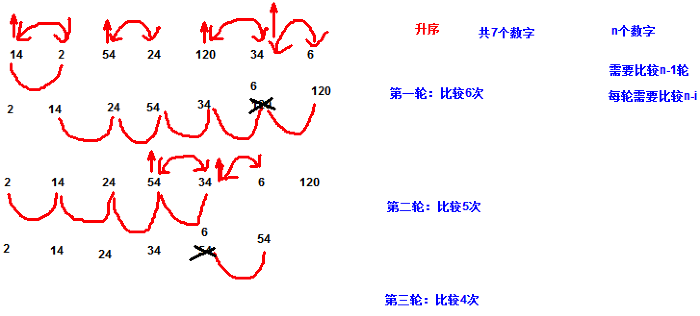

# 方法和数组，主讲：汤小洋 

## 一、Java方法

### 1. 简介

​	方法是实现特定功能的代码段的封装，在需要时可以多次调用方法来完成该功能，实现代码的复用

### 2. 用法

​	使用步骤：

1. 定义方法

   语法：

   ```java
   修饰符	返回值类型 方法名(参数){
       //方法体
   }
   ```

   ```java
   //自定义方法，无参无返回值
   	public static void sum() {
   		int sum = 0;
   		for (int i = 1; i < 100; i++) {
   			sum += i;
   		}
   		System.out.println("从1到100的和为：" + sum);
   	}
   ```

   

   说明：

   - 修饰符：对方法的修饰，public static暂且认为是固定写法
   - 返回值类型：方法执行后的返回值类型， 如果没有返回值则指定为void
   - 方法名：采用驼峰命名法，一般使用动词
   - 参数：执行方法时所需要的信息，参数由参数类型和参数名组成，多个参数之间以逗号隔开

2. 调用方法

   语法：

   ````java
   数据类型 变量 = 方法名(参数);
   ````

   ```java
int result = sum3(6, 15); // 调用方法并接收返回值，保存到变量中
   ```
   
   
   
   说明：
   
   - 如果方法有参数，则必须传递，且参数数量、类型必须一致
   - 如果方法有返回值，则可以接收返回值并保存到变量中

### 3. 递归

​	方法自己调用自己，称为递归，该方法称为递归方法

## 二、程序调试

### 1. 简介

​	如果程序出现问题/错误，运行结果与预期的不一样怎么办？

​	如何发现问题、定位错误所在的地方

​	方式：

1. 阅读代码 或 使用输出语句
2. 使用专门的技术：程序调试Debug

### 2. Debug的使用

​	步骤：

1. 设置断点

   程序暂停执行的代码行

2. 调试运行

   F6：单步执行，接着执行下一行  

   F5：单步跳入执行，会进到方法中

3. 观察变量

## 三、数组

### 1. 简介

​	数组是用来存储相同数据类型的一组数据

- 声明一个变量就是在内存空间划出一块合适的空间
- 声明一个数组就是在内存空间划出一串连续的空间

​       数组的四要素：

- 数组名称：用于区分不同的数组
- 数组元素：向数组中存放的数据
- 元素类型：数组元素的数据类型
- 元素下标：数组元素的编号，也称为索引，从0开始，通过下标来访问数组元素

### 2. 基本用法

​	步骤：

1. 声明数组
   指定元素的类型

   `数据类型[] 数组名称;` 或`数据类型 数组名称[];`

2. 分配空间

   指定数组长度/大小，即分配几个连续的空间

   `数组名称 = new 数据类型[大小];            `

3. 数组赋值

   向数组中添加元素

   `数组名称[下标]=值`

4. 访问元素

   获取数组中的元素

   `数组名称[下标]`
   
   ```java
   // 定义数组的同时为其分配空间
   		int[] scores = new int[5];
   ```
   
   

### 3. 动态赋值

​	循环接收用户输入的数据，动态为数组赋值

### 4. 增强for循环

​	增强for循环，用来对集合进行遍历操作，也称为foreach循环（foreach本身并不是java关键字）

​	语法：

```java
for(元素类型 循环变量:集合){

}
```
### 5. 默认值

​	数组中的元素有默认值

### 6. 常见错误

​	ArrayIndexOutOfBoundsException 数组下标越界异常

​	原因：访问数组元素时下标小于0 或 大于等于数组长度

## 四、数据存储方式

### 1. 内存分类

​	Java中内存的分类：栈内存、堆内存

​	区别：

- 栈的存取速度比堆要快
- 栈内存要小于堆内存


### 2. 数据类型

​	根据存储方式的不同，主要分为两种：

- 基本数据类型（8种）

  byte、short、int、long、float、double、char、boolean

  定义方式：`类型名称 变量名=值;`

- 引用数据类型

  除了基本数据类型和null以外的其他数据类型，如：String、数组、类、接口………

  定义方式：`类型名称 变量名 = new 类型名称()`

​        注：null是一种特殊的类型，表示空，null是所有引用类型变量的默认值

​      	      String类型比较特殊，因为特别常用，所以JVM对其做了优化（后面会讲）

### 3. 数据在内存中的存储方式

​	基本数据类型在内存中的存储


​	引用数据类型在内存中的存储


​	总结：

- 基本数据类型的值和引用数据类型的名称，存储在栈内存中
- 引用数据类型的值，存储在堆内存中

​        数组在内存中的存储


### 4. 值传递和引用传递

​	对于基本数据类型，传递的是值

​	对于引用类型，传递的是内存地址


## 五、二维数组

### 1. 简介

​	二维数组可以认为是特殊的一维数组：一维数组中的每个元素又是一个一维数组

 	分类：

- 规则的二维数组
- 不规则的二维数组

### 2. 规则的二维数组

​	数组形状是规则的

### 3. 不规则的二维数组

​	数组形状是不规则的

## 六、冒泡排序

​	原理：依次比较相邻的两个元素，如果顺序错误就交换位置

​	结论：如果有n个元素，需要比较n-1轮，每一轮需要比较n-m次（m表示第几轮）

​	注：排序算法有很多，如冒泡排序、快速排序、选择排序、插入排序等



## 七、Arrays工具类

​	java.util.Arrays类提供了操作数组的方法

​	注：java.util包提供了许多工具类，如Scanner、Arrays等

## 八、不定长参数

​	语法：`数据类型... 形参名`，表示不定长参数，也称为可变长参数

​	特点：

- 调用方法时参数的个数任意
- 只能是方法的最后一个参数
- 一个方法最多只能有一个不定长参数
- 本质上是一种特殊的数组，只能作为方法的形参使用


