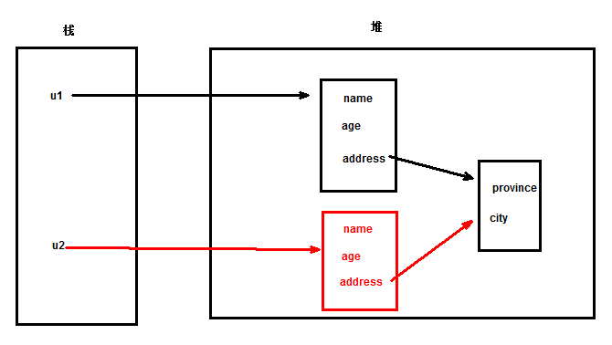
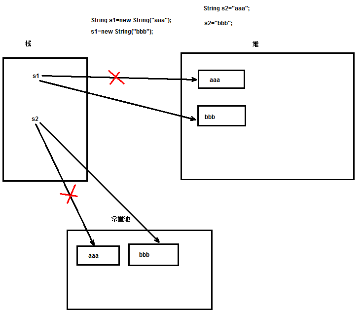

# 常用类，主讲：汤小洋

## 一、API的使用

### 1. 简介

#### 1.1 什么是API

​	Application Programming Interface 应用程序编程接口，实际上就是帮助手册

​	JDK API：提供了JDK中大部分类以及类中成员的介绍

#### 1.2 参考文档

​	官方文档 https://docs.oracle.com/javase/8/docs/api/ 

​	离线文档 jdk8_api_en.zip、jdk8_api_zh.zip

### 2. 文档结构

#### 2.1 Field Summary

​	类中属性的介绍

#### 2.2 Constructor Summary

​	类中构造方法的介绍

#### 2.3 Method Summary

​	类中方法的介绍

### 3. 查看JDK源码

​	快捷键：

- Ctrl+Shift+T ——> 打开类型，查看源码
- Ctrl+O ——> 查看类中成员
- Ctrl+T ——> 显示当前类的继承结构（层次树），默认是从上向下显示，再按一次是从下向上显示

​        关联JDK的源码：

- Preferences——>Java——>Installed JREs——>选中安装的jre——>Edit——>选中rt.jar——>Source Attachment——>External location——>选择JDK安装路径下的src.zip

### 4. 生成API文档

​	API文档就是根据文档注释生成的

​    文档注释以`/**`开头，以`*/`结尾，是一种带有特殊功能的注释

​	文档注释中可以包含特定的标记，都以@开头，常用标记：

- @author  作者
- @date 日期
- @version  版本
- @see 参考内容
- @since 从哪个版本开始支持
- @param  方法参数，格式为：@param 参数名称 参数描述
- @return  方法返回值，格式为： @return 返回值描述
- @throws 方法抛出的异常
- @exception 方法抛出的异常，作用和@throws相同 
- @override 重写方法
- @Deprecated 已过时，仅为了保证兼容性依然存在，不建议使用  [ˈdeprəkeɪtid] 不赞成的 

​        设置Eclipse自动生成注释

- Preferences——>java ——> Code Style ——> Code Template

  Comments——>Types——>Edit 为类设置注释模板

  ```java
  /**
   * <功能描述>
   * @author 汤小洋
   * @date ${date} ${time}
   * @version V1.0
   */
  ```

  Comments——>Methods——>Edit 为方法设置注释模板

  ```java
  /**
   * <功能描述>
   * ${tags}
   * @date ${date} ${time}
   */
  ```

  勾选下面的“Automatically add comments for new methods and types”

​        生成文档：

- 使用javadoc工具生成

  执行 `javadoc Start.java`（不演示）

- 使用eclipse向导生成

  右击项目或包——>Export——>搜索javadoc

  注：如果出现中文乱码，可以加参数 `-encoding utf8`

## 二、Object

### 1. 简介

​	java.lang.Object类是所有类的父类，所有类都直接或间接地继承了Object类

​	Object中共有**11**个方法，都需要掌握

### 2. 常用方法

| 方法名   | 作用                          |
| -------- | ----------------------------- |
| getClass | 获取对象的运行时类的Class对象 |
| equals   | 比较两个对象是否相等          |
| hashCode | 获取对象的hashCode值          |
| toString | 将对象转换为字符串            |
| clone    | 克隆对象                      |
| finalize | 对象被回收时自动调用          |

#### 2.1 getClass()

​	返回对象的运行时类的Class对象，表示运行时类，简单来说，可以认为是字节码文件

​	主要用于反射操作（后面会详细讲解）


​        Object类中的多个方法都是被`native`关键字修饰的

- 被native修饰的方法，称为本地方法
- 该方法的方法体由非java语言实现，主要用来调用本地的底层语言，如C或C++
- 定义该方法时并不提供方法体，而是在外部使用非java语言实现	

#### 2.2 equals()

​	equals和==的区别：

- ==判断是否引用同一个对象，比较的是栈中的值
- equals如果没有被重写，默认和==没区别，因为Object的equals()就是使用==进行判断的
- 如果重写了equals，则按照重写的比较规则进行比较

​        说明：

- 自定义类可以重写equals方法来实现对特定字段的等值判断
- 可以通过开发工具来快速重写equals方法

#### 2.3 hashCode()

​	返回对象的hashCode值，即哈希码值

- hashCode是为了支持数据结构中的哈希表hash table
- 如果没有重写该方法，默认返回的是对象的内存地址
- 重写equals方法时，务必同时重写hashCode方法

​        特性：

- 多次调用同一个对象的hashCode方法，必须返回相同的值
- 如果两个对象的equals比较为true，那么hashCode值应该相同
- 如果两个对象的equals比较为false，不强制要求hashCode值不同，但为不同对象产生不同的hashCode值可以提升哈希表的性能（讲集合时会讲解）

#### 2.4 toString()

​	将对象转换为字符串表示形式

- 当直接输出对象时，会自动调用对象toString()方法，即本质上输出的是toString()方法的返回值
- 如果没有重写该方法，默认返回的是：`类全名@十六进制的hashCode值`（可查看源码）
- 通过重写该方法，输出对象时可以返回更易读的信息，便于查看结果，一般用于测试

#### 2.5 clone()

​	用于克隆对象

​	对象被克隆的要求：

- 类必须实现`Cloneable`接口，表示该类可被克隆
- 必须重写clone()方法，并且要调用super.clone()

​       浅克隆和深克隆

- 浅克隆（浅复制）

  从Object继承的clone()方法默认是浅克隆，只克隆对象本身，不克隆它所引用的对象，即只克隆第一层

  所有的对其他对象的引用仍然指向原来的对象

  

- 深克隆（深复制）

  把要克隆的对象所引用的其他对象都克隆一遍

  所有的对其他对象的引用都将指向被克隆的新对象

  需要自己实现，对所有引用的其他对象进行再次克隆操作

#### 2.6 finalize()

​	该方法不需要程序员手动调用，由垃圾回收器自动调用

​	垃圾回收机制：

- JVM中存在一个守护线程，叫做gc，garbage collector 垃圾回收器 [ˈgɑ:bɪdʒ]
- 守护线程：该线程随着JVM的启动而启动，程序员无法操作/关闭 该线程
- gc的作用

  每个对象上，都会存在一个int类型的变量，叫做 引用计数器

  每当有一个 引用（变量） 指向该对象，引用计数 + 1

  每当有一个 引用（变量） 不再指向该对象，引用计数 - 1

  当引用计数值为 0 时，JVM（GC） 认为该对象为 垃圾

  gc会在 **合适的时候**（算法：1. 相同时间间隔 2. JVM内存占用率超过一定比率）释放内存
- 当对象被释放（内存被回收/对象被销毁）时，gc会调用finalize()方法
- 可以通过执行`System.gc()`，**建议**JVM进行垃圾回收，但一般不会这样做

## 三、String

### 1. 简介

​	java.lang.String字符串就是一个字符序列，由多个字符组成，是Java中最常用的类型

```java
public final class String implements CharSequence, .....
```

​	创建字符串的两种方式：

1. 直接创建
2. 使用构造方法创建

### 2. 常用方法

| 方法名           | 作用                                                         |
| ---------------- | ------------------------------------------------------------ |
| length           | 获取字符串长度                                               |
| indexOf          | 获取指定子串第一次出现的位置，如果找不到则返回-1             |
| lastIndexOf      | 获取指定子串最后一次出现的位置                               |
| substring        | 获取指定索引范围内的子串，即截取字符串，范围是[beginIndex,endIndex) |
| charAt           | 获取指定索引位置的字符                                       |
| startsWith       | 判断是否以指定子串开头                                       |
| endsWith         | 判断是否以指定子串结尾                                       |
| contains         | 判断是否包含指定子串                                         |
| isEmpty          | 判断是否为空字符串                                           |
| equals           | 判断值是否相等                                               |
| equalsIgnoreCase | 判断值是否相等，忽略大小写                                   |
| toUpperCase      | 转换为大写                                                   |
| toLowerCase      | 转换为小写                                                   |
| replace          | 替换                                                         |
| trim             | 去掉字符串首尾的空格                                         |
| split            | 将字符串分割为数组                                           |
| toCharArray      | 将字符串转换为字符数组                                       |
| getBytes         | 将字符串转换为字节数组                                       |
| join             | 将多个元素以指定分隔符拼接为字符串，jdk8中新增方法，静态方法String.join() |

### 3. 字符集

​	字符Character：是各种文字和符号的总称，包括各国家文字、标点符号、图形符号、数字等

​	字符集Charset：是多个字符的集合，字符集种类较多，每个字符集包含的字符个数不同

​	常见字符集：ASCII、ISO-8859-1、GB2312、GBK、UTF-8

​	注：Windows系统默认使用GBK，Linux和Mac系统默认使用UTF-8


​	由于计算机底层使用的是二进制，只认识0和1，所以在处理各种字符时，需要对字符进行编码和解码，以便计算机能够识别和存储

​	编码和解码：

- 将字符串转换为字节数组，称为编码
- 将字节数组转换为字符串，称为解码

​        在编码和解码时需要指定所使用的字符集


​	乱码问题：编写程序时，由于字符集设置不对 或 编码解码时使用了不一致的字符集，导致出现乱码  


### 4. 正则表达式

#### 4.1 简介

​	正则表达式是一门独立的语言，有自己的语法，用于检测指定字符串是否符合特定规则

​	正则表达式就是用来定义规则的

#### 4.2 规则

​	规则的定义

| 示例           | 作用                                |
| -------------- | ----------------------------------- |
| a              | 只能是a                             |
| a\|b           | 只能是a或b                          |
| a{5}           | 只能是a，并且有5位                  |
| a{5,}          | 只能是a，至少5位                    |
| a{5,7}         | 只能是a，5到7位                     |
| a*             | 只能是a，0到多位，即可有可无        |
| a+             | 只能是a ，1到多位，即至少有1位      |
| a?             | 只能是a ，0到1位                    |
| [a-g]{5}       | 只能是a到g，5位                     |
| [a-gA-G]{5}    | 只能是a到g，忽略大小写，5位         |
| [a-zA-Z0-9]{5} | 只能是字母或数字，5位               |
| .              | 除换行符以外的任意字符              |
| \d             | 数字，此处\表示正则转义符           |
| \D             | 非数字                              |
| \w             | 数字、字母、下划线                  |
| \W             | 非（数字、字母、下划线）            |
| \s             | 空白字符，包括空格、tab缩进、换行等 |
| \S             | 非空白字符                          |
| \n             | 回车                                |
| ^a             | 匹配字符串头部的a                   |
| a$             | 匹配字符串末尾的a                   |

#### 4.3 用法

​	String中支持正则的方法

| 方法名       | 作用                                     |
| ------------ | ---------------------------------------- |
| matches      | 判断字符串是否匹配某个正则               |
| replaceAll   | 作用和replace一样，区别是支持正则        |
| replaceFirst | 作用和replaceAll一样，区别是只替换第一个 |
| split        | 使用正则，将字符串分割为数组             |

### 5. 不变性

​	字符串的值一旦确定，则不可修改

​        `不可修改`指的是内存中的值不可修改，不是变量值不可修改

### 6. 常量池

​	String常量：使用双引号直接创建的字符串，称为String常量，即字符常量

- 字符常量被存放在内存的常量池中
- 常量池中的值不会被gc回收，即gc不会清理该区域内容
- 多次出现的相同字符常量，只会在常量池中创建一个String对象（JVM做了优化） 

​        常量池的位置

- jdk1.6常量池在方法区的PermGen Space永久代中（Permanent Generation，指的是内存的永久保存区域） [ˈpɜ:mənənt]  
- jdk1.7常量池在堆内存中
- jdk1.8在元空间中，和堆相独立



## 四、StringBuffer与StringBuilder

### 1. 简介

​	String是不可变字符串，不可修改

- 频繁对String进行修改时会在内存中产生许多对象，垃圾数据 
- String类中提供了许多方法，但没有`增删改`操作的方法	

​        如果需要频繁的对字符串进行修改操作，建议使用StringBuffer和StringBuilder，它们是可变字符串	

​	这两个类的API方法基本一致

### 2. 用法


### 3. 区别

​	StringBuffer

- 线程安全（多个人同时访问一个字符串时，不会出现问题）
- 效率低

​        StringBuilder

- 线程不安全（多个人同时访问一个字符串时，可能会出现问题）
- 效率高

## 五、包装类

### 1. 简介

​	基本数据类型功能比较简单，不具有面向对象的特性

​	Java中为每个基本数据类型都提供了一个对应的包装类，使其具有面向对象的特性

| 基本数据类型 | 对应的包装类 |
| ------------ | ------------ |
| byte         | Byte         |
| short        | Short        |
| int          | Integer      |
| long         | Long         |
| float        | Float        |
| double       | Double       |
| char         | Character    |
| boolean      | Boolean      |

### 2. 基本类型和包装类的转换

​	装箱和拆箱：

- 将基本数据类型转换为包装类，称为装箱
- 将包装类转换为基本数据类型，称为拆箱

​        在JDK1.5以前，需要手动装箱和拆箱，即手动进行转换

​	在JDK1.5及以后，支持自动装箱和拆箱，即自动进行转换 

### 3. 基本类型和String的转换

​	将基本数据类型和String进行转换

## 六、其他类

### 1. Date

#### 1.1 简介

​	java.util.Date表示日期

​	Java底层使用long类型来表示日期

- long类型的值表示的是当前时间的毫秒值
- 这个毫秒值是基于 `1970年1月1日0时0分0秒`的差值，这个时间被认为是计算机的起始时间（纪元时间）

​        Date类中有多个构造方法都是过时的，不建议使用

#### 1.2 常用方法

​	Date类中有多个方法都是过时的，不建议使用

#### 1.3 Date和String的转换

​	    使用`java.text.SimpleDateFormat`日期格式化类，继承自DateFormat父类

​		格式字符串，参考API文档中的SimpleDateFormat类

### 2. Calendar

#### 2.1 简介

​     	java.util.Calendar表示日历，用于日期的运算和取值

​		Calendar是一个抽象类，不能通过new来创建，使用静态方法getInstance()获取一个实例

#### 2.2 常用方法

​	提供了多个方法用来获取和设置日期时间

### 3. Math

​        java.lang.Math用于执行数学运算

​		Math类中所有方法都是静态方法

### 4. Random

​       java.util.Random用于生成随机数

### 5. UUID

​       java.util.UUID用于生成唯一识别码

