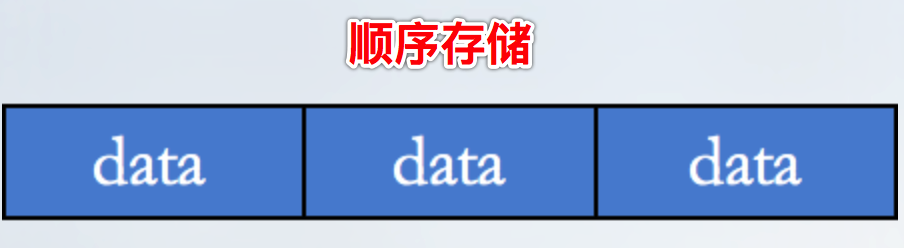
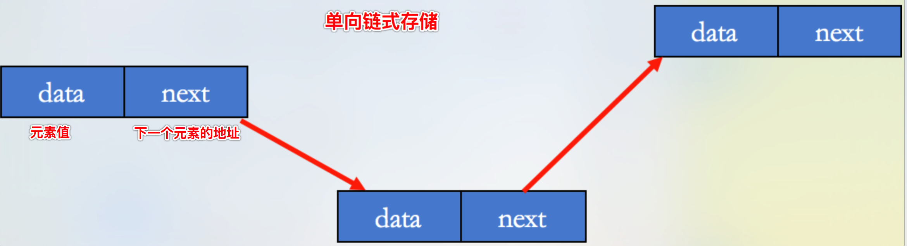
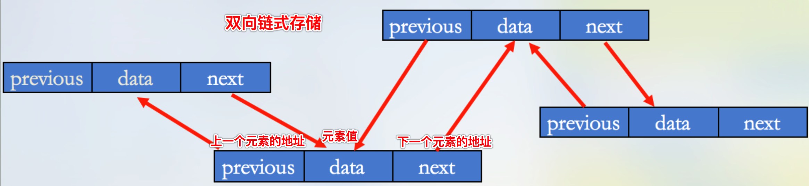
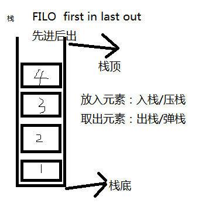
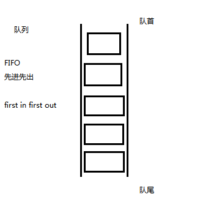
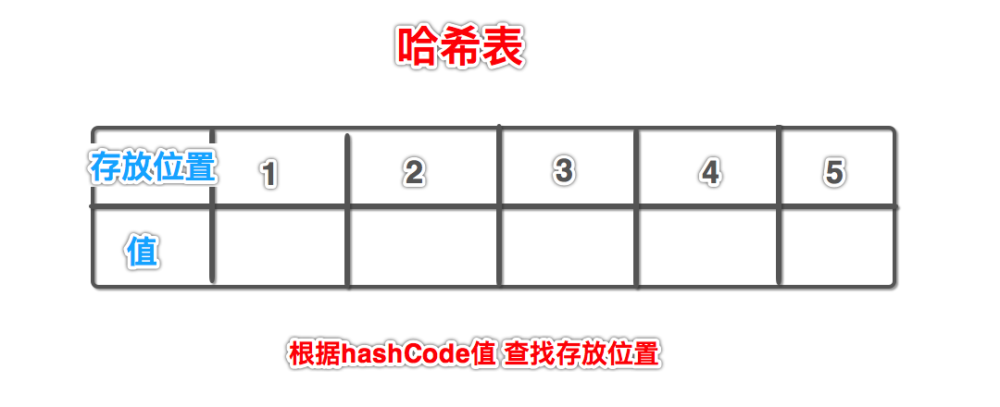

# 集合，主讲：汤小洋

## 一、简介

### 1. 概念

​	简单来说，集合就是一组数据，存放多个元素的数据结构

<font color="red">以下内容为补充说名</font>

<font color ="red"></font>


### 2. 存储结构

​	集合的存储结构，分为两种：

- 顺序存储

  将集合中的元素依次存放在某个存储区域中，称为顺序存储，在内存中分配的空间是连续的

  特性：访问效率高、插入和删除效率低

  

- 链式存储

  在内存中分配的空间可以是不连续的

  分为：单向链式存储、双向链式存储（每个数据节点中保存：元素值、上一个元素的地址、下一个元素的地址）

  特性：插入和删除效率高、访问效率低

  

  

  

  
  
  
  
  
  
  
  
  
  
  
  
  
  
  ## 2.2迭代器用法实例
  
  

### 3. 集合接口和类

​	集合相关的API都在java.util包中

```java
|-集合
	|-Collection接口，对象集合
		|-List接口
			|-ArrayList
			|-LinkedList
			|-Vector
				|-Stack
		|-Set接口
			|-HashSet
			|-TreeSet
		|-Queue接口 (后面补充)
			|-LinkedList
	|-Map接口，键值对集合
		|-HashMap
		|-HashTable
			|-Properties
```

## 二、List

​	特点：有序、可重复

​	实现类：ArrayList、LinkedList、Vector、Stack

### 1. ArrayList

​	ArrayList实现了长度可变的数组

- 本质上就是使用数组实现的，数组的默认长度为10（参考源码）
- 存储结构：顺序存储
- 特点：访问元素时效率高，而插入或删除时效率低，因为会导致后面所有元素都移动

### 2. Vector


​	Vector和ArrayList非常相似，都是使用数组实现的，用法基本相同，区别：

​	Vector

- 同步的，线程安全，方法基本都被synchronized修饰
- 执行效率低，影响性能
- 可以使用Iterator或Enumeration遍历

​        ArrayList

- 异步的，线程不安全
- 相比较Vector，执行效率高
- 不能使用Enumeration遍历

​	**Vector已过时，不建议使用**，作为替代可以使用Collections.synchronizedList

### 3. Stack

​	Stack继承自Vector

​	特点：先进后出

​	常用方法：具有List的所有方法，同时具有栈的操作方法

​	*注：栈和队列都是比较常用的数据结构*




### 4. LinkedList

​	当需要频率插入或删除元素时可以使用LinkedList

- 存储结构：双向链式存储
- 特点：插入或删除元素时效率高

​        常用方法：具有List的所有方法，同时具有一些额外的方法

​	LinkedList实现Queue接口，是一种队列（所有实现Queue接口的类都是队列）

​	队列的特点：先进先出



## 三、Set

​	特点：

- 无序（元素顺序与放入顺序无关），不能按索引访问元素
- 不可重复（集合中不允许出现重复的元素）

​	实现类：HashSet、TreeSet


### 1. HashSet

​	HashSet是一种基于哈希算法的集合，以哈希表形式存储

- 数据结构：哈希表，也称为哈希散列表，*也是一种比较常用的数据结构*

  

  

- 特点：操作速度更快，效率更高，根据哈希算法进行快速的查找，根据hashCode()方法返回值，确定其存储位置

​        HashSet判断元素是否重复的过程：

1. 添加元素时首先调用要存入对象的hashCode()方法，获取hashCode值

2. 根据hashCode值，使用哈希算法确定在哈希表中的存放位置

3. 判断该位置是否已经有元素：

   如果该位置没有元素，则直接将元素放入该位置 ——> 结束

   如果该位置已经有元素，则调用已有对象的equals方法（或者 == 运算符）和要放入的对象进行比较：

   ​	如果返回true，则认为是重复元素，舍弃要放入的元素 ——> 结束

   ​	如果返回false，则在当前位置下，以链表的形式追加 ——> 结束

​        **总结：**

- 判断重复的依据：当添加的两个元素的hashCode()返回值相同，并且equals()返回值为true时，则认为是重复的相同元素
- 添加到Set集合中的元素应该重写hashCode()和equals()方法，防止相同的元素被添加到Set集合中

### 2. TreeSet

​	TreeSet是用于对元素进行排序的有序集合类，不允许有重复的元素，不保证元素的顺序与插入的顺序一致

- 数据结构：二叉树
- 特点：TreeSet中元素是有大小顺序的

​        TreeSet会对元素进行排序，排序的依据：

1. 元素本身具有的自然顺序

   让对象实现`Comparable`接口，实现compareTo()方法

   让对象自身具有可比较性

2. 提供一个比较器，根据比较器进行排序

   定义一个比较器，实现`Comparator`接口的类，实现compare()方法

   在创建TreeSet时传入比较器

​         TreeSet判断重复的依据：当添加的两个元素的compareTo()返回值为0时，则认为是相同元素

## 四、Map

​	Map是专门用来处理 键值映射数据 的一种集合，可以根据键key实现对值value的操作

- 是一种映射关系，称为键值对（key-value）

- ```java
  
  ```

- 

- key必须是唯一的，不允许重复

- 一个key只能对应一个value，但一个value可以有多个key与之对应

- 不保证元素的顺序与插入的顺序一致，不能按索引访问元素

​        实现类：HashMap、Hashtable、Properties

### 1. HashMap

​	HashMap是一种基于哈希算法的Map集合，以哈希表形式存储

- 数据结构：哈希表

- 特点：查找元素时效率高

  注：HashSet的底层是HashMap，HashSet中的元素是作为HashMap的Key存储的，Value是一个Object对象

​        遍历HashMap的三种方式：

- 通过keySet()获取所有key的集合，然后遍历所有的key
- 通过values()获取所有value的集合，然后遍历所有的value
- 通过entrySet()获取所有key-value的集合，然后遍历所有的key-value键值对

​        HashMap判断key是否重复的过程：

1. 添加元素时首先调用key的hashCode()方法，获取key的hashCode值

2. 根据hashCode值，使用哈希算法确定在哈希表中的存放位置

3. 判断该位置是否已经有元素：

   如果该位置没有元素，则直接将元素放入该位置 ——> 结束

   如果该位置已经有元素，则调用已有元素的key的equals方法（或者 == 运算符）和要放入的对象的key进行比较：

   ​	如果返回true，则认为key是重复的，此时使用要放入元素的value覆盖原有value ——> 结束

   ​	如果返回false，则在当前位置下，以链表的形式追加 ——> 结束

​        **总结：**

- 判断重复的依据：当添加的两个key的hashCode()返回值相同，并且equals()返回值为true时，则认为是重复的key
- 添加到Map集合中的Key应该重写hashCode()和equals()方法，防止相同的Key被添加到Map集合中

### 2. Hashtable

​	Hashtable和HashMap非常相似，用法基本相同，区别：

​	Hashtable

- 同步的，线程安全
- key和value都不允许为null
- 可以使用Enumeration遍历

​        HashMap

- 异步的，线程不安全
- key和value都可以为null
- 不能使用Enumeration遍历

### 3. Properties

​	Properties继承自Hashtable，也是键值对集合，但一般只用来存放字符串键值对

​    属性文件：

- 以.properties为后缀

- 内容格式 ：`属性名=属性值`

- 默认使用的是ISO-8859-1字符集，不支持中文，但Eclipse会自动进行编码转换

- 可以修改字符集：

  Preferences——>General——>Content Types——>Text——>Java Properties File——>Default encoding：改为utf-8

## 五、Collections类

### 1. 简介

​	Collections工具类提供了集合操作的相关方法，如排序、查找、求最大值、最小值等

​	 类似于Arrays工具类，提供了操作数组的相关方法

### 2. 常用方法


​	Collection和Collections区别：

- Collection是接口，继承自它的接口主要是List和Set
- Collections是针对集合类的一个工具类，提供一系列静态方法实现对集合的操作

## 六、总结

### 1.  集合间的对比

​	List：元素有序、可重复

- ArrayList

  基于Array的List ，异步的，线程不安全，性能上要优于Vector

- Vector

  基于Array的List，同步的，线程安全

- LinkedList

  链表存储，每个节点除包含本身的数据外，还包含下/上一个节点的信息

​        Set：元素无序、不可重复

- HashSet

  基于哈希表，要求放入的对象要重写hashCode()和equals()方法

- TreeSet

  对元素进行排序，要求放入的对象是可排序的

​        Map：键值对

- HashMap
- Hashtable
- Properties

### 2. 数组和集合的对比

​	数组：

1. 数组可以存储基本数据类型和对象
2. 数组长度固定
3. 数组在定义时必须指定元素类型
4. 数组中无法直接获取实际存储的元素个数
5. 数组是有序的分配连续空间

​        集合：

1. 集合只能存储对象（可以以包装类的形式存储基本数据类型）
2. 集合长度可以动态改变
3. 集合在定义时可以不指定元素类型，默认为Object类型
4. 集合中可以直接通过size()获取实际存储的元素个数
5. 集合有多种存储方式适应不同的场合
6. 集合以接口和类的形式存在，具有封装、继承、多态等类的特性

​        注：Arrays是专门用来操作数组的工具类；而Collections是专门用来操作集合的工具类


