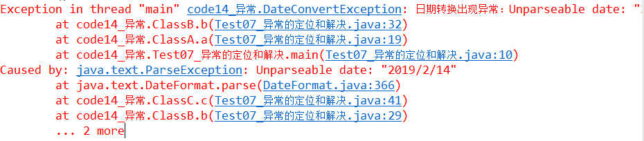

# 异常，主讲：汤小洋

## 一、简介

### 1. 什么是异常

​	程序在运行过程中发生的意外情况，称为异常。如：除数为0、访问下标不存在的数组元素等

​	异常是一种信号，用于向调用者传递信息，表示程序发生了意外情况

​	程序运行时一旦出现异常，将会导致程序立即终止，异常之后的代码将无法继续执行，所以需要对异常进行处理。

​	注：编译器能够发现的错误是语法错误，不是异常


### 2. 常见异常

| 异常                             | 含义             | 发生时机                                   |
| -------------------------------- | ---------------- | ------------------------------------------ |
| ArithmeticException [əˈrɪθmətɪk] | 算术异常         | 除数为0                                    |
| ArrayIndexOutOfBoundsException   | 数组下标越界异常 | 访问下标不存在的数组元素                   |
| NullPointerException             | 空指针异常       | 对null调用了方法                           |
| ClassCastException               | 类型转换异常     | 将两个不相关的类进行了强转                 |
| NumberFormatException            | 数字格式异常     | 字符串不满足数字的格式要求，不能转换为数字 |
| ClassNotFoundException           | 类找不到异常     | 指定的类不存在                             |
| ParseException                   | 解析异常         | 字符串格式不正确                           |

​	不同的异常自身携带了不同的信息，表示发生了不同的意外情况

### 3. 异常分类


```java
|-Throwable
	|-Exception 检查异常
		|-ClassNotFoundException
		|-ParseException
		|-...
		|-RuntimeException 运行时异常
			|-AuthmeticException
			|-ArrayIndexOutOfBoundsException
			|-NullPointerException
			|-.....
	|-Error	 // 网络连接失败、内存溢出等，称为错误
```

​	检查异常：

- 所有继承Exception类的异常，称为检查异常 或 非运行时异常 Checked Exception
- 该类异常是可预期的，很有可能会发生
- 编译器要求必须显式处理该异常，即编写代码时就强制要处理

​        运行时异常： 

- 所有继承RuntimeException类的异常，称为运行时异常 或 非检查异常
- 该类异常并不一定可预测发生
- 如果代码中没有逻辑性错误，是不会出现运行时异常的
- 编译器不要求必须处理该异常，即编写代码时可以不处理

## 二、异常的产生和处理

### 1. 产生

​	每种异常都是使用一个Java类来表示的

​	异常的产生：

1. 当程序发生异常时，会自动生成一个对应异常类的对象，然后将该异常对象提交给JRE，这个过程称为抛出异常 throw
2. 当JRE接收到异常对象时，会寻找能处理此异常的代码并把当前异常对象交给其处理，这个过程称为捕获异常 catch
3. 如果JRE找不到可以捕获异常的方法，则运行时系统将终止，程序将退出

​       所以需要对异常进行处理，否则程序将立即终止，无法继续执行。

### 2. 处理

​	异常处理的两种方式：

- 使用try...catch处理异常
- 使用throws声明抛出异常

#### 2.1 使用try...catch

​	使用try-catch-finally捕获并处理异常

​	语法：

```java
try{
    //可能出现异常的代码
}catch(异常类型 异常对象){ //捕获异常
    //对异常进行处理的代码
}finally{
    //无论是否出现异常都必须要执行的代码
}
```

	

注意：

- try是必须的，catch和finally至少要有一个
- catch可以有多个，用来捕获处理多种不同类型的异常

#### 2.2 使用throws

​	如果一个方法可能产生某种异常，但并不知道如何处理这种异常，此时可以声明该方法会抛出异常，表明该方法将不对这种异常进行处理，而由该方法的调用者来处理

​	使用throws和throw关键字

- throws用来声明方法中会抛出异常
- throw用来在方法内手动抛出异常

## 三、自定义异常

​	自定义异常类时，需要继承Exception类或其子类

​        一般多继承自Exception或RuntimeException类

- 如果继承Exception，则为检查异常，必须处理
- 如果继承RuntimeException，则为运行时异常，可以不处理

## 四、方法重写的异常问题

​	方法重写时的异常问题

- 若父类不抛出异常，则子类不能抛出`检查异常`，但可以抛出`运行时异常` 或 在方法内部使用try..catch捕获处理异常
- 若父类抛出异常，子类可以不抛出异常
- 重写方法不能抛出比被重写方法范围更大的异常类型

## 五、异常的定位和解决



​	查找异常的出现位置并解决：

1. 首先查看有没有Caused by，如果有则从Caused by开始找；如果没有则从头开始找
2. 然后找到**第一行**自己写的代码，问题就在这里
3. 最后根据Caused by所在行 或 第一行的**异常类型和异常消息**，确定产生异常的原因


