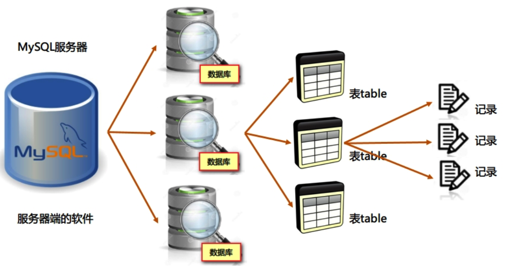

# MySQL基础

## 一、MySQL简介

### 1. 介绍

#### 1.1 数据的存储方式

​	在日常的工作学习中，我们通常会把数据存储到普通文件中，如记事本、Word、Excel等

​	缺点：操作数据不方便，效率低，如查询符合条件的数据、对数据进行访问限制等

​	在软件开发中，一般都将数据存储到数据库中，便于管理、速度快、效率高。

#### 1.2 什么是数据库？

​	数据库：Database，按照数据结构来组织、存储和管理数据的仓库，简单来说就是存储数据的仓库

​	数据库管理系统：用来管理数据库的软件系统，常见的：MySQL、Oracle、SQL Server、DB2、Access等

#### 1.3 什么是MySQL？

​	MySQL：是一个开源的关系型数据库管理系统，由瑞典MySQL AB公司开发，后来被Oracle收购，所以目前属于Oracle公司

​	特点：免费、体积小、速度快，中小型网站多使用MySQL数据库

​	DBA：DataBase Administrator 数据库管理员

​	官网：https://www.mysql.com

​    版本：要么5 要么8，一般5.5最多


### 2. 安装MySQL

#### 2.1 安装步骤

- 双击`phpstudy_x64_8.1.1.3.exe`进行安装
- 启动MySQL，并设置为开机自动启动
- 将MySQL的bin目录添加到系统PATH变量中，便于使用

#### 2.2 验证安装

​	打开命令行窗口：点击开始，输入`cmd`，然后按回车

​	执行如下命令：`mysql  -V`，查看MySQL版本


## 二、基本操作

### 1. 连接MySQL

​	要想操作MySQL数据库，必须先使用账户和密码连接MySQL服务器，登陆成功后才能使用

​	MySQL默认提供了一个超级管理员账号root，使用安装时设置的密码即可登录

​	语法：

```mysql
mysql -u用户名 -p密码 [-h数据库服务器地址] 	
```

​	登陆后可以使用`exit`或`quit`退出MySQL

### 2. 关于数据库和表

​	MySQL服务器：安装了MySQL程序的电脑，称为MySQL服务器 或 数据库管理系统，可以管理多个数据库

​	数据库：存储数据的仓库，一般会为每个应用都创建一个数据库，用于存储该应用相关的所有数据，如员工管理系统数据库、学生考试系统数据库等

​	表：一般会在数据库中创建多个表，用于存储应用中每个实体的数据，如员工表、部门表等

​	行：表中的每一条数据，也称为记录

​	列：行中的每一个字段



​	**结论：一台MySQL服务器包含多个数据库，一个数据库包含多张表，一张表包含多条记录，一条记录包含多个字段**

### 3. 查看数据库和表	

```mysql
show databases; -- 查看当前所有数据库
use 数据库名;  -- 切换数据库
show tables; -- 查看当前数据库中所有表
```

​	注意：

- 执行命令时需要以分号 ; 结尾
- 以`-- ` 开头的内容表示注释，可以忽略

## 三、SQL简介

### 1. 简介

​	Structured Query Language 结构化查询语言

​	用来对数据库进行查询、更新和管理的一种语言，所有关系型数据库都支持SQL。

### 2. SQL组成

​	包含三个部分：

- DML

  Data Manipulation Language 数据操作语言

  用于查询、更新数据： insert、delete、update、select

- DDL

  Data Definition Language 数据定义语言

  用于定义数据的结构：create、alter、drop

- DCL

  Data Control Language 数据控制语言

  用于设置用户的权限：grant、revoke

### 3. 导入初始数据

#### 3.1 导入数据

​	使用root用户连接MySQL，然后执行如下命令：

```sql
source D:/init.sql
```

​	注：以.sql结尾的文件是数据库脚本文件，包含一系列的sql语句

#### 3.2 表结构

```sql
desc 表名;  -- 查看表结构
select * from 表名; -- 查看表中所有数据	
```

​	emp雇员表

| 列名     | 类型           | 含义              |
| -------- | -------------- | ----------------- |
| empno    | int 整数       | 雇员编号          |
| ename    | varchar 字符串 | 雇员姓名          |
| job      | varchar 字符串 | 工作、职位        |
| mgr      | int 整数       | 上司编号 manager  |
| hiredate | date 日期      | 入职时间          |
| sal      | double 小数    | 薪水、工资 salary |
| comm     | int 整数       | 奖金 commission   |
| deptno   | int 整数       | 部门编号          |

​	dept部门表

| 列名   | 类型    | 含义              |
| ------ | ------- | ----------------- |
| deptno | int     | 部门编号          |
| dname  | varchar | 部门名称          |
| loc    | varchar | 部门位置 location |

​	salgrade工资等级表

| 列名  | 类型 | 含义          |
| ----- | ---- | ------------- |
| grade | int  | 编号          |
| losal | int  | 工资下限 low  |
| hisal | int  | 工资上限 high |

​	bonus奖金表

## 四、查询操作

### 1. 简单查询

#### 1.1 语法

```sql
select 列名1 别名1,列名2 别名2... from 表名;
```

#### 1.2 用法

​	例：查询员工的姓名

```sql
select ename from emp;
```


​	例：查询员工的编号、姓名、工作

```sql
select empno,ename,job from emp;
```

​	例：查询员工的所有信息

```sql
select *from emp
```

​	例：查询员工的姓名、工资、入职时间，并为每列设置别名

```sql
select ename 姓名,sal 工资,hiredate 入职时间 from emp;
```

​	例：查询员工的姓名、工资，并分别设置别名为`your name`、`your salary`(取英文别名需要单引号)

```sql
select ename 'your name',sal 'your salary' from emp;
```


​	例：编号为xxxx的雇员，姓名为xxxx，职位为xxxx

```sql

```


​	例：查询雇员姓名及年薪

​	例：查询所有的职位

### 2. 限定查询

​	语法：

```sql
select *|列名1 别名1,列名2 别名2... 
from 表名
where 条件;
```

#### 2.1 比较运算符

​	>、<、>=、<=、=、!=

​	例：查询工资大于1500的雇员信息

​	例：查询雇员的编号不是7369的雇员信息

​	例：查询姓名是smith的雇员编号、姓名、工资、入职时间		

#### 2.2 null和not null

​	例：查询每月有奖金的雇员信息

#### 2.3 and

​	例：查询基本工资大于1500，同时可以获得奖金的雇员姓名、工资和奖金	

#### 2.4 or

​	例：查询从事销售工作，或工资大于等于2000的雇员信息

#### 2.5 not

​	例：查询从事非销售工作，并且工资不小于1500的雇员信息

​	例：查询从事销售工作，并且工资小于1500以外的雇员信息

#### 2.6 between and

​	例：查询基本工资大于1500，但小于3000的雇员信息

​	例：查询1981年入职的雇员编号、姓名、入职时间、所在部门编号

#### 2.7 in和not in

​	例：查询编号为7788、7499、7369的雇员信息	

​	例：查询姓名为SMITH、ALLEN、KING的雇员编号、姓名、入职时间

#### 2.8 like

​	用来进行模糊查询，需要结合通配符一起使用

​	常用通配符：

- %  可以匹配任意长度字符
- _    可以匹配单个字符

​    例：查询雇员姓名以s开头的雇员信息

​	例：查询雇员姓名中包含m的雇员信息

​	例：查询1981年入职的雇员编号、姓名、入职时间、所在部门编号

​	例：查询姓名以d结尾，长度为4个字符的雇员信息

### 3. 排序

#### 3.1 语法

​	语法：

```sql
select *|列名1 别名1,列名2 别名2... 
from 表名
where 条件
order by 排序列1 asc|desc,排序列2 asc|desc;
```

​	asc表示升序，desc表示降序，如果省略不写，则默认为升序

#### 3.2 示例

​	例：查询所有雇员信息，按工资由低到高排序

​	例：查询所有雇员信息，按工资由高到低排序，如果工资相同，则按入职时间由早到晚排序

​	例：查询部门10的雇员信息，按工资降序排列

​	例：查询雇员编号、姓名、年薪，按年薪由高到低排序

