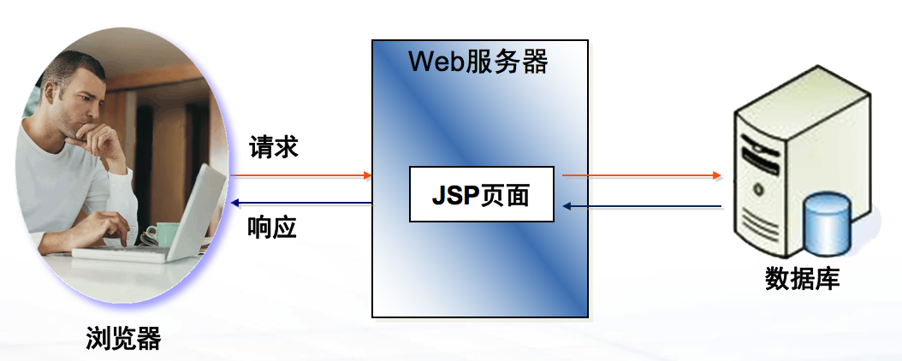
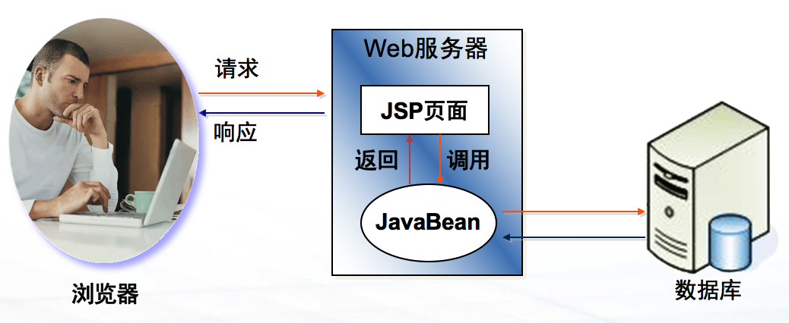
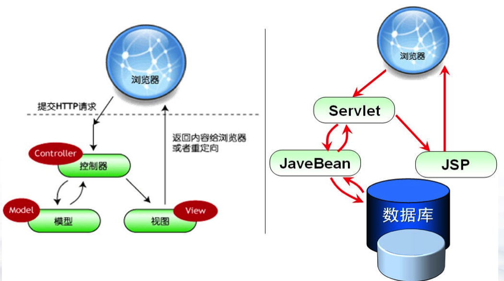

# MVC，主讲：汤小洋

## 一、体系结构模型

​	JSP应用程序的体系结构模型，分为两种：

- Model I：以JSP为核心
- Model II：以MVC为核心

### 1. Model I

​	又可细分为两种：

​	方式1：纯粹使用JSP

+ 优点
  
  实现简单，开发周期短
  
  不需要重新编译
  
+ 缺点
  
  业务逻辑和页面混在一起，可读性差
  
  代码复用性低，不利于大幅度的修改，不利于分工协作
  

​    方式2：使用JSP+JavaBean

​		

+ 优点
  
  使用JavaBean实现业务逻辑，和页面相分离，可读性高
  
  代码复用性高，利于代码的维护，利于分工协作
  
+ 缺点
  
  缺乏流程控制
  
  用户身份验证、异常处理等比较麻烦

### 2. Model II

​	将Servlet纳入体系结构中，由其扮演控制器的角色

​	实现以MVC为核心的体系结构

## 二、MVC

### 1. 什么是MVC

​	Model  模型，封装了业务逻辑，对业务数据进行处理

​	View 视图，封装了显示逻辑，如JSP页面、Excel、PDF、FreeMarker等

​	Controller 控制器，控制整个网站的处理流程，协调视图与模型

​	

​	View 视图，封装了显示逻辑，如JSP页面

​	Controller 控制器，控制整个网站的处理流程，协调视图与模型

​	MVC是一种Web应用架构，是一种代码设计思想

​	思想：将所有客户端请求(Request)全部交由控制器，由控制器将其分发，并将结果响应回客户端

### 2. 运行流程

1. 所有请求不再直接访问视图与模型，而是统一交给控制器

2. 然后由控制器来分发给指定的视图与模型

3. 如果分发给视图，则由控制器选择合适的视图来展现

4. 如果分发给模型，则由控制器选择合适的模型来实现具体的业务逻辑

   业务逻辑处理完成后，将处理结果交给控制器

   由控制器根据响应结果的不同，选择合适的视图来展现

### 3. 优缺点

​	优点：
+ 集中的程序流程控制
+ 开发流程明确，利于分工协作

​    缺点：
+ 增加了代码量
