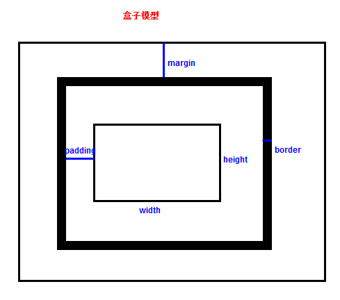

# CSS，主讲：汤小洋

## 一、CSS简介

### 1. 什么是CSS

​	CSS：Cascading Style Sheet 层叠样式表

​	是一组样式设置规则，用于控制页面的外观样式

### 2. CSS作用

- 页面外观美化
- 布局和定位

## 二、基本用法

### 1. CSS语法

```html
<head>
	<style type="text/css">
  		选择器{
          属性名:属性值;
          属性名:属性值;
  		}
 	</style>  
</head>
```

- 选择器：要修饰的对象（东西）
- 属性名：修饰对象的哪个属性（样式）
- 属性值：属性的取值


### 2. CSS应用方式

​	也称为CSS引用方式，有三种方式：内部样式、行内样式、外部样式

#### 2.1 内部样式

​	也称为内嵌样式，在页面头部通过style标签定义

​	对当前页面所有符合样式选择器的标签都起作用

#### 2.2 行内样式

​	也称为嵌入样式，使用HTML标签的style属性定义

​	只对设置style属性的标签起作用

#### 2.3 外部样式

​	使用单独的`.css`文件定义，然后在页面中使用link标签引入外部样式表

```html
<link rel="stylesheet" href="css样式文件的路径" type="text/css">
```

​	所有引入样式表文件的页面都起作用

## 三、选择器

### 1. 基础选择器

#### 1.1 标签选择器

​	也称为元素选择器，使用HTML标签作为选择器名称

​	以标签名作为样式应用依据

#### 1.2 类选择器

​	使用自定义名称，以.作为前缀，然后通过HTML标签的class属性调用类选择器

​	以标签的class属性值作为样式应用依据

​	注意：

- 调用时不能添加`.`号
- 同时调用多个类选择器时以 空格 隔开
- 类选择器名称不能以数字开头

#### 1.3 ID选择器

​	使用自定义名称，以#作为前缀，然后通过HTML标签的id属性进行名称自动匹配

​	以标签的id属性值作为样式应用依据，一对一的关系

### 2. 复杂选择器

#### 2.1 复合选择器

​	标签选择器和类选择器、标签选择器和ID选择器，一起使用

​	必须同时满足两个条件才能应用样式

#### 2.2 组合选择器

​	也称为集体声明

​	将多个具有相同样式的选择器放在一起声明，使用逗号,隔开

#### 2.3 嵌套选择器

​	在某个选择器内再设置选择器，通过空格隔开

​	只有满足层次关系最里层的选择器所对应的标签才会应用样式

​	注：使用`空格`时不区分父子还是后代，使用`>`时必须是父子关系才行

#### 2.4 伪类选择器

​	根据不同的状态显示不同的样式，一般多用于a标签，即超链接

​	四种状态：

​		:link 未访问的链接

​		:visited 已访问的链接

​		:hover 鼠标移动到链接上，即悬浮在链接上

​		:active 选定的链接，被激活

​	**要注意四种状态的书写顺序：link --> visited -->  hover --> active**

### 3. 选择器优先级

#### 3.1 优先级

​	行内样式 > ID选择器 > 类选择器 > 标签选择器

​	原因：首先加载标签选择器，再加载类选择器，然后加载ID选择器，最后加载行内样式，后加载的会覆盖先加载的同名样式

#### 3.2 !important

​	可以使用 !important 使某个样式属性具有最高的优先级

## 四、常用CSS属性

### 1. 字体属性

​	定义字体相关的样式

| 属性        | 含义       | 说明                 |
| ----------- | ---------- | -------------------- |
| font-size   | 大小、尺寸 | 可以使用多种单位     |
| font-weight | 粗细       | 取值：normal、bold   |
| font-family | 字体       | 取值：黑体、楷体等   |
| font-style  | 样式       | 取值：normal、italic |

### 2. 文本属性

| 属性            | 含义         | 解释                                                         |
| --------------- | ------------ | ------------------------------------------------------------ |
| color           | 颜色         | 使用英文单词、16进制的RGB值，特定情况下可以缩写，如#FFFFFF --> #FFF |
| line-height     | 行高         | 行内容的高度                                                 |
| text-align      | 水平对齐方式 | 取值：left、center、right                                    |
| vertical-align  | 垂直对齐方式 | 取值：top、middle、bottom，可用于图片和文字的对齐方式        |
| text-decoration | 文本修饰     | 取值：underline、overline、line-through、none                |

### 3. 背景属性

| 属性                | 含义               | 解释                                                   |
| ------------------- | ------------------ | ------------------------------------------------------ |
| background-color    | 背景颜色           |                                                        |
| background-image    | 背景图片           | 必须使用url(路径)                                      |
| background-repeat   | 背景图片的重复方式 | 取值：repeat(默认)、repeat-x、repeat-y、no-repeat      |
| background-position | 背景图片的显示位置 | 取值：关键字（top、bottom、left、right、center）、坐标 |
| background          | 简写               | 一般顺序：颜色 \| 图片 \| 重复方式 \| 显示位置         |

### 4. 列表属性

​	使用list-style属性设置列表项前的标记

### 5. 浮动属性

​	通过float属性实现元素的浮动，取值：

- left 左浮动
- right 右浮动
- none 不浮动，默认值

### 6. 元素的显示和隐藏

​	通过display属性设置元素是否显示，以及是否独占一行

​	常用取值：

- none 不显示
- inline 将块级元素变为行级元素，不再独占一行
- block 将行级元素变为块级元素，独占一行
- inline-block 在inline的基础上允许设置宽和高

​	注：行级元素默认无法设置宽和高，可以为行级元素设置display:inline-block，然后就可以设置宽和高了

## 五、盒子模型

### 1. 概念

​	盒子模型是网页布局的基础，将页面中所有的元素都看作成一个盒子，盒子都包含以下几个属性：

- width 宽度
- height 高度
- border 边框
- padding 内边距
- margin 外边距



### 2. 盒子属性

#### 2.1 border

​	表示盒子的边框

​	分为四个方向：border-top、border-right、border-bottom、border-left

​	每个方向都包含三种样式：颜色color、粗细width、样式style

​	简写：

- 按方向简写

    border-top、border-right、border-bottom、border-left

    书写顺序，`border-方向 : width style color`

- 如果四个边都一样

    简写，`border : width style color`

#### 2.2 padding

​	表示盒子的内边距，即内容与边框之间的距离

​	同样也分为四个方向，可以简写（按顺时针方向、默认上下一样，左右一样）

#### 2.3 margin

​	表示盒子的外边距，即盒子与盒子之间的距离

​	同样也分为四个方向，可以简写（按顺时针方向、默认上下一样，左右一样）	

### 3. 元素所占空间

#### 3.1 元素所占空间

​	页面中的元素实际所占空间：

- 宽=width+左右padding+左右border+左右margin
- 高=height+上下padding+上下border+上下margin

#### 3.2 盒子属性默认值

​	不同标签的盒子属性默认值可能不同，需要自己设置

```css
*{
  margin:0;
  padding:0;
}
```

## 六、定位方式

### 1. 简介

​	通过position属性实现对元素的定位，有四种定位方式

​	常用取值：

| 取值     | 含义     | 解释                                   |
| -------- | -------- | -------------------------------------- |
| static   | 默认值   | 按照常规文档流进行显示                 |
| relative | 相对定位 | 相对于标签原来位置进行的定位           |
| absolute | 绝对定位 | 相对于第一个非static定位的父标签的定位 |
| fixed    | 固定定位 | 相对于浏览器窗口进行定位               |

​	设置定位方式后，还需要设置定位属性(偏移量)：top、bottom、left、right

### 2. 相对定位

​	先设置元素的position属性为relative，然后再设置偏移量

### 3. 绝对定位

​	先设置父标签为非static定位，然后设置元素的position属性为absolute，最后再设置偏移量

​	注意：设置元素为绝对定位后，元素会浮在页面上方

### 4. 固定定位

​	先设置元素的position属性为fixed，然后再设置偏移量

​	注意：设置元素为固定定位后，元素会浮在页面上方


