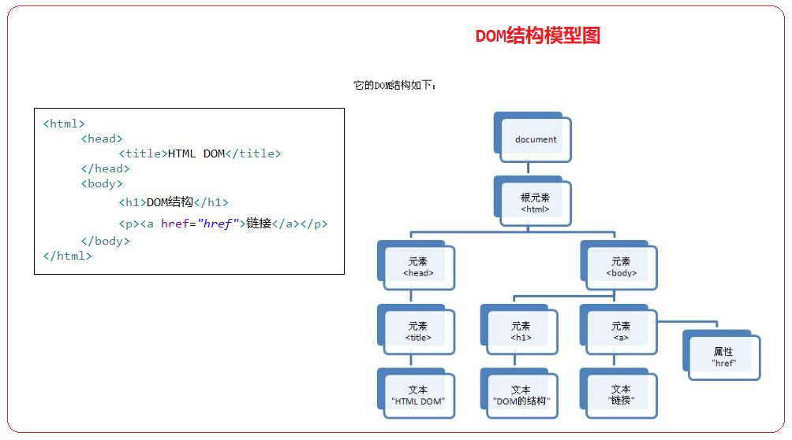
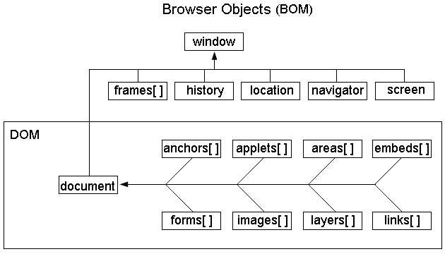

# JavaScript，主讲：汤小洋

## 一、JavaScript简介

### 1. 什么是JavaScript

​	JavaScript简称为JS，由网景公司开发的客户端脚本语言，不需要编译，可以直接运行

​	Web前端三层：

- 结构层  HTML  定义页面的结构
- 样式层  CSS    定义页面的样式
- 行为层  JavaScript  用来实现交互，提升用户体验

### 2. JavaScript作用

+ 在客户端动态的操作页面
+ 在客户端做数据的校验
+ 在客户端发送异步请求

## 二、引用方式

### 1. 内联方式

​	在页面中使用script标签，在script标签的标签体中编写js代码

​	script标签可以放在页面的任意位置，一般放在head中

```html
<script type="text/javascript">
	js代码 
</script>
```

### 2. 行内方式

​	在普通标签中编写js代码，一般需要结合事件属性，如onclick、onmouseover等

```html
<input type="button" value="点我" onclick="alert('Hello')"/>
<!-- 使用超链接的href属性执行js时，必须添加javascript前缀 -->
<a href="javascript:alert('World')">我是超链接</a>
```

### 3. 外部方式

​	使用单独的`.js`文件定义，然后在页面中使用script标签引入外部脚本文件

```html
<script type="text/javascript" src="js文件的路径"></script>
```

​	注：如果某个script标签用于引入外部js文件，则该script标签的标签体中不能再写js代码

## 三、基本用法

### 1. 变量

​	js是一门弱类型的语言，声明变量时使用var关键字，不需要指定变量的类型

​	语法：`var 变量名=变量值;`

​	在ECMAScript 6规范中新增let关键字，也用于声明变量

​	使用let声明的变量支持块级作用域，而使用var声明的变量不支持块级作用域

​	注：在IDEA中配置ES版本 Settings——>Languages & FrameWorks——>JavaScript——>JavaScript Language version

### 2. 输入和输出

​	输出：

- alert() 弹出警告框
- console.log() 输出到浏览器的控制台
- document.write() 输出到页面

​    输入：

- prompt() 弹出输入框，获取用户输入的数据

  使用`typeof 变量`判断变量的类型

  使用`Number(变量)`将字符串转换为数值

### 3. 转义符

​	常用转义符：

- `\n` 换行
- `\t` 缩进
- `\"`双引号
- `\'`单引号

### 4. 注释

​	单行注释：`//`

​	多行注释：`/* */`

### 5. 编码规范

​	代码区分大小写

​	合理的代码缩进

​	每条语句结束时可以加分号，也可以不加

## 四、核心语法

### 1. 数据类型

​	基础数据类型：
+ string  字符串
+ number  数值（NaN表示非数字Not a Number，其自身是number类型，表示数值的不正常状态）
+ boolean  布尔
+ null  空类型
+ undefinded  未定义类型

​    数据类型转换：

- 转换为number

  使用Number()、parseInt()、parseFloat()

- 转换为string

  拼接空字符串

- 转换为boolean

  使用Boolean()

  注：0、空字符串、null、undefinded、NaN会被转换成false，其他值都会被转换为true

### 2. 运算符

​	算术运算符：+、-、*、/、%、**、++、--

​	比较运算符：<、>、>=、<=、==、===、!=

​	赋值运算符：=、+=、-=、*=、/=、%=

​	逻辑运算符：&&、||、!

​	条件运算符：条件?表达式1:表达式2

### 3. 选择结构

​	if…else、switch

### 4. 循环结构

​	while、do…while、for、for…in、for...of

​	break、continue

```js
var str='welcome'; // 可以将字符串看作是由多个字符组成的集合
for(var index in str){  //index表示集合中每个元素的索引，并不是元素本身
	// console.log(index);
	console.log(str[index]);
}
```

### 5. 数组

#### 5.1 定义方式

​	语法：

```js
var arr = new Array();
var arr = new Array(值1,值2...);
var arr = [值1,值2...];
```

​	注意：

- 数组长度会自动扩展
- 数组中元素的默认值为undefined
- 使用length属性来获取数组的长度

#### 5.2 常用方法

| 方法             | 描述                                                         |
| ---------------- | ------------------------------------------------------------ |
| sort()           | 排序，默认按字符编码的顺序排列，非string类型会自动转换为string，可自定义比较规则 |
| reverse()        | 反转，将数组元素倒序排列                                     |
| push()           | 添加新的元素                                                 |
| join(separator)  | 将数组中元素使用指定的分隔符连接成字符串，默认通过逗号进行连接 |
| indexOf()        | 返回指定元素在数组中首次出现的位置                           |
| slice(begin,end) | 截取数组中索引从begin到end的元素，左闭右开，如果省略第二个参数，则表示截取到末尾 |
| toString()       | 将数组转换为字符串                                           |

#### 5.3 二维数组

​	二维数组可以认为是特殊的一维数组，即一维数组中的每个元素又是一个一维数组

​	语法：

```js
var arr = new Array();
arr[0] = new Array();
arr[1] = new Array();
arr[][] = 值;

var arr=[
  [值1,值2...],
  [值1,值2...],
  [值1,值2...]
];
```

### 6. 函数

#### 6.1 自定义函数

​	语法：

```js
function 函数名(参数1,参数2...){
  // 函数体
}
```

​	注意：

+ 定义函数时不需要指定参数的类型
+ 实参个数和形参个数可以不同，未指定参数时其默认值为undefined
+ 不需要指定返回值的类型，如果有返回值，直接使用return返回即可
+ 如果函数中没有使用return返回值，则默认返回undefined

​    变量的作用域：

- 局部作用域

  在函数中声明的变量，只能在该函数内访问，函数运行结束后变量自动销毁

- 全局作用域

  在函数外声明的变量，在任何位置都可以访问

- 块级作用域

  使用let关键字声明的变量，只能在声明它的代码块内访问

#### 6.2 回调函数

​	不立即执行的函数调用，满足一定条件时才会执行或者由别的代码调用执行，称为回调函数 callback

​	调用时只写函数名，没有小括号()和参数

​	应用：

- 作为事件绑定的函数
- 作为另一个函数的参数

#### 6.3 匿名函数

​	没有名字的函数，称为匿名函数，一般用于回调	

​	应用场景：

- 用于事件的回调

  ```js
  window.onclick=function(){ // 匿名函数，用于回调
  	console.log("点击了页面！");
  };
  ```

- 用于一次性执行的函数，会自动执行，称为自执行函数

  ```js
  (function(){
  	console.log("此函数只执行一次！");
  })();
  ```

#### 6.4 箭头函数

​	ES6中允许使用“箭头”`=>`定义函数，称为箭头函数，也叫lambda表达式，是一种特殊的匿名函数

## 五、复合类型

### 1. String

#### 1.1  定义方式

​	语法：

```javascript
var str = 'welcome';	// 基本数据类型string
var str = new String('welcome');  // 引用数据类型String
```

​	使用length属性获取字符串的长度

#### 1.2 常用方法 

| 方法          | 描述                                             |
| ------------- | ------------------------------------------------ |
| charAt()      | 返回在指定索引位置的字符，也可使用`[索引]`的方式 |
| indexOf()     | 返回某个指定的字符串值在字符串中首次出现的位置   |
| lastIndexOf() | 返回某个指定的字符串值在字符串中最后出现的位置   |
| toLowerCase() | 把字符串转化为小写                               |
| toUpperCase() | 把字符串转化为大写                               |
| substring()   | 提取字符串中两个指定的索引号之间的字符           |
| replace()     | 将指定的字符串替换为指定的新的字符串             |
| split()       | 把字符串分割为字符串数组                         |
| trim()        | 去除前后两端的空格                               |

### 2. Date

#### 2.1 定义方式

​	语法：

```js
var date = new Date(); // 定义一个日期对象，表示当前时间
var date = new Date(year,month,day,hour,minute,second) // 参数为指定的年、月、日、时、分、秒
var date = new Date(millSeconds); //参数为与1970-1-1相差的毫秒数
```

#### 2.2 常用方法

| 方法名            | 说明                               |
| ----------------- | ---------------------------------- |
| getFullYear()     | 以四位数字返回年份                 |
| getMonth()        | 返回月份(0~11)，0表示1月           |
| getDate()         | 返回一个月中的某一天(1~31)         |
| getHours()        | 返回小时 (0 ~ 23)                  |
| getMinutes()      | 返回分钟 (0 ~ 59)                  |
| getSeconds()      | 返回秒数 (0 ~ 59)                  |
| getMilliseconds() | 返回毫秒(0 ~ 999)                  |
| getDay()          | 返回一周中的某一天(0~6)，0表示周日 |
| getTime()         | 返回从1970-1-1 0:0:0至今的毫秒数   |

setXxx方法与getXxx方法类似，用于设置对应的值

### 3. JSON

#### 3.1 JSON简介

​	JavaScript Object Notation 是一种轻量级的数据交换格式，用于表示JavaScript对象的一种方式

​	采用与编程语言无关的文本格式，易于阅读和编写，同时也易于解析和生成。

#### 3.2 基本用法

​	语法：`{"属性名":属性值,"属性名":属性值....}`

​	注意：

- JSON结构是由一系列的键值对所组成，称为JSON对象
- 属性名使用双引号引起来

​    使用：

+ 简单的JSON对象
+ 复合属性，属性的值为JSON对象
+ JSON对象的集合

#### 3.3  JSON转换

- JSON转换为字符串

  ```js
  var person={
    "name":"汤小洋",
    "age":18,
    "height":180.5
  };
  var str=JSON.stringify(person);
  ```

- 字符串转换为JSON

  ```js
  var str='{"name":"tom","age":20}';
  var obj=JSON.parse(str);
  var users='[
  	{"id":1,"username":"admin","password":"123"},
  	{"id":2,"username":"tom","password":"456"}
  ]';
  var objs=JSON.parse(users); 
  ```

### 4. 对象类型

#### 4.1 对象简介

​	对象类型可以理解为java中的引用数据类型

​	JavaScript是面向对象的语言，但并不是人们常说的纯粹的面向对象的语言，因为它不支持某些特征。

#### 4.2 创建对象

​	三种方式：

+ 使用Object

```javascript
// 新创建的对象没有属性和方法
var 对象名=new Object();
// 为对象添加属性
对象名.属性名=属性值;
// 为对象添加方法
对象名.方法名=function(){
  	方法体
}

// 调用属性和方法
对象名.属性名; 或 对象名['属性名'];
对象名.方法名();
```

+ 使用构造函数，模拟类的定义，相当于自定义了一个类型

```javascript
function 构造函数名(形参1,形参2…) { // 为了区别于普通函数，构造函数名建议首字母大写
 		this.属性名=形参1; 
 		this.属性名=形参2; 
	 	this.方法名=function(){
      	方法体
    };
} 

var 对象名=new 构造函数名(实参1,实参2…);
```

+ 使用对象字面量（对象字面量和JSON的区别：JSON的属性必须加双引号，而对象字面量可以不加）

```javascript
var 对象 = {
  属性名:属性值, // 属性名可以不用引号
  属性名:属性值,
  方法名:function(){
    方法体
  }
};
```

## 六、DOM操作

### 1. DOM简介

​	Document Object Model 文档对象模型

​	浏览器加载HTML文档时，会将HTML文档解析为一个树形结构，称为DOM树

- HTML文档和DOM树是一一对应的关系
- 当DOM树被改变时，与之对应的HTML文档也会随之改变
- 当需要对HTML中的内容进行动态改变时，可以使用DOM来进行操作
- DOM提供了一组用来操作HTML文档的API，即提供一套属性、方法和事件 
- 树上的每一个节点都是一个DOM对象，树的顶层为document对象，表示整个文档



### 2. 查询操作

​		即获取DOM对象

| 方法或属性                               | 含义                                        |
| ---------------------------------------- | ------------------------------------------- |
| document.getElementById("id值")          | 根据id属性来查询节点，返回匹配的第一个节点  |
| document.getElementsByName("name属性值") | 根据name属性来查询，返回所有匹配的节点集合  |
| document.getElementsByTagName("标签名")  | 根据标签名来查询，返回所有匹配的节点集合    |
| document.querySelector("选择器")         | 根据css选择器来查询，返回匹配的第一个节点   |
| document.querySelectorAll("选择器")      | 根据css选择器来查询，返回所有匹配的节点集合 |
| parentNode属性                           | 查询当前节点的父节点                        |
| previousElementSibling属性               | 查询当前节点的上一个元素节点                |
| nextElementSibling属性                   | 查询当前节点的下一个元素节点                |
| firstElementChild属性                    | 查询当前节点的第一个元素子节点              |
| lastElementChild属性                     | 查询当前节点的最后一个元素子节点            |

### 3. 访问操作

#### 3.1 访问属性

​	即获取/设置DOM对象的属性

​	DOM对象的属性和HTML标签的属性几乎是一样的，一般情况下DOM对象都会存在一个与对应HTML标签同名的属性

​	用法：`DOM对象.属性`

#### 3.2 访问内容

​	即获取/设置标签中的内容

​	两种方式：

- 使用innerHTML

  用法：`DOM对象.innerHTML`  将内容解析为HTML

- 使用innerText

  用法： `DOM对象.innerText`  将内容作为纯文本

#### 3.3 访问CSS

​	即获取/设置CSS样式

​	三种方式：

- 使用style属性

  用法：`DOM对象.style.样式属性`

  如果CSS属性中有短横线-，需要去掉短横线，然后将其后的单词首字母改成大写

- 使用className属性

  用法：`DOM对象.className`
  
- 使用classList属性

    用法：`DOM对象.classList`

### 4. 添加操作

| 方法                                | 含义                                                     |
| ----------------------------------- | -------------------------------------------------------- |
| document.createElement("标签名")    | 创建一个元素节点，即标签                                 |
| document.createTextNode("文本内容") | 创建一个文本节点，即标签中的文本内容                     |
| node.appendChild(newNode)           | 将一个新的节点newNode添加到指定的节点node中子节点的末尾  |
| node.insertBefore(newNode,refNode)  | 将一个新的节点newNode插入到node节点的子节点refNode之前   |
| node.replaceChild(newNode,refNode)  | 用一个新的节点newNode替换原有的node节点中的子节点refNode |

### 5. 删除操作

| 方法          | 含义         |
| ------------- | ------------ |
| node.remove() | 删除当前节点 |

## 七、事件处理

### 1. 简介

​	事件：发生在HTML元素上的事情，可以是用户的行为，也可以是浏览器的行为，如

- 用户点击了某个HTML元素
- 用户将鼠标移动到某个HTML元素上
- 用户输入数据时光标离开
- 页面加载完成

​    事件源：事件触发的源头，即触发事件的元素，如按钮、输入框、超链接等

​    事件对象：当一个事件发生时，这个事件相关的详细信息会被保存到一个对象中，称为event对象

​    事件监听：监听事件的发生，绑定事件函数，当事件被触发后执行该事件函数，即回调函数

### 2. 绑定事件

​	两种方式：

+ 静态绑定，通过标签的事件属性绑定

  ```html
  <input type="button" value="按钮" onclick="fn()">
  ```

+ 动态绑定，通过js代码绑定事件

  ```html
  <input type="button" value="按钮" id="btn">
  <script>
      var btn = document.getElementById("btn");
      btn.onclick=function(){
          console.log("动态绑定");
      }
  </script>
  ```
  

​	注意：

- 可以通过事件回调函数的第一个参数获取事件对象event
- 在事件回调函数中，this表示事件源，即发生事件的元素

### 3. 常用事件

#### 3.1 鼠标事件

| 事件名      | 描述               |
| ----------- | ------------------ |
| onclick     | 鼠标单击           |
| ondblclick  | 鼠标双击           |
| onmouseover | 鼠标移到某元素之上 |
| onmouseout  | 鼠标从某元素上移开 |

#### 3.2 键盘事件

| 事件名     | 描述                       |
| ---------- | -------------------------- |
| onkeydown  | 某个键盘的键被按下去       |
| onkeypress | 某个键盘的键被按下去且松开 |
| onkeyup    | 某个键盘的键被松开         |

#### 3.3 表单事件

| 事件名   | 描述                                                         |
| :------- | ------------------------------------------------------------ |
| onfocus  | 元素获得焦点                                                 |
| onblur   | 元素失去焦点                                                 |
| onchange | 域的内容发生改变，一般用于文件选择器和下拉列表               |
| onsubmit | 表单提交前触发，回调函数返回true表示允许表单提交，返回false表示阻止表单提交 |

### 4. 事件操作

#### 4.1 事件冒泡

​	概念：当一个HTML元素产生事件时，该事件会从当前元素(事件源)开始，往上冒泡直到页面的根元素，所有经过的节点都会收到该事件并执行

​	特点：先触发子级元素的事件，再触发父级元素的事件

​	阻止事件冒泡 ：`event.stopPropagation()` 

#### 4.2 事件默认行为

​	概念：当一个事件发生时浏览器自己会默认做的事情，如：点击链接时默认会跳转，右键点击时默认会弹出菜单

​	阻止事件的默认行为：`event.preventDefault()`

### 5. 示例：下拉列表

#### 5.1 Select和Option对象

Select对象：表示HTML表单中的一个下拉列表

- 属性

  length	设置或返回下拉列表中选项的数量

  selectedIndex	设置或返回下拉列表中被选中项的索引

  value	返回下拉列表中被选中项的值

  options	返回下拉列表中所有的选项，值为Option对象数组

- 方法

  add()	向下拉列表中添加一个选项

- 事件

  onchange  下拉列表的选项改变时触发

Option对象：表示HTML表单中下拉列表的一个选项

- 属性

  text	设置或返回在页面中显示的文本值

  value	设置或返回传递给服务器的值

- 构造函数

  Option(文本值,服务器值)	创建一个选项

#### 5.2 二级菜单联动

​	实现省市级联的效果

## 八、BOM操作

### 1. BOM简介

​	JavaScript由三部分组成：

- ECMAScript 核心语法
- DOM 文档对象模型
- BOM 浏览器对象模型

​	

### 2. window对象

​	常用属性：document、location、history等，都是子级对象

​    常用方法：

| 方法名                  | 含义                                                         |
| ----------------------- | ------------------------------------------------------------ |
| alert(text)             | 显示一个带有提示信息和确定按钮的警告框                       |
| prompt(text)            | 显示一个带有提示信息、文本输入框、确定和取消按钮的输入框，返回值为输入的数据 |
| confirm(text)           | 显示一个带有提示信息、确定和取消按钮的确认框 ，确定返回true，取消返回false |
| open(url,name, options) | 打开具有指定名称的新窗口，并加载给定url所指定的文档          |
| setTimeout(fn,delay)    | 设置一次性定时器，在指定毫秒值后执行某个函数                 |
| setInterval(fn,delay)   | 设置周期性定时器，周期性循环执行某个函数                     |
| clearTimeout(timer)     | 清除一次性定时器                                             |
| clearInterval(timer)    | 清除周期性定时器                                             |

​	常用事件：

| 事件名   | 描述           |
| -------- | -------------- |
| onload   | 页面加载完成   |
| onclick  | 鼠标单击       |
| onscroll | 窗口滚动条滑动 |

注：由于window对象是BOM结构的顶层对象，所以在调用window的属性和方法可以省略`window.`

### 3. location对象

​	常用属性：

- href	设置或返回地址栏中的url   
- search 设置或返回地址栏中url的查询部分，即`？`后面的参数信息

​	常用方法：

- reload()   重新加载当前页

### 4. history对象

​	常用方法：

| 方法名     | 含义                               |
| ---------- | ---------------------------------- |
| back( )    | 后退，加载History列表中的上一个url |
| forward( ) | 前进，加载History列表中的下一个url |

## 九、数据校验

### 1. 正则表达式

#### 1.1 简介

​	正则表达式是一门独立的语言，有自己的语法，用于检测指定字符串是否符合特定规则

​	正则表达式就是用来定义规则的，称为Regular Expression

​	在JavaScript中提供了RegExp对象，表示正则表达式

#### 1.2 定义方式

​	创建正则表达式对象，两种方式：

- 使用字面量

  ```javascript
  var reg = /pattern/attribute;
  ```

- 使用构造函数

  ```javascript
  var reg = new RegExp(pattern,attribute);
  ```

​     说明：

- pattern  表示匹配模式，用于指定匹配规则，由元字符、量词、特殊符号组成
- attribute  表示匹配特征，取值：i 忽略大小写、g 全局匹配、m 多行匹配

#### 1.3 匹配规则

元字符：具有特殊含义的字符

| 符号 | 描述                           |
| ---- | ------------------------------ |
| \s   | 匹配任何的空白字符             |
| \S   | 任何非空白字符                 |
| \d   | 匹配一个数字字符，等价于[0-9]  |
| \D   | 除了数字之外的任何字符         |
| \w   | 匹配一个数字、下划线或字母字符 |
| \W   | 任何非单字字符                 |
| .    | 匹配除了换行符之外的任意字符   |

量词：指定字符出现的次数

| 符号  | 描述                                                    |
| ----- | ------------------------------------------------------- |
| {n}   | 匹配前一项n次                                           |
| {n,}  | 匹配前一项n次，或者多次                                 |
| {n,m} | 匹配前一项至少n次，但是不能超过m次                      |
| *     | 匹配前一项0次或多次，等价于{0,}                         |
| +     | 匹配前一项1次或多次，等价于{1,}                         |
| ?     | 匹配前一项0次或1次，也就是说前一项是可选的，等价于{0,1} |

 特殊符号：具有特殊含义的符号

| 符号    | 描述                             |
| ------- | -------------------------------- |
| /…/     | 代表一个模式的开始和结束         |
| ^       | 匹配字符串的开始，即表示行的开始 |
| $       | 匹配字符串的结束，即表示行的结束 |
| [  ]    | 表示可匹配的列表                 |
| ( )     | 用于分组                         |
| \|      | 表示或者                         |
| [ ^   ] | 在[  ]中的尖括号表示非           |

注：`[\u4E00-\u9FA5]`用来匹配中文字符

#### 1.4 基本用法

​	使用正则表达式对象的test方法

​	语法：`var flag = reg.test(字符串); `

​	判断字符串是否符合正则表达式对象所指定的模式规则，返回true或false

### 2. 表单校验

#### 2.1 目的

​	客户端表单校验的目的：

- 保证输入的数据符合要求
- 减轻服务器的压力

#### 2.2 实现

​	通过onsubmit事件绑定回调函数，判断表单数据是否符合要求，回调函数返回boolean值

- 如果不符合要求，则返回false，阻止表单提交
- 如果符合要求，则返回true

## 十、客户端存储

### 1. 简介

​	出于记录用户特定数据的目的，需要客户端数据存储技术

​	常用存储机制：

- Cookie

    优点：需要与服务器端交互、浏览器自动管理不同站点的数据并发送到服务器端

    缺点：安全性受限、数据量受限(4KB)、可用性受限、明文存储

- Web Storage

    HTML5新增，分为localStorage和sessionStorage

    优点：操作简单、不会自动发送到服务器端、存储空间大(浏览器可支持到10MB以上)

    缺点：安全性受限、永不过期、不区分站点、明文存储

### 2. Cookie

​	以键值对形式存储，在客户端通过document对象的cookie属性进行操作

- 写入Cookie

    语法：`document.cookie="键=值;expires=失效时间的世界标准格式时间的字符串"`

    如果未指定expires，则浏览器关闭时cookie就失效

- 读取Cookie

    先通过`document.cookie`进行整体读取，然后再根据`;`分号和`=`等号进行拆分

### 3. WebStorage

#### 3.1 简介

​	WebStorage是HTML5中引入的本地存储解决方案，可以在客户端本地存储数据

​	由两部分组成：

- localStorage：在本地永久性存储数据
- sessionStorage：存储的数据只在会话期间有效，关闭浏览器则自动删除

#### 3.2 基本用法

​	localStorage和sessionStorage的用法相同，常用API

| 方法/属性          | 作用                             |
| ------------------ | -------------------------------- |
| setItem(key,value) | 写入数据，添加/修改键值对        |
| getItem(key)       | 读取数据，根据键读取对应的值     |
| removeItem(key)    | 删除数据，根据键删除对应的键值对 |

注：WebStorage中只能存储字符串数据，如果要存储对象，需要先转换为字符串格式
