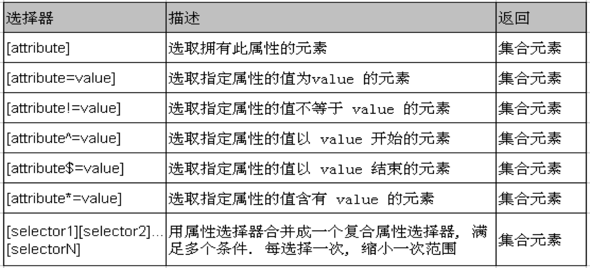

# jQuery，主讲：汤小洋

## 一、jQuery简介

### 1. 什么是jQuery

​	jQuery是一个优秀的JavaScript框架，是对JavaScript的封装，封装了许多方法，简化操作

​	jQuery实际上就是一个js文件，使用时只需要引入该js文件即可

​	理念：write less,do more

### 2. 版本

​	开发版：

+ `jquery-版本.js`
+ 完整无压缩版本，可读性高，主要用于开发、学习等

​    发布版：

+ `jquery-版本.min.js`
+ 压缩版本，文件小，可读性差，主要用于发布、上线等

## 二、使用jQuery

### 1. 基本用法

​    语法：`$(选择器).方法名()`

- $()：jQuery的核心函数，获取页面中元素对应的jQuery对象
- 选择器：指定需要操作的元素
- 方法名：jQuery中提供的方法

​    jQuery对象：
+ jQuery对象是指jQuery操作的对象，是jQuery独有的
+ jQuery对象可以使用jQuery中提供的方法，但不能使用DOM对象的方法
+ jQuery对象和DOM对象是不同的，但两者可以相互转换

​    页面加载：

- $(document).ready(callback)表示页面加载完成后执行的事件回调
- 可以简写为$(callback)

### 2. 对象转换

​	DOM对象转jQuery对象

- 语法：`$(DOM对象)`

​    jQuery对象转DOM对象
+ 语法：`jQuery对象[0]`或`jQuery对象.get(0)` 
+ jQuery对象是一个数组对象，获取数组中元素，得到的就是DOM对象

## 三、选择器

### 1. 基本选择器

通过元素的id、class和标签名来获取


### 2. 层次选择器

通过元素之间的层次关系来获取，如：后代元素、子元素、相邻元素、兄弟元素等


### 3. 属性选择器

通过元素的属性来获取



### 4. 过滤选择器

对获取到的元素进行过滤


## 四、jQuery的DOM操作

### 1. 简介

​	jQuery对JavaScript中的DOM操作进行了封装，特点：

- 将DOM中的属性替换为jQuery中的方法
- 大部分的方法既能获取值，也能设置值
- 支持链式操作

### 2. 查询操作

| 方法                          | 含义                                                         |
| ----------------------------- | ------------------------------------------------------------ |
| prev()                        | 查询当前节点的上一个节点                                     |
| next()                        | 查询当前节点的下一个节点                                     |
| siblings()                    | 查询当前节点的所有兄弟节点                                   |
| parent()                      | 查询当前节点的父节点                                         |
| children()                    | 获取当前节点的所有子节点                                     |
| each(function(index,element)) | 遍历节点集合，回调函数的参数分别表示：索引和当前遍历节点的DOM对象 |

### 3. 访问操作

#### 3.1 访问属性

| 方法             | 含义                         |
| ---------------- | ---------------------------- |
| attr(name,value) | 获取/设置元素的属性          |
| val(value)       | 获取/设置表单元素的value属性 |
| prop(name,value) | 获取/设置复选框的checked属性 |

#### 3.2 访问内容

| 方法        | 含义             |
| ----------- | ---------------- |
| html(value) | 将内容解析为HTML |
| text(value) | 将内容作为纯文本 |

#### 3.3 访问CSS

| 方法                  | 含义               |
| --------------------- | ------------------ |
| css(属性名,属性值)    | 获取/设置CSS样式   |
| addClass(类选择器)    | 为元素添加类选择器 |
| removeClass(类选择器) | 移除元素的类选择器 |

### 4. 节点操作

#### 4.1 创建节点

​	语法：

```javascript
var 节点对象 = $("<标签>");  // 返回节点的jQuery对象
var 节点对象 = $("<标签 属性名='属性值'>内容</标签>");	
```

#### 4.2 插入节点

| 方法                      | 含义                                                      |
| ------------------------- | --------------------------------------------------------- |
| node.append(newNode)      | 将一个新的节点newNode添加到指定的节点node中子节点的末尾   |
| node.prepend(newNode)     | 将一个新的节点newNode添加到指定的节点node中子节点的开始处 |
| node.after(newNode)       | 将一个新的节点newNode插入到node节点的后面                 |
| node.before(newNode)      | 将一个新的节点newNode插入到node节点的前面                 |
| node.replaceWith(newNode) | 将节点node替换为新的节点newNode                           |

#### 4.3 删除节点

| 方法     | 含义                                       |
| -------- | ------------------------------------------ |
| remove() | 删除节点，节点所包含的所有后代节点也会删除 |
| empty()  | 清空元素中的所有后代节点，节点本身不会删除 |

## 五、事件处理

### 1. 简介

jQuery对JavaScript中的事件进行了封装，特点：

- 将JavaScript中的事件属性替换为jQuery中的事件方法

### 2. 常用事件

| 事件方法    | 描述                                                         |
| ----------- | ------------------------------------------------------------ |
| click()     | 鼠标单击                                                     |
| mouseover() | 鼠标移到某元素之上                                           |
| mouseout()  | 鼠标从某元素上移开                                           |
| keydown()   | 某个键盘的键被按下去                                         |
| keypress()  | 某个键盘的键被按下去且松开                                   |
| keyup()     | 某个键盘的键被松开                                           |
| focus()     | 元素获得焦点                                                 |
| blur()      | 元素失去焦点                                                 |
| change()    | 域的内容发生改变，一般用于文件选择器和下拉列表               |
| submit()    | 表单提交前触发，回调函数返回true表示允许表单提交，返回false表示阻止表单提交 |

### 3. 绑定事件

​	两种方式：

- 使用事件方法 `jQuery对象.事件方法(function(){ })`
- 使用on()方法 `jQuery对象.on(事件类型,function(){ });`

## 六、其他操作

### 1. 数据操作

|     方法名      | 含义                      |
| :-------------: | ------------------------- |
| data(key,value) | 获取/设置对象上绑定的数据 |
| removeData(key) | 删除对象上绑定的数据      |

### 3. 自定义属性

​	html标签有预定义属性，也可以自定义属性，用于实现数据绑定和设置，一般命名格式：`data-xxx`

```html
<div id="username" data-id="9527" data-options="{age:20,sex:'male'}"></div>

<script>
  console.log($('#username').attr('data-id'));
  console.log($('#username').attr('data-options'));
</script>
```
