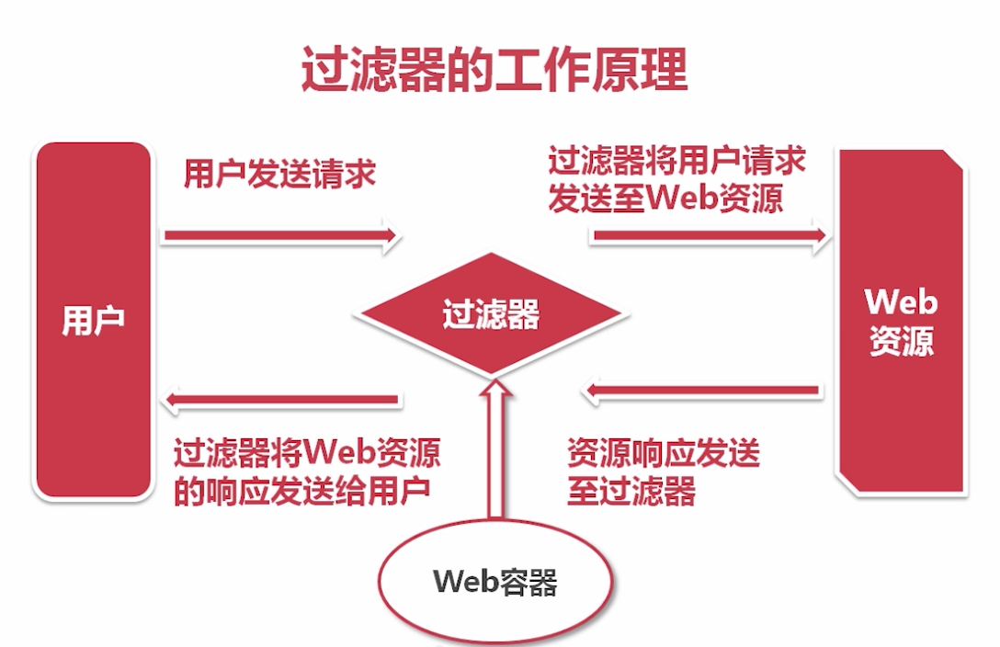
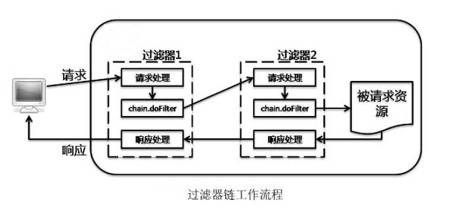

# JSP

## 一、JSP简介

### 1. 什么是JSP

​	Java Server Page，是指在HTML中嵌入Java代码，是一个以`.jsp`结尾的文件，用于简化页面的开发

​	JSP文件由Web服务器执行，转换为一个Servlet，然后将生成的页面信息响应给客户端

​	从本质上来讲，JSP就是一个Servlet

### 2. JSP执行过程

​	执行过程：

1. 客户端向服务器发送请求，请求访问JSP页面
2. 服务器将该JSP文件转换成Java文件，其实就是一个Servlet
3. 将Java文件编译生成字节码文件
4. 执行字节码文件，生成页面结果并响应给客户端

​    JSP转换后的Java代码的位置：

- Windows `~/.IntelliJIdea2018.1\system\tomcat\应用名\work`
- Mac `~/Library/Caches/IntelliJIdea2018.1/tomcat/应用名/work`

### 3. JSP与HTML

​	HTML：
+ 运行在客户端，是一个静态页面，用于显示页面中的内容
+ 页面中只能包含HTML标签、CSS样式、JavaScript代码
+ 无需部署到服务器上，可以通过本地进行访问

​    JSP：
+ 运行在服务端，是一个动态页面，由服务器动态生成页面的内容
+ 页面中还可以包含Java代码、JSP标签等
+ 必须部署到服务器上，通过服务器的方式进行访问

### 4. JSP与Servlet

​	JSP在执行时会被转换为Java代码，本质上就是一个Servlet

​	使用JSP可以替代原来Servlet中绘制页面的代码，简化页面的开发

​	一般都是将JSP和Servlet一起使用：

- 由JSP实现显示逻辑
- 由Servlet实现业务逻辑

## 二、JSP组成

​	JSP页面的元素包括：静态内容、指令、小脚本、表达式、声明、注释

### 1. 静态内容

​	HTML静态文本，如HTML标签、CSS样式、JavaScript脚本

### 2. 指令

​	语法：`<%@ 指令名 属性名="属性值" 属性名="属性值" %>`

​	常用指令：page、include、taglib

​	page指令用来设置整个页面的属性

- `<%@ page contentType="text/html;charset=UTF-8" language="java" import="java.util.*" %>`
- contentType 指定JSP页面所使用的编码
- language 指定JSP页面使用的语言，可以省略，默认就是java
- import 导入包

​    include指令用于将另一个页面引入到当前页面中

- `<%@ include file="路径">`

### 3. 小脚本

​	语法：`<% Java代码 %>`

​	用于在JSP中编写Java代码

### 4.  表达式

​	语法：`<%=表达式 %>`

​	用于在页面上输出数据，相当于打印的操作

### 5. 声明

​	语法： `<%! Java代码 %>`

​	用于在JSP中定义Java的变量和方法等

### 6. 注释


​	语法：`<%-- JSP注释 --%>`

​	用于在JSP中定义注释，也可以使用HTML注释：`<!-- HTML注释 -->`

## 三、JSP内置对象

### 1. 简介

​	JSP内置对象是Web容器创建的一组对象，可以在JSP页面直接使用，无需手动创建对象

​	内置对象有九个：request、response、pageContext、session、application、out、page、config、exception

### 2. 常用内置对象

​	request：
+ HttpServletRequest 请求对象
+ 封装了请求中的数据

​    response：
+ HttpServletResponse 响应对象
+ 封装了响应信息

​    pageContext：
+ PageContext 页面上下文对象
+ 表示当前页面的上下文，用于获取当前页面中的一些信息
+ 可以通过pageContext获取其他内置对象，如pageContext.getRequest()

​    session：

+ HttpSession 会话对象
+ 封装了会话信息

​    application：
+ ServletContext Servlet上下文对象
+ 表示整个应用程序，用于获取与整个应用相关的信息
+ 该对象在应用程序启动时实例化，有且只有一个

### 3. 四大作用域

​	作用域就是作用的范围，可以将数据存储到不同的作用域中，限定数据能够作用的范围

| 作用域      | 范围                            |
| ----------- | ------------------------------- |
| page        | 当前页面，通过pageContext来操作 |
| request     | 同一个请求                      |
| session     | 同一个会话                      |
| application | 整个应用                        |

​	在作用域中存取数据

| 方法名                                | 含义     |
| ------------------------------------- | -------- |
| setAttribute(String key,Object value) | 存储数据 |
| getAttribute(String key)              | 获取数据 |

### 4. 全局异常处理

​	通过配置处理整个工程中出现的异常

```xml
<error-page>
    <!-- 响应的状态码 -->
    <error-code>404</error-code>
    <!-- 出现异常时显示的页面 -->
    <location>/404.jsp</location>
</error-page>
```

## 四、状态管理

### 1. Cookie

#### 1.1 简介

​	Cookie是Web服务器保存在客户端的一系列文本信息，是客户端保存用户状态的一种技术

- 当服务器响应客户端时，会将少量的数据通过Cookie写入到客户端中
- 客户端将Cookie中的数据保存在硬盘上
- 当客户端再次访问服务器时，会将Cookie中的数据带入到请求中
- 服务器可以获取到请求中携带的Cookie数据

​     通过Cookie可以将数据在服务器和客户端之间来回的传递，进行数据的交互，实现用户状态的管理

​	注：可以通过浏览器的调试工具来查看客户端存储的Cookie信息

#### 1.2 基本操作 

​	创建Cookie：

+ 语法：`Cookie cookie = new Cookie(String key,String value)`
+ key表示保存数据的键，value表示保存数据的值
+ Cookie只能保存字符串

​    写入Cookie，将Cookie添加到客户端：

+ 语法：`response.addCookie(cookie)`

​    设置Cookie有效期：

- 语法：`cookie.setMaxAge(int seconds)` 单位为秒 
- 默认当会话结束后，则Cookie过期

​	设置Cookie存储的路径：

- 语法：`cookie.setPath(String uri)`  
- 默认值是产生cookie的应用的路径，该cookie默认只能在当前应用中共享

​    修改Cookie：

- 语法：`Cookie cookie = new Cookie(key,value)`
- 当添加一个与已经存在的Cookie的key相同的数据时，则会覆盖原来的，相当于是修改

​    删除Cookie：

- 语法： `cookie.setMaxAge(0)`
- 将Cookie的有效期设置为0，则Cookie会自动被删除

​    获取Cookie：

- 从请求中获取携带的所有Cookie数据

```java
Cookie[] cookies = request.getCookies();
for(Cookie cookie : cookies){
    System.out.println(cookie.getName()+"---"+ URLDecoder.decode(cookie.getValue(),"UTF-8")); // 解码
}
```

​	JS中获取Cookie

- 在客户端获取Cookie数据，借助于jQuery的cookie插件

#### 1.3 工具类

```java
public class CookieUtil {

    public static void addCookie(String name, String value, HttpServletResponse response){
        try {
            Cookie cookie = new Cookie(name, URLEncoder.encode(value,"UTF-8"));
            response.addCookie(cookie);
        } catch (UnsupportedEncodingException e) {
            e.printStackTrace();
        }
    }

    public static void addCookie(String name, String value, int maxAge,HttpServletResponse response){
        try {
            Cookie cookie = new Cookie(name, URLEncoder.encode(value,"UTF-8"));
            cookie.setMaxAge(maxAge);
            response.addCookie(cookie);
        } catch (UnsupportedEncodingException e) {
            e.printStackTrace();
        }
    }

    public static void removeCookie(String name,HttpServletResponse response){
        addCookie(name,"",0,response);
    }

    public static void modifyCookie(String name,String value,HttpServletResponse response){
        addCookie(name,value,response);
    }

    public static void modifyCookie(String name,String value,int maxAge,HttpServletResponse response){
        addCookie(name,value,maxAge,response);
    }

    public static String findByName(String name, HttpServletRequest request){
        Cookie[] cookies = request.getCookies();
        try {
            if(cookies != null){
                for(Cookie cookie : cookies){
                    if(cookie.getName().equals(name)){
                        return URLDecoder.decode(cookie.getValue(),"UTF-8");
                    }
                }
            }
        } catch (UnsupportedEncodingException e) {
            e.printStackTrace();
        }
        return null;
    }
}
```

#### 1.4 应用场景

​	场景：对特定对象的追踪、简化登陆

​	**实现自动登录：**当用户首次登录时需要输入用户名和密码，登录成功后使用Cookie保存用户的登录信息，并设置有效期为10分钟

​	在cookie有效期内，可无需登录直接进入主页面

```java
@WebServlet("/login")
public class LoginServlet extends HttpServlet {
    @Override
    protected void service(HttpServletRequest request, HttpServletResponse response) throws ServletException, IOException {
        String username = request.getParameter("username");
        String password = request.getParameter("password");

        if("admin".equals(username) && "123".equals(password)){
            CookieUtil.addCookie("username",username,600,response);
            CookieUtil.addCookie("password",password,600,response);
            request.getRequestDispatcher("WEB-INF/pages/main.jsp").forward(request,response);
        }else{
            request.setAttribute("errorMsg","用户名或密码错误");
            request.getRequestDispatcher("test06.jsp").forward(request,response);
        }
    }
}
```

```java
@WebServlet("/main")
public class MainServlet extends HttpServlet {
    @Override
    protected void service(HttpServletRequest request, HttpServletResponse response) throws ServletException, IOException {
        String username = CookieUtil.findByName("username",request);
        String password = CookieUtil.findByName("password",request);

        if("admin".equals(username) && "123".equals(password)){
            request.getRequestDispatcher("WEB-INF/pages/main.jsp").forward(request,response);
        }else{
            CookieUtil.removeCookie("username",response);
            CookieUtil.removeCookie("password",response);
            response.sendRedirect(request.getContextPath()+"/test06.jsp");
        }
    }
}
```

#### 1.5 Cookie限制

+ Cookie是客户端存储技术，且只能存储字符串
+ Cookie保存的数据大小有限制，一般在4K左右（和浏览器有关）
+ 明文存储，安全性较低
+ 浏览器可以禁用Cookie，禁用后将无法使用Cookie存储数据

### 2. Session

#### 2.1 简介

​	Session表示用户会话，一个会话就是浏览器与服务器之间的一次通话，包含浏览器与服务器之间的多次请求、响应过程

​	用于在服务器上存储用户会话的相关信息，是服务器保存用户状态的一种技术

- 当服务器接收到客户端的请求时，会查看请求头中是否存在一个名为`JSESSIONID`的cookie

    ​	如果不存在，默认会创建一个新的Session对象

    　如果存在，则返回该session id对应的Session对象

- 在服务器响应客户端时，会将session id保存到Cookie中，对应的key为`JSESSIONID`

​    通过Session可以在服务器上存储会话信息，记录会话状态，实现用户状态的管理

#### 2.2 基本操作

​	获取Session对象：

+ 语法：`request.getSession(boolean flag)`
+ true表示如果当前不存在对应的Session，则创建一个新的Session对象并返回，默认为true
+ false表示如果当前不存在对应的Session，则返回null

​    获取Session的id：

- 语法：`session.getId()`

　设置Session有效期：

- 语法：`session.setMaxInactiveInterval(int seconds)` 单位为秒
- 默认当会话结束后，则Session过期；如果会话不结束，则默认有效期为30分钟

​    向Session中存放数据：

+ 语法：`session.setAttribute(String key,Object value)`

​    获取Session中的数据：

+ 语法：`session.getAttribute(String key)`

​    删除Session中的数据：

+ 语法：`session.removeAttribute(String key)`

​    清空Session，使Session失效，一般在注销时使用：

+ 语法：`session.invalidate()`

#### 2.3 应用场景

​	场景：登录检查、存储数据、跨请求存储数据、验证码

​	**实现验证码**

```java
@WebServlet("/code")
public class CodeServlet extends HttpServlet {
    @Override
    protected void service(HttpServletRequest request, HttpServletResponse response) throws ServletException, IOException {

        Random random = new Random();

        //在内存中创建一个画板
        BufferedImage image = new BufferedImage(50,25,BufferedImage.TYPE_INT_RGB);

        //获取画笔
        Graphics graphics = image.getGraphics();

        //设置填充的背景
        //将填充的背景设置的与画板大小
        graphics.fillRect(0,0,50,25);

        //设置画笔的颜色
        //使用随机色
        graphics.setColor(new Color(random.nextInt(256),random.nextInt(256),random.nextInt(256)));

        //设置字体
        graphics.setFont(new Font("宋体",Font.BOLD+ Font.ITALIC,18));

        //设置验证码的内容
        //要求随机生成0-9a-z
        String s = "0123456789qwertyuiopasdfghjklzxcvbnm";
        StringBuffer code = new StringBuffer();
        for(int i = 0; i < 4; i++){
            code.append(s.charAt(random.nextInt(s.length())));
        }

        //将生成的随机数存放到session
        //方便使用的时候进行校验
        request.getSession().setAttribute("randCode",code.toString());
        graphics.drawString(code.toString(),5,18);
        System.out.println("验证码:"+code);

        //输出验证码图片
        OutputStream out = response.getOutputStream();

        ImageIO.write(image,"JPEG",out);
    }
}
```

### 3. Cookie和Session的区别

|          | coookie                      | session                                  |
| -------- | ---------------------------- | ---------------------------------------- |
| 存储位置 | 保存在客户端                 | 保存在服务器                             |
| 数据类型 | 只能保存字符串               | 可以保存任意类型                         |
| 数据大小 | 数据大小有限制，一般在4K左右 | 只要服务器内存够，理论上无限制           |
| 有效期   | 可以长期保存在客户端         | 随会话结束而关闭                         |
| 安全性   | 安全性较低                   | 安全性较高                               |
| 禁用操作 | 浏览器可以禁用Cookie         | Cookie被禁用后可以通过url重写操作Session |

## 五、EL和JSTL

目的：为了使JSP页面中不再出现Java代码

### 1. EL表达式

#### 1.1 简介

​	Expression Language（表达式语言），用于在JSP页面中操作数据， 简化JSP页面代码

​	语法：`${表达式}`

​	示例：

```java
${对象.属性} 或 ${对象[属性]}  // 访问对象的属性，本质上是调用对象的getXxx()方法
```

#### 1.2 访问作用域

​	访问作用域中存储的数据，语法：`${作用域访问对象.key}`

- 当省略作用域访问对象，直接使用`${key}`获取作用域数据时，表示在所有作用域中查找
- 按作用域从小到大的顺序进行查找：pageContext——>request——>session——>application 
- 如果找到，则返回数据，并停止查找
- 如果在所有的作用域中都未找到，则什么都不显示

| 作用域范围  | 作用域访问对象   |
| ----------- | ---------------- |
| page        | pageScope        |
| request     | requestScope     |
| session     | sessionScope     |
| application | applicationScope |

#### 1.3 EL隐式对象

​	可以在EL表达式中直接使用的对象，常用的EL隐式对象：

| 对象名称         | 描述                                                       |
| ---------------- | ---------------------------------------------------------- |
| pageScope        | 操作page作用域，就是作用域访问对象                         |
| requestScope     | 操作request作用域                                          |
| sessionScope     | 操作session作用域                                          |
| applicationScope | 操作application作用域                                      |
| param            | 相当于request.getParameter(key)                            |
| paramValues      | 相当于request.getParameterValues(key)                      |
| pageContext      | 相当于JSP中的内置对象pageContext，可以用来访问其他内置对象 |

注：访问应用路径`${pageContext.request.contextPath}`

#### 1.4 EL运算

​	算术运算、关系运算、逻辑运算、三目运算、空运算

```jsp
${2+6}<br/>
${4>2}<br/>
${name == "tom"} 或 ${name eq "tom"}<br/>
${4>2 && 2>5}<br/>
${4>2 || 2>5}<br/>
${6>2 ? "big" : "small"}<br/>
${empty user}<br/>
${not empty emp}<br/>
```

#### 1.5 JS中使用EL

​	可以在JavaScript中使用EL表达式

```html
<script>
  location.href='${pageContext.request.contextPath}/js/jquery.js';
  console.log('${user.name}');
</script>  
```

### 2. JSTL标签库

#### 2.1 简介

​	JSP Standard Tag Library（JSP标准标签库），用于在JSP页面中实现逻辑处理，如条件判断、循环等

​	提供了一系列的标签库，用于简化JSP页面代码，一般会将EL表达式和JSTL一起使用

#### 2.2 使用步骤

​	步骤：

1. 添加jar包

   `jstl-1.2.jar`

2. 引入JSTL标签库

   在JSP页面中使用taglib指令引入标签库

   `<%@ taglib prefix="c" uri="http://java.sun.com/jsp/jstl/core" %>`  核心标签库

   `<%@ taglib prefix="fmt" uri="http://java.sun.com/jsp/jstl/fmt" %>` 格式化标签库

3. 使用JSTL标签

   `<前缀:标签名></前缀:标签名>`

#### 2.3 常用标签

​	if标签：用于条件的判断

- 如果条件成立，则执行标签体的内容

 ```jsp
  <c:if test="条件">
      内容
  </c:if>
 ```

​    choose标签：用于条件的选择

- 如果条件1成立，则执行内容1，不再做其他判断

- 如果条件1不成立，则判断条件2，如果成立则执行内容2，不再做其他判断，以此类推...

- 如果所有条件都不成立，则执行otherwise标签体的内容

 ```jsp
  <c:choose>
      <c:when test="条件1">
          内容1
      </c:when>
      <c:when test="条件2">
          内容2
      </c:when>
      ...
      <c:otherwise>
          内容n
      </c:otherwise>
  </c:choose>
 ```

​    foreach标签：用于遍历集合数据

- 集合中元素的索引从0开始

```jsp
  <c:forEach items="集合" var="迭代变量" varStatus="当前遍历元素的状态" begin="起始索引" end="结束索引">
  	${迭代变量}    
  </c:forEach>
```

​    formatDate标签：用于格式化日期

- type属性，指定日期的类型格式，取值：

  date：只显示年月日，默认值

  time：只显示时分秒

  both：显示年月日时分秒

- pattern属性，自定义日期格式，如yyyy年MM月dd日

 ```jsp
  <fmt:formatDate value="日期值" type="日期类型" pattern="自定义格式"/>
 ```

## 六、过滤器

### 1. 简介

​	Filter过滤器，主要用来对Web资源的请求和响应进行拦截，并做一定的处理，是Java Web三大组件之一（ Servlet、Filter、Listener）

​	一般多用于在Servlet执行前/后做一些额外的处理操作

​	过滤器的工作原理：



### 2. 开发过滤器

​	步骤：

1. 定义一个类，实现Filter接口

2. 实现doFilter()方法

   过滤器的生命周期：实例化——>初始化init()——>执行过滤doFilter()——>销毁destory()

3. 配置过滤器

   基于web.xml文件

   ```xml
   <filter>
       <filter-name>HelloFilter</filter-name>
       <filter-class>filter.HelloFilter</filter-class>
   </filter>
   <filter-mapping>
       <filter-name>HelloFilter</filter-name>
       <url-pattern>/*</url-pattern>
   </filter-mapping>
   ```

   基于注解

   ```java
   @WebFilter("/*")
   ```

### 3. 过滤器链

​	过滤器链的工作流程：



### 4. 应用场景

​	Web开发中常用的过滤器应用场景：

- 中文处理，解决中文乱码
- 访问控制，对用户请求进行统一认证
- 对用户的访问请求进行记录和审核
- 对用户发送的数据进行过滤和替换
- 转换图像格式
- 对响应的内容进行压缩，减少传输量
- 对请求和相应进行加密处理

## 七、监听器

### 1. 简介

​	Listener监听器，用于在服务器端监听特定事件的发生，当事件触发时进行相应的处理

### 2. 开发监听器

​	步骤：

1. 创建一个类，实现相应的接口

   根据监听的事件的不同，实现不同的接口

   - ServletRequestListener 监听请求的创建和销毁
   - HttpSessionListener 监听会话的创建和销毁
   - ServletContextListener 监听Web应用的启动和销毁
   
2. 实现接口中的方法

3. 配置监听器
   基于web.xml文件

   ```xml
   <listener>
       <listener-class>监听器类的全名</listener-class>
   </listener>
   ```

   基于注解

   ```java
   @WebListener
   ```

## 八、文件处理

### 1. 文件上传

​	实现文件上传的要求

+ 表单提交方式必须使用`method="post"`
+ 表单数据传输的方式必须使用`enctype="multipart/form-data"`

​    使用commons-fileupload

​    注：开发中上传的文件都是保存在磁盘上，数据库中添加一个字段，保存文件的存储路径

### 2. 文件下载

​	两种方式：

- 使用物理路径
- 使用二进制流

## 九、log4j日志

### 1. 简介

​	logger for Java

+ 是Apache开源的用于记录日志的工具
+ 在开发中所做的操作都应尽可能的进行日志记录，有价值的日志能够快速帮我们定位问题所在
+ 我们可以控制日志输出的位置
  + 控制台
  + 文件
  + 数据库
  + ...

### 2. 用法

​	步骤：

1. 添加jar包

   `log4j-1.2.14.jar`

2. 创建配置文件

   在src目录下创建一个名为`log4j.properties`的文件，名称固定

3. 在`log4j.properties`中进行日志的配置

    不同的日志配置决定了日志记录的信息

4. 通过`Logger`类进行日志的记录操作

### 3. 详解

​	日志等级：

+ debug:调试消息日志
+ info:普通消息日志
+ warn:警告消息日志
+ error:错误消息日志
+ fatal:灾难消息日志

​    Appender：表示日志记录器，控制日志记录的位置

+ ConsoleAppender 将日志记录在控制台
+ FileAppender 将日志记录在文件中
+ JDBCAppender 将日志记录在数据库中

​    Layout：表示日志布局，控制日志的输出格式

+ SimpleLayout 基本格式

+ HTMLLayout 打印的是一个HTML表格格式

+ PatternLayout 自定义格式


## 十、商城管理系统

### 1.需求设计

```
功能：
1.用户功能
	用户登陆、用户注册、注销
2.商品功能
	商品展示
3.购物车
	添加到购物车
```

### 2.数据库设计

```
t_user 用户表
  id
  username
  password
  phone
  address

t_product 商品表
  id 
  name
  price 

t_order 订单表
  id
  no
  price
  user_id

t_item 明细表
  id
  product_id
  num
  price
  order_id
```

```sql
drop database if exists shop;
create database shop charset utf8;
use shop;

create table t_user(
  id int primary key auto_increment,
  username varchar(20),
  password varchar(50),
  phone varchar(20),
  address varchar(100)
)charset utf8;

create table t_product(
  id int primary key auto_increment,
  name varchar(20),
  price double
)charset utf8;

create table t_order(
  id int primary key auto_increment,
  no varchar(20),
  price double,
  user_id int,
  foreign key (user_id) references t_user(id)
)charset utf8;

create table t_item(
  id int primary key auto_increment,
  product_id int,
  num int,
  price double,
  order_id int,
  foreign key (product_id) references t_product(id),
  foreign key (order_id) references t_order(id)
)charset utf8;
```

