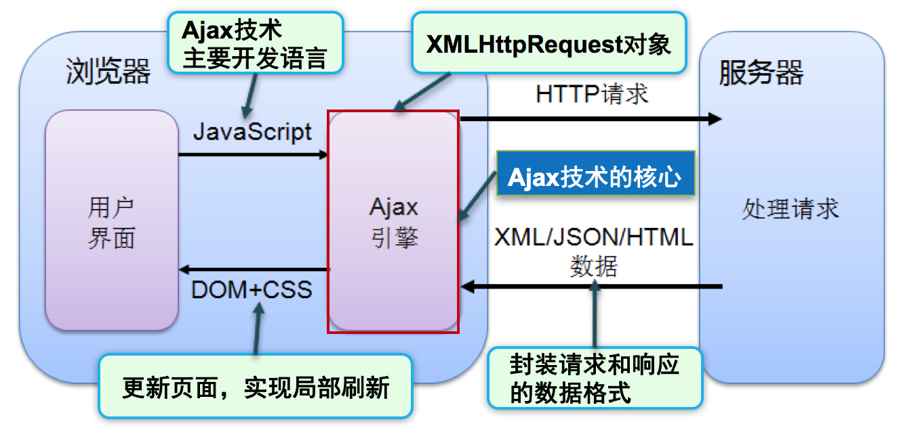

# Ajax

## 一、Ajax简介

### 1. 什么是Ajax

​	Asynchronous JavaScript And Xml（异步JavaScript和XML）

​	Ajax是一种局部刷新页面的技术，在无需重新加载整个网页的情况下，能够更新网页的部分内容。

### 2. 传统Web与Ajax的差异

|                | 传统Web                                              | AJAX                                         |
| -------------- | ---------------------------------------------------- | -------------------------------------------- |
| 发送请求方式   | 使用表单或超链接，发送同步请求                       | 使用XMLHttpRequest对象，发送异步请求         |
| 服务器响应内容 | 完整的页面                                           | 只响应需要的数据                             |
| 客户端处理方式 | 需等待服务器响应完成并重新加载页面后用户才能进行操作 | 可以动态更新页面内容，用户无需等待请求的响应 |

同步请求和异常请求：

- 同步请求：在服务端响应之前浏览器处于阻塞状态，等待服务端响应，此时不能进行交互操作
- 异步请求：在服务端响应之前浏览器可以执行其他操作，无需等待服务器响应

### 3. Ajax执行流程



​	流程：

1. 客户端使用JavaScript提供的XMLHttpRequest对象，异步的向服务器发送请求
2. 服务器处理请求后，以字符串、JSON等形式只返回数据，而非返回整个页面
3. 客户端接收服务器返回的数据，并使用DOM动态更新页面，实现局部刷新

## 二、XMLHttpRequest对象

### 1. 常用属性

​	readyState：

- 表示XMLHttpRequest对象的状态，取值：

  | 状态码 | 含义                                                   |
  | ------ | ------------------------------------------------------ |
  | 0      | XMLHttpRequest对象已经创建，还没有完成初始化           |
  | 1      | XMLHttpRequest对象开始发送请求                         |
  | 2      | XMLHttpRequest对象发送请求完成                         |
  | 3      | XMLHttpRequest对象开始读取响应，还没有结束             |
  | 4      | XMLHttpRequest对象读取响应结束，可以对响应结果进行处理 |

​    status：

- 表示Http请求响应的状态，取值：

  | 状态码 | 含义                                 |
  | ------ | ------------------------------------ |
  | 200    | 请求成功，服务器响应正常             |
  | 400    | 客户端请求的语法错误，服务器无法理解 |
  | 403    | 服务器拒绝执行此请求，如权限不足     |
  | 404    | 请求的资源不存在                     |
  | 500    | 服务器内部错误                       |

​    responseText：

+ 获取响应的文本内容

### 2. 常用方法

​	open(method,url,async)：

- 用来建立与服务器的连接，参数：

  | 参数   | 含义                                |
  | ------ | ----------------------------------- |
  | method | 请求方式，取值：get（默认）、post   |
  | url    | 请求地址                            |
  | async  | 是否异步，取值：true（默认）、false |

​    send()：

- 用来发送请求

### 3. 常用事件

​	onreadystatechange：

- 指定回调函数，当readyState状态改变时触发
- 只有当readyState是4，并且status是200的时候，才能处理服务器响应的数据

## 三、响应Ajax请求

### 1. 返回普通字符串

```java
PrintWriter out = response.getWriter();
out.print("");
out.close();
```

### 2. 返回JSON

​	Fastjson是阿里巴巴的开源JSON解析库，可以将Java对象转换为JSON字符串，也可以将JSON字符串转换为Java对象

​	常用方法：

- String toJSONString(Object object)  

- T parseObject(String text, Class<T> clazz)

    注：可以使用`@JSONField(format = "yyyy-MM-dd HH:mm:ss")`，用在Date属性上，自动格式化日期

### 3. 自定义响应对象

​	ResponseResult / AjaxResult

```java
public class ResponseResult {
    //响应状态码
    private int status;
    //响应消息
    private String message;
    //返回数据
    private Object data;
		...
}
```

## 四、jQuery实现Ajax

### 1. $.ajax()

​	语法：`$.ajax(settings)`

- settings是一个以{key:value}组成的Ajax请求设置，常用选项：

  | 选项     | 含义                                              |
  | -------- | ------------------------------------------------- |
  | type     | 请求方式，取值：get（默认）、post                 |
  | url      | 请求地址                                          |
  | data     | 请求参数，即发送给服务器的数据                    |
  | dataType | 响应的数据类型，取值：text（默认）、json、jsonp等 |
  | success  | 请求成功后执行的回调函数                          |
  | error    | 请求失败时执行的回调函数                          |

### 2. $.get()

​	以get方式发送Ajax请求

​	语法：`$.get(url[,data][,success][,dataType])`

### 3. $.post()

​	以post方式发送Ajax请求

​	语法：`$.post(url[,data][,success][,dataType])`

### 4. $.getJSON()

​	以get方式发送Ajax请求，响应JSON数据
​	语法：`$.getJSON(url[,data][,success])`

## 五、Ajax跨域

### 1. 简介

​	当访问的资源URL与当前URL的`协议、域名、端口`三者有任何一个不一样时，称为跨域

​	浏览器的同源策略：要求所访问资源的协议名、域名、端口必须完全相同，不允许XMLHttpRequest发送跨域请求

​	解决跨越的两种方式：

- CORS
- JSONP

### 2. CORS

​	CORS是一个W3C标准，全称是Cross-Origin Resource Sharing 跨域资源共享

​	它允许浏览器向跨源服务器发出XMLHttpRequest请求，需要设置服务器端允许跨域请求

```java
response.setHeader("Access-Control-Allow-Origin", "*"); // 允许任何域的跨域请求
```

### 3. JSONP

​	全称是JSON With Padding

​	原理：

- 虽然XMLHttpRequest无法跨越，但HTML的标签是支持跨域的，如`<script src="">、<iframe src="">`等
- 通过HTML标签向服务器发送一个包含callback参数的跨域请求，服务端返回数据时将这个callback参数作为函数名来包裹住JSON数据
- 客户端提供一个对应的callback回调函数，处理服务器返回的数据

​    jQuery实现JSONP，语法：

- 使用$.ajax()，只需要指定dataType为jsonp即可

```javascript 
$.ajax({
    type: 'get',  // JSONP只支持get方式发送请求
    url: 'http://127.0.0.1:8080/ajax/hello', // 访问另一个域的资源
    dataType: 'jsonp',
    success: function (result) {
        console.log(result);
    }
});
```

### 4. API数据接口

​	提供数据服务的API接口。可以让开发者在无需理解内部细节的情况下，调用他人提供的资源，简单、高效的获取数据。

​	常用API数据平台：

- 聚合数据 		https://www.juhe.cn
- 阿里云数据 	https://market.aliyun.com/data
- 极速数据		http://www.jisuapi.com
- HaoService	http://www.haoservice.com

## 六、前端模板引擎

### 1. 简介

​	产生原因：

- 在前端更新页面时，字符串的拼接非常繁琐
- 用户界面与业务数据（内容）混合在一起

​    前端模板引擎：

- 可以使用户界面与业务数据分离
- 自动将数据填充到模板中，然后返回想要的html，显示到页面上
- 提高开发效率

​    artTemplate是腾讯开源的前端模板引擎，高性能，语法简洁。

### 2. 用法

​	参考：https://gitee.com/tangyang8942/artTemplate

​	使用步骤：

1. 引用模板引擎js

   ```html
   <script src="js/template.js"></script>
   ```

2. 定义模板，使用一个`type="text/html"`的script标签

   ```html
   <script id="test" type="text/html">
     <h1>{{title}}</h1>
     <ul>
         {{each list as value i}}
             <li>索引 {{i + 1}} ：{{value}}</li>
         {{/each}}
     </ul>
   </script>
   ```

3. 渲染模板

   ```javascript
   var data = {
   	title: '标签',
   	list: ['文艺', '博客', '摄影', '电影', '民谣', '旅行', '吉他']
   };
   var html = template('test', data);
   document.getElementById('content').innerHTML = html;
   ```

   