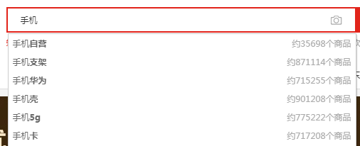

# javaScript高级

## 1.核心知识点

1. 正则表达式概念
2. 正则表达式js中的使用
3. 正则表达式的特殊字符
4. 正则表达式的替换

## 2.学习目标

1. 能够说出正则表达式的作用
2. 能够写出简单的正则表达式
3. 能够使用正则表达式对表单验证
4. 能够使用正则表达式替换内容

## 3.开始学习

### 1. 正则表达式

#### 1.1概念

```js
正则表达式: 用来匹配字符串中字符组合的模式,在js中,正则表达式也是一个对象.

在线验证正则表达式:
https://c.runoob.com/front-end/854
```

#### 1.2作用

1. 验证表单 

   ```js
   1. 注册信息填写手机号: 
   https://mail.163.com/register/index.htm?from=force/&cmd=register.entrance
   
   2. 注册信息填写身份证号信息:
   https://apply.bjhjyd.gov.cn/apply/user/person/register.html
   ```

2. 过滤(替换)页面中的敏感词

3. 提取(京东搜索演示)

   

#### 1.3特点

1. 灵活性,逻辑性强
2. 可以快速实现匹配字符串的控制
3. 实际开发中,一般都是复制写好的正则表达式,能够根据需求会修改即可

### 2.正则表达式使用

#### 1.1 创建

```js
let reg =  / /;
注意:
1. 不需要加引号
```

#### 1.2检测正则表达式

```js
正则表达式.test(str);

备注:
test()正则表达式中一个方法,检测是否匹配正则规则,返回布尔类型的结果,true 表示符合 false 表示不符合
exec()正则表达式中一个方法,检测是否匹配正则规则, 如果不匹配返回null
例如:
var reg = /123/;
reg.test('123');
reg.exec('123456');
```

### 3. 正则表达式字符

#### 1.0正则表达式基本语法介绍

```js
简单模式:
let reg = /abc/;

解释: 表示一个值中只要包含连续三个值是abc就可以
例如:
let reg = /abc/;
let str = '123abc123';
console.log(reg.test(str));  

let str = 'abc123';
console.log(reg.test(str));  

let str = '123abc';
console.log(reg.test(str)); 

let str = '1a2b3c';
console.log(reg.test(str)); 

let str = 'aabbcc';
console.log(reg.test(str)); 
```

#### 1.1 边界符

- `^ `符号

```js
^: 匹配输入的开始,以谁开始
例如:
//规则: 以小写字母a开始就可以
let reg = /^a/;
let str = 'Abc';
console.log(reg.test(str));  

let str = 'Aabc';
console.log(reg.test(str));  

let str = 'abc';
console.log(reg.test(str));

let str = 'aabc';
console.log(reg.test(str));  

let str = 'a';
console.log(reg.test(str));  


思考:举一反三

//规则: 以数字1开始就可以
let reg = '^1';
let str = 123;
console.log(reg.test(str));  

let str = 2123;
console.log(reg.test(str));  

//规则: 以字母abc开始就可以
let reg = '^abc';
let str = 'abc';
console.log(reg.test(str)); 

let str = 'a123b123c';
console.log(reg.test(str));  

let str = 'aabbcc';
console.log(reg.test(str)); 

let str = 'abc123abc';
console.log(reg.test(str)); 
```

- `$`

  ```js
  $: 匹配输入的结束
  
  例如:
  // 规则:  匹配以小写字母a结束
  let reg = /a$/;
  let str = 'apple';
  console.log(reg.test(str));  
  
  let str = 'appleA';
  console.log(reg.test(str));  
  
  let str = 'appleaa';
  console.log(reg.test(str)); 
  
  let str = 'a';
  console.log(reg.test(str));
  
  
  //举一反三:
  let reg = /中国$/;
  let str = '我爱你中国';
  console.log(reg.test(str));  
  
  let str = '中国我爱你中国';
  console.log(reg.test(str)); 
  
  let str = '中国我爱你';
  console.log(reg.test(str)); 
  
  let str = '中我爱你国';
  console.log(reg.test(str)); 
  ```

- **思考题:**

  ```js
  //规则: 以小写字母a开始,以小写字母a结束	,那就是字母a,不能有其他的
  let reg = /^a$/;
  
  let str = 'a';
  console.log(reg.test(str)); 
  
  let str = 'aa';
  console.log(reg.test(str)); 
  
  
  
  //规则: 以abc开始以abc结束,就是abc不能有其他的
  let reg = /^abc$/;
  let str = 'abc';
  console.log(reg.test(str)); 
  
  
  let str = 'aabbcc';
  console.log(reg.test(str)); 
  
  
  let str = '123abc123';
  console.log(reg.test(str)); 
  ```

#### 1.2字符集

- `[]`

  ```js
  []: 一个字符集合。匹配方括号中的任意字符
  
  例如:
  //规则: 匹配 abcd中任意一个字符
  let reg = /[abcd]/;
  let str = 'a';
  console.log(reg.test(str)); 
  
  let str = 'b';
  console.log(reg.test(str)); 
  
  let str = 'ac';
  console.log(reg.test(str)); 
  
  let str = 'bfc';
  console.log(reg.test(str));  
  
  let str = 'efg';
  console.log(reg.test(str)); 
  
  let str = 'Abc';
  console.log(reg.test(str)); 
  
  let str = 'A';
  console.log(reg.test(str)); 
  ```

- 思考题:

  ```js
  //规则: 适配以a,b,c三个中任意一个开始
  let reg = /^[abc]/;
  let str = 'a';
  console.log(reg.test(str)); 
  
  
  let str = 'buffa';
  console.log(reg.test(str)); 
  
  let reg = /^[abc]/;
  let str = 'cccc';
  console.log(reg.test(str)); 
  
  
  
  //规则: 必须是 a, b, c 三个字母中的一个,有其他的不行, 三选一
  let reg = /^[abc]$/;
  let str = 'cccc';
  console.log(reg.test(str)); 
  
  
  let str = 'a';
  console.log(reg.test(str)); 
  
  let str = 'ab';
  console.log(reg.test(str)); 
  ```

- `[-]`

  ```js
  [-]: 表示范围
   
  例如:
  //规则: 匹配 a 到 f 之间的任意一个
  let reg = /[a-f]/;
  let str = 'abcdef';
  console.log(reg.test(str));  
  
  let str = 'ag';
  console.log(reg.test(str));
  
  let str = 'g';
  console.log(reg.test(str)); 
  
  
  
  举一反三:
  //规则: 以 a - f 中任意一个字母开头
  let reg = /^[a-f]/;
  let str = 'ga';
  console.log(reg.test(str));
  
  let str = 'afa';
  console.log(reg.test(str)); 
  
  let str = 'efg';
  console.log(reg.test(str));
  
  
  //规则: 必须是 a - f 中的任意一个字母, 多选一
  let reg = /^[a-f]$/;
  let str = 'efg';
  console.log(reg.test(str));
  
  let str = 'af';
  console.log(reg.test(str)); 
  
  let str = 'c';
  console.log(reg.test(str));
  ```

- 课堂案例

  1.  用户名中包含 a到z  或者  A 到Z      正则如何写?

     ```js
     let reg = /[a-zA-Z]/
     ```

  2.  用户名中只能包含  a到z  或者 A到Z 中的一个字母    正则如何写?

     ```js
     let reg = /^[a-zA-Z]$/
     ```

  3. 用户名中包含  a到z  或者  A 到Z   或者 0 - 9   正则如何写?

     ```js
     let reg = /[a-zA-Z0-9]/
     ```

- `^`取反

  ```js
  //规则: 匹配只要不是 abc这三个字母中的任何一个都可以
  let reg = /[^abc]/;
  let str = 'a';
  console.log(reg.test(str));  
  
  let str = 'd';
  console.log(reg.test(str)); 
  
  let str = 'def';
  console.log(reg.test(str)); 
  
  
  举一反三:
  //规则: 只要不是以 a b c 三个字母中任意一个字母开头就可以
  let reg = /^[^abc]/;
  let str = 'def';
  console.log(reg.test(str)); 
  
  let str = 'abc';
  console.log(reg.test(str)); 
  
  let str = 'cawq';
  console.log(reg.test(str));
  ```

#### 1.3量词符

- `*`

  ```js
  出现次数 >= 0
  
  //匹配: 字母a出现次数 >= 0     备注:要出现只能出现a,不能有其他的字符
  let  reg = /^a*$/;
  let str = 'aaa';
  console.log(reg.test(str));
  
  
  let str = '';
  console.log(reg.test(str)); 
  
  
  let str = 'bcf';
  console.log(reg.test(str));
  
  
  举一反三:
  
  //匹配: a - z 中任意一个字母出现次数 >=0次
  let  reg = /^[a-z]*$/;
  let str = '123abcdef123';
  console.log(reg.test(str)); 
  
  let str = '';
  console.log(reg.test(str));
  
  let str = 'aabbcc';
  console.log(reg.test(str));
  ```

- `+`

  ```js
  出现次数 >= 1
  
  //匹配: 字母a出现次数 >= 1    要出现只能出现字母a
  let  reg = /^a+$/;
  let str = 'bcf';
  console.log(reg.test(str));  
  
  let str = '';
  console.log(reg.test(str)); 
  
  let str = 'aabb';
  console.log(reg.test(str)); 
  
  let str = 'aa';
  console.log(reg.test(str));
  
  
  举一反三:
  //匹配: a - z 中任意一个字母出现次数最少一次
  let reg = /^[a-z]+$/;
  let str = '';
  console.log(reg.test(str));
  
  
  let str = 'abcdef';
  console.log(reg.test(str));
  
  
  let str = 'aabbccddeeff';
  console.log(reg.test(str)); 
  
  
  let str = '123abcdef123';
  console.log(reg.test(str));
  ```

- `?`

  ```js
  出现次数 1次 或者 0次
  // 匹配: 字母a出现1次或者0次
  let reg = /^a?$/;
  let str = 'aa';
  console.log(reg.test(str)); 
  
  let str = 'a';
  console.log(reg.test(str));
  ```

- `{n}`

  ```js
  出现具体n次
  
  //匹配: 字母a必须出现3次
  let reg = /^a{3}$/;
  let str = 'a';
  console.log(reg.test(str));
  
  let str = 'aa';
  console.log(reg.test(str)); 
  
  let str = 'aaa';
  console.log(reg.test(str)); 
  
  let str = '';
  console.log(reg.test(str)); 
  
  let str = 'bdc';
  console.log(reg.test(str)); 
  ```

- `{n,}`

  ```js
  出现大于等于 n 次
  
  // 匹配: 字母a出现的次数大于等于3
  let reg = /^a{3,}$/;
  let str = 'a';
  console.log(reg.test(str)); 
  
  let str = 'aa';
  console.log(reg.test(str)); 
  
  let str = 'aaa';
  console.log(reg.test(str)); 
  
  let str = 'aaaaaa';
  console.log(reg.test(str)); 
  ```

- `{n,m}`

  ```js
  出现次数大于等于 n 小于等于m
  // 匹配: 字母a出现的次数大于等于3小于等于4次
  let reg = /^a{3,4}$/;
  let str = 'aaa';
  console.log(reg.test(str)); 
  
  
  let str = 'aaaa';
  console.log(reg.test(str)); 
  
  
  let str = 'aa';
  console.log(reg.test(str)); 
  
  let str = 'aaadc';
  console.log(reg.test(str)); 
  
  let str = '';
  console.log(reg.test(str)); 
  
  注意: 数字之间不能出现空格
  
  
  举一反三:
  //匹配: 字母 a-c 出现总次数等于4   (从字面a-c中只能选4个值)
   let reg = /^[a-c]{4}$/;
   let str = 'aaaa';
   console.log(reg.test(str));
  
    let str = 'aaaabbbb';
    console.log(reg.test(str));
  
   let str = 'abca';
   console.log(reg.test(str));
  
   let str = 'aacc';
   console.log(reg.test(str));
  
  //匹配: 字母 a - c 出现总次数大于等于4   (从字面a-c中最少选出4个)
  let reg = /^[a-c]{4,}$/;
  let str = 'aaa';
  console.log(reg.test(str));  
  
  let str = 'aaaabbbb';
  console.log(reg.test(str));  
  
  let str = 'abcdffff';
  console.log(reg.test(str)); 
  
  let str = 'hjkl';
  console.log(reg.test(str));  
  
  
  //匹配: 字母 a -c 出现次总次数 大于等于2 小于等于5  (从字面a-c中最少选出2个到5个)
  let reg = /^[a-c]{2,5}$/;
  let str = 'aaa';
  console.log(reg.test(str)); 
  		  
  let str = 'aaaabbbb';
  console.log(reg.test(str)); 
  
  let str = 'hjkl';
  console.log(reg.test(str));
  
  
  思考:
  //匹配: abc三个字母中c连续出现3次
  let reg = /^abc{3}$/;
  let str = 'abcabcabc';
  console.log(reg.test(str));
  
  let str = 'abccc';
  console.log(reg.test(str));
  
  
  //匹配: abc三个字母整体连续出现三次
  let reg = /^(abc){3}$/;
  let str = 'abcabcabc';
  console.log(reg.test(str));
  ```


### 4. 用户名案例

#### 1.1 呈现要求

- 如果用户名输入合法,则提示信息为:用户名合法,颜色为绿色
- 如果用户名输入不合法,提示用户名不符合规范,颜色为红色

#### 1.2具体实现

```js
// 要求:用户名只能为英文字母,数字,下划线组成,且用户名长度为6-16位
let reg = /^[a-zA-Z0-9_]{6,16}$/;
//获取当前输入框
let int = document.querySelector('input');
int.onfocus = function() {
	this.value = '';
}
int.onblur = function() {
	let v = this.value;
	if(reg.test(v)) {
	 	this.style.borderColor = 'green';
	 }else {
	 	this.style.borderColor = 'red';
	 	this.value = '输入有误';
	 }
}
```

### 5.预定义类

```js
备注: 使用在线工具演示即可
```

#### 1.1  数字类

```js
\d :  匹配0-9之间的任意一个数字  相当于 [0-9]
\D:   匹配0-9以外的所有字符     相当于[^0-9]
```

#### 1.2 字符类

```js
\w :  匹配任意的字母,数字和下划线  相当于 [a-zA-Z0-9_]
\W :  除所有的字母,数字,和下划线以外的字符  相当于 [^a-zA-Z0-9_]
```

#### 1.3特殊符号(了解)

```js
\s: 匹配空格(包含换行符,制表符,空格符等)    相当于[\t\r\n\v\f]
                                
\S: 匹配除特殊字符外      相当于[^\t\r\n\v\f]
```

### 6.正则替换

#### 1.1语法

```js
字符串.replace(正则表达式,替换为哪个值);
字符串.replace(要被替换的值,替换后的值);
```

#### 1.2正则参数

```js
//[switch]
g : 全局匹配 (global)  
如果不带g，正则过程中字符串从左到右匹配，找到第一个符合条件的即匹配成功，返回
如果带g，则字符串从左到右，找到每个符合条件的都记录下来，直到字符串结尾位置
例如:
let reg = /abc/g;
let str = 'abcdefabc';
console.log(reg.exec(str));
console.log(reg.exec(str));

i: 忽略大小写 (ignore)
例如: 
let reg = /a/i;
console.log(reg.test('A'));

gi: 全局忽略大小写
let reg = /a中国/gi;
console.log(reg.test('A中国'));

课堂案例:
let tar = document.querySelector('textarea');
let btn = document.querySelector('input');
let div = document.querySelector('div');
btn.onclick = function() {
	let v = tar.value;
	let reg = /[日本狗2B]/gi;
	v = v.replace(reg, '*');
	div.innerHTML = v;
}
```


