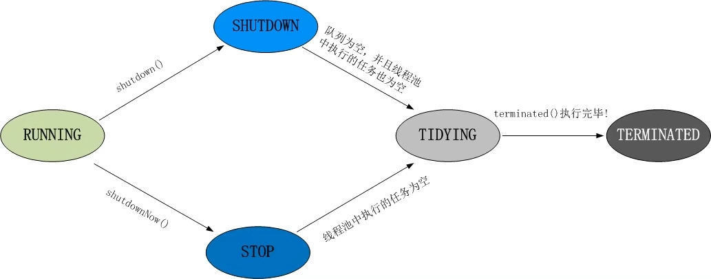
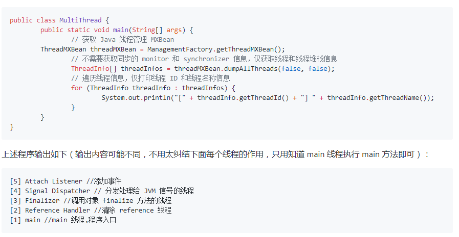
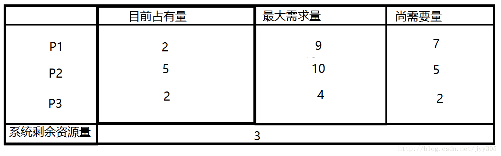
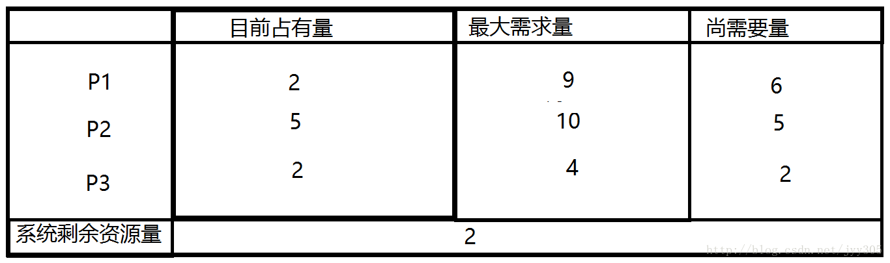

# 16. 多线程

## 1.  线程池都有哪些状态 ？

- 线程池的5种状态：
  - Running
  - ShutDown
  - Stop
  - Tidying
  - Terminated。

- 线程池各个状态切换框架图：



### RUNNING

1. 状态说明：线程池处在RUNNING状态时，能够接收新任务，以及对已添加的任务进行处理。

2. 状态切换：线程池的初始化状态是RUNNING。换句话说，线程池被一旦被创建，就处于RUNNING状态，并且线程池中的任务数为0！

   ```java
   private final AtomicInteger ctl = new AtomicInteger(ctlOf(RUNNING, 0));
   ```

### SHUTDOWN

1. 状态说明：线程池处在SHUTDOWN状态时，不接收新任务，但能处理已添加的任务。

2. 状态切换：调用线程池的shutdown()接口时，线程池由RUNNING -> SHUTDOWN。

### STOP

1. 状态说明：线程池处在STOP状态时，不接收新任务，不处理已添加的任务，并且会中断正在处理的任务。

2. 状态切换：调用线程池的shutdownNow()接口时，线程池由(RUNNING or SHUTDOWN ) -> STOP。

### TIDYING

1. 状态说明：当所有的任务已终止，ctl记录的”任务数量”为0，线程池会变为TIDYING状态。当线程池变为TIDYING状态时，会执行钩子函数terminated()。terminated()在ThreadPoolExecutor类中是空的，若用户想在线程池变为TIDYING时，进行相应的处理；可以通过重载terminated()函数来实现。

2. 状态切换：当线程池在SHUTDOWN状态下，阻塞队列为空并且线程池中执行的任务也为空时，就会由 SHUTDOWN -> TIDYING。

   当线程池在STOP状态下，线程池中执行的任务为空时，就会由STOP -> TIDYING。

### TERMINATED

1. 状态说明：线程池彻底终止，就变成TERMINATED状态。

2. 状态切换：线程池处在TIDYING状态时，执行完terminated()之后，就会由 TIDYING -> TERMINATED。

## 2. 进程

- 进程是程序的一次执行过程，是系统运行程序的基本单位，因此进程是动态的。系统运行一个程序即是一个进程从创建，运行到消亡的过程。

- 在 Java 中，当我们启动 main 函数时其实就是启动了一个 JVM 的进程，而 main 函数所在的线程就是这个进程中的一个线程，也称主线程。

- 如下图所示，在 windows 中通过查看任务管理器的方式，我们就可以清楚看到 window 当前运行的进程（.exe 文件的运行）。


## 3. 线程?

- 线程与进程相似，但线程是一个比进程更小的执行单位。一个进程在其执行的过程中可以产生多个线程。与进程不同的是同类的多个线程共享进程的堆和方法区资源，但每个线程有自己的程序计数器、虚拟机栈和本地方法栈，所以系统在产生一个线程，或是在各个线程之间作切换工作时，负担要比进程小得多，也正因为如此，线程也被称为轻量级进程。

- Java 程序天生就是多线程程序，我们可以通过 JMX 来看一下一个普通的 Java 程序有哪些线程，代码如下。



- 从上面的输出内容可以看出：一个 Java 程序的运行是 main 线程和多个其他线程同时运行。

## 4. Thread类的sleep()方法和对象的wait()方法都可以让线程暂停执行，它们有什么区别？ 

- sleep()方法（休眠）是线程类（Thread）的静态方法，调用此方法会让当前线程暂停执行指定的时间，将执行机会（CPU）让给其他线程，但是对象的锁依然保持，因此休眠时间结束后会自动恢复（线程回到就绪状态，请参考第66题中的线程状态转换图）。

- wait()是Object类的方法，调用对象的wait()方法导致当前线程放弃对象的锁（线程暂停执行），进入对象的等待池（wait pool），只有调用对象的notify()方法（或notifyAll()方法）时才能唤醒等待池中的线程进入等锁池（lock pool），如果线程重新获得对象的锁就可以进入就绪状态。

## 5. 怎么防止死锁？

### 5.1. **一、什么是死锁**

- 死锁是指多个进程因竞争资源而造成的一种僵局（互相等待），若无外力作用，这些进程都将无法向前推进。例如，在某一个计算机系统中只有一台打印机和一台输入 设备，进程P1正占用输入设备，同时又提出使用打印机的请求，但此时打印机正被进程P2 所占用，而P2在未释放打印机之前，又提出请求使用正被P1占用着的输入设备。这样两个进程相互无休止地等待下去，均无法继续执行，此时两个进程陷入死锁状态。

### 5.2.  **死锁产生的原因**

1. 系统资源的竞争

系统资源的竞争导致系统资源不足，以及资源分配不当，导致死锁。

2. 进程运行推进顺序不合适

进程在运行过程中，请求和释放资源的顺序不当，会导致死锁

### 5.3. **死锁的四个必要条件**

- 互斥条件：一个资源每次只能被一个进程使用，即在一段时间内某 资源仅为一个进程所占有。此时若有其他进程请求该资源，则请求进程只能等待。

- 请求与保持条件：进程已经保持了至少一个资源，但又提出了新的资源请求，而该资源 已被其他进程占有，此时请求进程被阻塞，但对自己已获得的资源保持不放。

- 不可剥夺条件:进程所获得的资源在未使用完毕之前，不能被其他进程强行夺走，即只能 由获得该资源的进程自己来释放（只能是主动释放)。

- 循环等待条件: 若干进程间形成首尾相接循环等待资源的关系

- 这四个条件是死锁的必要条件，只要系统发生死锁，这些条件必然成立，而只要上述条件之一不满足，就不会发生死锁。

### 5.4. **死锁的避免与预防**

#### 1. 死锁避免

死锁避免的基本思想：系统对进程发出的每一个系统能够满足的资源申请进行动态检查，并根据检查结果决定是否分配资源，如果分配后系统可能发生死锁，则不予分配，否则予以分配，这是一种保证系统不进入死锁状态的动态策略。

- 如果操作系统能保证所有进程在有限时间内得到需要的全部资源，则系统处于安全状态否则系统是不安全的。,安全状态是指：如果系统存在 由所有的安全序列{P1，P2，…Pn},则系统处于安全状态。一个进程序列是安全的，如果对其中每一个进程Pi(i >=1 && i <= n)他以后尚需要的资源不超过系统当前剩余资源量与所有进程Pj(j < i)当前占有资源量之和，系统处于安全状态则不会发生死锁。

- 不安全状态：如果不存在任何一个安全序列，则系统处于不安全状态。他们之间的对对应关系如下图所示：


下面我们来通过一个例子对安全状态和不安全状态进行更深的了解



- 如上图所示系统处于安全状态，系统剩余3个资源，可以把其中的2个分配给P3，此时P3已经获得了所有的资源，执行完毕后还能还给系统4个资源，此时系统剩余5个资源所以满足（P2所需的资源不超过系统当前剩余量与P3当前占有资源量之和），同理P1也可以在P2执行完毕后获得自己需要的资源。 如果P1提出再申请一个资源的要求，系统从剩余的资源中分配一个给进程P1，此时系统剩余2个资源，新的状态图如下：那么是否仍是安全序列呢那我们来分析一下



- 系统当前剩余2个资源，分配给P3后P3执行完毕还给系统4个资源，但是P2需要5个资源，P1需要6个资源，他们都无法获得资源执行完成，因此找不到一个安全序列。此时系统转到了不安全状态。

#### 2. **死锁预防**

- 我们可以通过破坏死锁产生的4个必要条件来 预防死锁，由于资源互斥是资源使用的固有特性是无法改变的。

1. 破坏“不可剥夺”条件：一个进程不能获得所需要的全部资源时便处于等待状态，等待期间他占有的资源将被隐式的释放重新加入到 系统的资源列表中，可以被其他的进程使用，而等待的进程只有重新获得自己原有的资源以及新申请的资源才可以重新启动，执行。

2. 破坏”请求与保持条件“：第一种方法静态分配即每个进程在开始执行时就申请他所需要的全部资源。第二种是动态分配即每个进程在申请所需要的资源时他本身不占用系统资源。

3. 破坏“循环等待”条件：采用资源有序分配其基本思想是将系统中的所有资源顺序编号，将紧缺的，稀少的采用较大的编号，在申请资源时必须按照编号的顺序进行，一个进程只有获得较小编号的进程才能申请较大编号的进程。

## 6. 请说出与线程同步以及线程调度相关的方法 

- wait()：使一个线程处于等待（阻塞）状态，并且释放所持有的对象的锁；

- sleep()：使一个正在运行的线程处于睡眠状态，是一个静态方法，调用此方法要处理InterruptedException异常；

- notify()：唤醒一个处于等待状态的线程，当然在调用此方法的时候，并不能确切的唤醒某一个等待状态的线程，而是由JVM确定唤醒哪个线程，而且与优先级无关；

- notityAll()：唤醒所有处于等待状态的线程，该方法并不是将对象的锁给所有线程，而是让它们竞争，只有获得锁的线程才能进入就绪状态；

##  7. 使用多线程可能带来什么问题？

- 并发编程的目的就是为了能提高程序的执行效率提高程序运行速度，但是并发编程并不总是能提高程序运行速度的，而且并发编程可能会遇到很多问题，比如：内存泄漏、上下文切换、死锁还有受限于硬件和软件的资源闲置问题。

# 