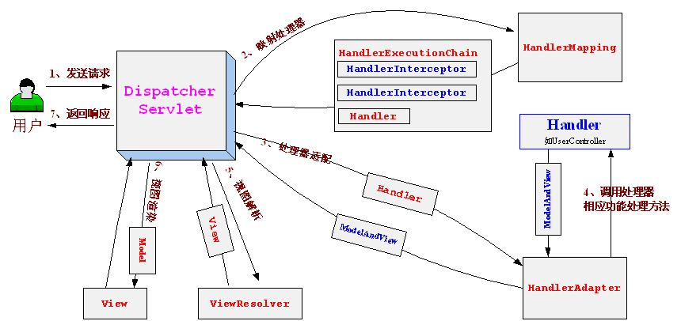

# SpringMVC，主讲：汤小洋

## 一、SpringMVC简介

### 1. 什么是MVC

​	M：model   数据模型，封装了业务逻辑，对业务数据进行处理

​	V：view  视图，封装了显示逻辑，如HTML、JSP、Excel、PDF等

​	C：controller 控制器，控制整个网站的处理流程，协调视图与模型

​	MVC是一种Web应用架构，是一种代码设计思想

​	思想：将所有客户端请求全部交由控制器，由控制器将其分发，并将结果响应回客户端

​	注：区别MVC和三层架构

### 2. SpringMVC优点

​	简单，使用注解配置替代原生XML配置

​	效率高，单例的，将Controller层对象交给IoC容器管理

​	扩展性好，方便用户自定义

​	SpringMVC和Spring无缝衔接

### 3. 实现原理

#### 3.1 流程图



#### 3.2 执行过程

​	分为六步：

- DispatcherServlet

    SpringMVC核心控制器：主要作用是用来分发，不进行任何处理

- HandlerMapping

    映射处理器：根据请求URL映射到具体的处理器Handler

    Handler就是Controller层实现类，也可称为Controller或Action

- HandlerAdapter

    适配器：用来适配不同的处理器Handler

    处理器有两种实现方式：实现接口、基于注解，所以执行之前需要先适配，这样才能知道如何执行

- Handler

    处理器：执行处理具体业务，并产生数据模型Model和视图名View

    Handler将数据模型和视图封装成ModelAndView对象并返回

- ViewResolver

    视图解析器：根据视图名解析为具体的视图，一般多为jsp页面，然后封装为View对象

- View

    视图：使用具体视图技术进行渲染，结合Model展示数据

    视图有很多种形式，如jsp、freemarker、velocity、pdf、excel等

## 二、第一个SpringMVC程序

### 1. 添加依赖

```xml
<dependency>
  	<groupId>org.springframework</groupId>
  	<artifactId>spring-webmvc</artifactId>
</dependency>
```

### 2. 创建Controller

```java
@Controller
public class HelloController {
	@RequestMapping("/hello")
	public ModelAndView sayHello(String name){
		ModelAndView mav = new ModelAndView();
		mav.addObject("msg","Hello "+name);
		mav.setViewName("hello");
		return mav;
	}
}  
```

### 3. 核心配置文件	

​	名称自定义，如springmvc.xml

```xml
<!-- 扫包 -->
<context:component-scan base-package="controller"/>

<!-- mvc的注解驱动 -->
<mvc:annotation-driven/>

<!-- 配置ViewResolver -->
<bean class="org.springframework.web.servlet.view.InternalResourceViewResolver">
  <property name="prefix" value="/WEB-INF/view/"/>
  <property name="suffix" value=".jsp"/>
</bean>
```

### 4. 配置核心控制器

​	在web.xml中配置SpringMVC核心控制器，需要指定配置文件的路径

```xml
<!-- 配置DispatcherServlet，核心控制器，本质上就是一个Servlet -->
<servlet>
  <servlet-name>springMVC</servlet-name>
  <servlet-class>org.springframework.web.servlet.DispatcherServlet</servlet-class>
  <init-param>
    <param-name>contextConfigLocation</param-name>
    <param-value>classpath:springmvc.xml</param-value>
  </init-param>
  <load-on-startup>1</load-on-startup>
</servlet>
<servlet-mapping>
  <servlet-name>springMVC</servlet-name>
  <url-pattern>/</url-pattern>
</servlet-mapping>
```

## 三、案例

### 1. 用户登陆

​	login.jsp、success.jsp

​	LoginController.java

### 2. 静态资源处理

​	当配置DispatcherServlet的url-pattern为`/`时，会拦截所有请求（包括静态资源），导致所有静态资源都无法访问

​	两种处理方式：

- 使用tomcat提供的默认Servlet	

    ```xml
    <mvc:default-servlet-handler/>
    ```

- 使用SpringMVC提供的处理方式

    ```xml
    <mvc:resources mapping="/img/**" location="/img/"></mvc:resources>
    <!-- 当访问/css/时映射访问/WEB-INF/css/目录 -->
    <mvc:resources mapping="/css/**" location="/WEB-INF/css/"></mvc:resources>	
    <mvc:resources mapping="/js/**" location="/WEB-INF/js/"></mvc:resources>
    <mvc:resources mapping="/images/**" location="/WEB-INF/images/"></mvc:resources>
    ```


### 3. 直接访问jsp页面

​	WEB-INF目录下的JSP页面默认是不能直接访问的，一般都是在Controller中做转发映射，比较麻烦

​	可以使用`<mvc:view-controller path=""/>`来配置，不需要在控制器中再去做转发映射

```xml
<!-- 通过/userLogin直接访问视图login -->
<mvc:view-controller path="/showLogin" view-name="login"/>
```

## 四、Controller详解

### 1. 方法的返回值

​	有三种类型：

- ModelAndView 表示返回的为数据模型和视图

- String 表示返回的为视图

  三种形式（写法）：

  ​	普通字符串 --> 表示视图名称，直接跳转到jsp页面

  ​    "forward:"+url --> 转发  

  ​	"redirect:"+url --> 重定向	                       			

- Object 表示返回的为数据模型（响应Ajax请求）  

### 2. SpringMVC注解

| 注解              | 解释                                                         |
| ----------------- | ------------------------------------------------------------ |
| @Controller       | 将类映射为Controller层，添加到IoC容器中                      |
| @RequestMapping   | 配置请求映射路径，即URL                                      |
| @RequestParam     | 表示参数来源于请求参数                                       |
| @PathVariable     | 表示参数来源于URL（URL就是请求路径）                         |
| @CookieValue      | 表示参数来源于Cookie                                         |
| @RequestBody      | 表示参数来源于请求体（只有post请求才会有）                   |
| @ModelAttribute   | 将请求数据转换为对象                                         |
| @ControllerAdvice | 统一异常处理，处理全局异常                                   |
| @ExceptionHandler | 异常处理器，处理特定异常的方法                               |
| @ResponseBody     | 将方法返回值写到响应体中，一般都返回JSON数据                 |
| @RestController   | 将类映射为Controller层，同时为所有方法添加@ResponseBody注解，相当于@Controller+ResponseBody |

### 3. @RequestMapping

该注解可以定义在方法上，也可以定义在类上，表示层级关系

配置URL时以/开头和不以/开头的区别

- 添加时表示从项目名称开始查找
- 不添加时表示从当前方法所在层级开始查找，当RequestMapping有多层时需要注意差别         

请求映射路径的写法（path属性）：

- 固定写法

  value和path属性互为别名，其值是一个数组，可以指定多个值，允许通过多个路径访问

- Rest风格

  {变量}表示URL中的占位符，URL中必须有对应的值，可以结合@PathVariable获取值

根据请求方式访问（method属性）：

- 限定请求方式：GET、POST、PUT、DELETE等	
- 也可通过@GetMapping、@PostMapping等注解直接限定请求方式

## 五、方法的参数

​	Controller中方法的参数可以是多种类型

### 1. JavaEE组件

​	HttpServletRequest

​	HttpServletResponse

​	HttpSession

### 2. 向界面传递数据

​	Model、Map、ModelMap

​	将数据存放在request作用域中

### 3. String、基本类型及包装类

​	@RequestParam	表示参数来源于请求参数，默认为所有参数添加该注解，参数值来源于同名称的请求参数

​	@PathVariable		表示参数来源于URL（URL就是请求路径）

​	@CookieValue		表示参数来源于Cookie

​	@RequestBody		表示参数来源于请求体（只有post请求才会有）

### 4. 自定义对象

​	如：User、UserVo等

​	@DateTimeFormat(pattern="yyyy-MM-dd")  后台接收前台传递的日期类型参数

​	@ModelAttribute	将请求数据转换为对象，默认为所有自定义类型添加该注解

​	条件：对象的属性名必须与表单元素的名称相同

​	注：可以使用SpringMVC提供的`CharacterEncodingFilter`解决POST请求中文乱码问题

## 六、统一异常处理

### 1. 简介	

​	所谓统一异常处理，就是指对异常进行统一处理

​	两种方式：

- 使用web技术提供的统一异常处理
- 使用springmvc提供的统一异常处理

### 2. 用法

​	使用web技术的异常处理，在web.xml文件中配置error-page

```xml
<!-- 404异常处理 -->
<error-page>
  <error-code>404</error-code>
  <location>/404.jsp</location>
</error-page>
```

​	使用springmvc的异常处理，步骤：

1. 定义一个异常处理类，为类添加@ControllerAdvice注解
2. 定义异常处理方法，方法添加@ExceptionHandler注解

## 七、拦截器

### 1. 简介

​	使用拦截器Interceptor对请求进行拦截处理，类似于过滤器Filter

### 2. 用法

​	步骤：

1. 定义一个类，实现HandlerInterceptor接口

```java
public class HelloInterceptor implements HandlerInterceptor {
  
	// 调用目标处理方法之前执行，可以做权限、日志等
	public boolean preHandle(HttpServletRequest request, HttpServletResponse response, Object handler) throws Exception {
		System.out.println("HelloInterceptor.preHandle()");
		return true; // true表示继续调用后续拦截器或目标处理方法，false表示不再调用
	}

	// 调用目标处理方法之后执行，渲染视图之前，可以对请求域中的属性或视图进行修改
	public void postHandle(HttpServletRequest request, HttpServletResponse response, Object handler, ModelAndView modelAndView) throws Exception {
		System.out.println("HelloInterceptor.postHandle()");
	}

	// 渲染视图之后，可以用来释放资源
	public void afterCompletion(HttpServletRequest request, HttpServletResponse response, Object handler, Exception ex) throws Exception {
		System.out.println("HelloInterceptor.afterCompletion()");
	}

}
```

2. 配置拦截器

```xml
<mvc:interceptors>
  <mvc:interceptor>
    <mvc:mapping path="/hello" />
    <mvc:mapping path="/param/**" />
    <mvc:mapping path="/path/**" />
    <mvc:exclude-mapping path="/param/test1"/> <!-- 排除拦截该请求 -->
    <bean class="interceptor.HelloInterceptor"></bean>
  </mvc:interceptor>
</mvc:interceptors>
```

## 八、响应Ajax请求

### 1. @ResponseBody

​	将方法返回值写到响应体中，一般用来处理Ajax请求

​	注：可以使用@RestController，相当于@Controller+@ResponseBody

### 2. 返回JSON

​	使用fastjson，步骤：

1. 添加依赖

   ```xml
   <dependency>
     <groupId>com.alibaba</groupId>
     <artifactId>fastjson</artifactId>
     <version>1.2.44</version>
   </dependency>
   ```

2. 配置消息转换器

   ```xml
   <mvc:annotation-driven>
   	<mvc:message-converters>
         <bean class="com.alibaba.fastjson.support.spring.FastJsonHttpMessageConverter">
             <property name="supportedMediaTypes" value="application/json;charset=utf-8"/>
         </bean>
   	</mvc:message-converters>
   </mvc:annotation-driven>      
   ```

## 九、文件上传

​	SpringMVC为文件上传提供了支持，基于`commons-fileupload`

​	步骤：

1. 添加依赖

   ```xml
   <dependency>
     <groupId>commons-fileupload</groupId>
     <artifactId>commons-fileupload</artifactId>
     <version>1.3.1</version>
   </dependency>
   ```

2. 配置文件解析器

   ```xml
   <!-- 配置文件解析器，id名称必须为multipartResolver -->
   <bean id="multipartResolver" class="org.springframework.web.multipart.commons.CommonsMultipartResolver">
     <property name="defaultEncoding" value="utf-8"/>
     <property name="maxUploadSize" value="5000000"/>
   </bean>
   ```

3. 编写file.jsp

   ```jsp
   <form action="${pageContext.request.contextPath}/file/upload" method="post" enctype="multipart/form-data">
     <input type="file" name="file">  <br>
     <input type="submit" value="上传">
   </form>
   
   ```

4. 编写FileController类

   ```java
   /*
    * 通过参数CommonsMultipartFile接收文件
    * 必须在参数前添加@RequestParam注解，否则无法接收文件
    */
   @PostMapping("/upload")
   public String upload(@RequestParam CommonsMultipartFile file, HttpServletRequest req) {
     System.out.println(file.getName());
     System.out.println(file.getOriginalFilename());
     System.out.println(file.getSize());
     // System.out.println(file.getInputStream());
   
     String uploadPath = req.getServletContext().getRealPath("upload");
     String filename = StringUtils.renameFileName(file.getOriginalFilename());
     String filePath = uploadPath + File.separateor + filename;
     try {
       file.transferTo(new File(filePath));
     } catch (Exception e) {
       e.printStackTrace();
     }
     return "success";
   }
   ```

**补充：**

​	问题：maven打包时默认会忽略空目录，不对空目录进行打包

​	解决：编辑pom.xml文件，配置如下

```xml
<!-- 打包时包含空目录-->
<plugin>
    <groupId>org.apache.maven.plugins</groupId>
    <artifactId>maven-war-plugin</artifactId>
    <version>2.4</version>
    <configuration>
        <includeEmptyDirectories>true</includeEmptyDirectories>
    </configuration>
</plugin>
```

## 十、SSM综合案例

### 1. ssm项目模板

​	ssm-template

### 2. 员工管理系统

​	基于Layui的ems
