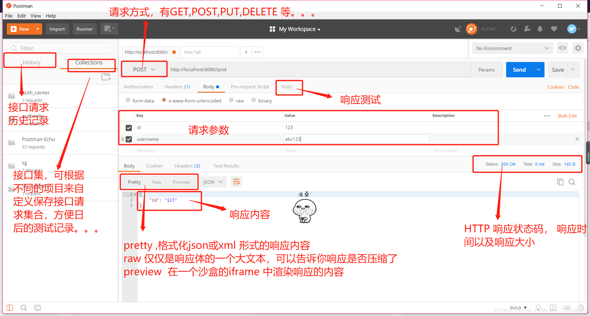

# SpringBoot，主讲：汤小洋

## 一、SpringBoot简介

### 1. SpringBoot是什么？

​	产生背景：Spring开发变的越来越笨重，大量的XML文件、繁琐的配置、复杂的部署流程、整合第三方框架难度大等，导致开发效率低下

​	SpringBoot是一个用来简化Spring应用的初始创建和开发过程的框架，简化配置，实现快速开发

​	融合了整个Spring技术栈，JavaEE开发的一站式解决方案	

​	参考：Spring官网 https://spring.io/projects

### 2. 为什么使用SpringBoot？	

​	优点：

- 快速创建独立运行的Spring项目并与主流框架集成
- 内置Servlet容器，应用无需打成WAR包
- 使用starter(启动器)管理依赖并进行版本控制 
- 大量的自动配置，简化开发
- 提供准生产环境的运行时监控，如指标、健康检查、外部配置等
- 无需配置XML，没有冗余代码生成，开箱即用

## 二、第一个SpringBoot程序

### 1. 环境要求

- SpringBoot 2.x
- JDK 8及以上
- Maven 3.5及以上
- Tomcat 9及以上

### 2. 操作步骤

​	步骤：

1. 创建一个maven的java工程

   传统web应用需要创建一个web工程，后期要打成war包，然后放到tomcat中，太麻烦

   而SpringBoot应用只需要创建一个java工程，后期直接打成可执行的jar包，其内置tomcat

2. 导入SpringBoot的相关依赖(参考官方文档)

   ````xml
   <!-- 继承SpringBoot的父工程 -->
   <parent>
       <groupId>org.springframework.boot</groupId>
    	 	<artifactId>spring-boot-starter-parent</artifactId>
     	<version>2.7.6</version>
   </parent>
   <dependencies>
     	<!-- 添加web应用的starter -->
       <dependency>
           <groupId>org.springframework.boot</groupId>
           <artifactId>spring-boot-starter-web</artifactId>
       </dependency>
   </dependencies>
   ````

3. 编写Controller

   ```java
   @Controller
   public class HelloController {
   
       @RequestMapping("/hello")
       @ResponseBody
       public String hello() {
           return "Hello World";
       }
   }
   ```

4. 编写主程序类，用来启动SpringBoot应用

   ```java
   /**
    * 使用@SpringBootApplication标注主程序类，表示这是一个SpringBoot应用
    */
   @SpringBootApplication
   public class MainApplication {
       public static void main(String[] args) {
           // 启动SpringBoot应用
           SpringApplication.run(MainApplication.class, args); //传入主程序类的Class对象
       }
   }
   ```

   注：主程序类必须放到其他类的上层包中，因为默认只扫描主程序类所在的包及其子包

5. 运行主程序并访问测试

   http://localhost:8080/hello

6. 部署打包

   添加spring-boot-maven-plugin插件，将应用打成可执行的jar包，然后直接执行`java -jar springboot01-helloworld-1.0-SNAPSHOT.jar`

   ```xml
   <build>
       <plugins>
           <plugin>
               <groupId>org.springframework.boot</groupId>
               <artifactId>spring-boot-maven-plugin</artifactId>
           </plugin>
       </plugins>
   </build>
   ```

### 3. 分析HelloWorld

​	POM文件：

- 父项目是spring-boot-starter-parent

  ```xml
  <parent>
      <groupId>org.springframework.boot</groupId>
      <artifactId>spring-boot-starter-parent</artifactId>
      <version>2.7.6</version>
  </parent>
  ```

  父项目的父项目是spring-boot-dependencies，用来管理SpringBoot应用中依赖的版本，进行版本控制	

  ```xml
  <parent>
      <groupId>org.springframework.boot</groupId>
      <artifactId>spring-boot-dependencies</artifactId>
      <version>2.7.6</version>
  </parent>
  ```
  
- 通过启动器starter指定依赖

  ```xml
  <dependency>
      <groupId>org.springframework.boot</groupId>
      <artifactId>spring-boot-starter-web</artifactId>
  </dependency>
  ```


​    主程序类：

- @SpringBootApplication

  标注在类上，表示这是一个SpringBoot应用，通过运行该类的main方法来启动SpringBoot应用

  ```java
  @Target(ElementType.TYPE)
  @Retention(RetentionPolicy.RUNTIME)
  @Documented
  @Inherited
  @SpringBootConfiguration
  @EnableAutoConfiguration
  @ComponentScan(excludeFilters = {
        @Filter(type = FilterType.CUSTOM, classes = TypeExcludeFilter.class),
        @Filter(type = FilterType.CUSTOM, classes = AutoConfigurationExcludeFilter.class) })
  public @interface SpringBootApplication {
  ```

- @SpringBootConfiguration

  标注在类上，表示这个类是SpringBoot的配置类

  层级关系：@SpringBootConfiguration——>@Configuration——>@Component

  @Configuration标注在类上，表示这个类是Spring的配置类，相当于是一个xml配置文件

- @EnableAutoConfiguration

  开启自动配置功能，SpringBoot会自动完成许多配置，简化了以前繁琐的配置

- @ComponentScan

  标注在类上，指定要扫描的包，默认只扫描主程序类所在的包及其子包

  可以使用@ComponentScan手动指定要扫描的包


## 三、快速创建SpringBoot项目

### 1. 简介

​	使用Spring Initializer快速创建SpringBoot项目

- 选择SpringBoot 2.x 版本
- 勾选Web模块

### 2. 基本操作

​	默认生成的.mvn、.gitignore、mvnw、mvnw.cmd，可以直接删除

​	POM文件和主程序类已经生成好了，直接写业务逻辑即可

​	resources文件夹的目录结构

```java
|-resources
	|-static // 存放静态资源，如css、js、images等
	|-templates // 存放模板页面，可以使用模板引擎，如thymeleaf、freemarker等
	|-application.properties // SpringBoot应用的配置文件，可以修改默认设置
```

​	注：SpringBoot生成的可执行jar包使用嵌入式的Tomcat，默认不支持JSP页面

### 3. 配置文件

SpringBoot的默认全局配置文件有两个：

- application.properties
- application.yml
- 注：文件名固定，存放在`classpath:/` 或 `classpath:/config/`目录下

​	

YAML是专门用来写配置文件的语言，文件的后缀名为`.yml`，语法规则：

- 使用缩进表示层级关系，相同层级的元素左侧要对齐
- 键和值之间以冒号+空格隔开 `key: value`
- `#` 表示注释

```yaml
server:
  port: 8081
  servlet:
    context-path: /springboot02
```


切换多个环境

- 针对不同的环境，可以提供不同的配置，如开发环境、测试环境、生产环境等，一般来说使用的数据库配置都是不同的
- 可以通过命名约定来定义多个配置文件，格式：`application-{profile}.yml`
- 然后在application.yml文件中使用`spring.profiles.active` 来激活某一个环境配置

```yml
spring:
  profiles:
    active: dev
```

### 4. 添加组件

​	通过定义**配置类**向容器中添加组件，使用注解：@Configuration和@Bean

```java
// 标注在类上，表示这是一个配置类，相当于以前编写的Spring配置文件
@Configuration
public class SpringConfig {

    // 标注在方法上，向容器中添加一个组件，将方法的返回值添加到容器中，方法名作为组件id
    @Bean
    public Date date(){
        Calendar c = Calendar.getInstance();
        c.set(2008,5,10);
        return c.getTime();
    }
}
```

### 5. Web开发

​	静态资源的存放位置：`classpath:/static/`

​	欢迎页：将index.html页面放到静态资源文件夹中

## 四、模板引擎

### 1. 简介

​	SpringBoot默认不支持JSP开发，因为JSP必须要打成war包才行，实际开发中JSP应用很少

​	目前主流Web开发一般都采用前后端分离的形式，前端使用MVVM框架，在SpringBoot中也可使用模板引擎Thymeleaf

- JSP缺点：本质上就是Servlet，需要后台编译，耗时，效率低
- 模板引擎：不需要编译，速度快（Thymeleaf、Freemarker、Velocity）
- MVVM框架：前端独立开发，效率更高，团队协作（Vue.js、React、Angular）

### 2. 使用步骤	

步骤：

1. 添加thymeleaf的依赖

   ```xml
   <dependency>
       <groupId>org.springframework.boot</groupId>
       <artifactId>spring-boot-starter-thymeleaf</artifactId>
   </dependency>
   ```

2. 将HTML页面放到templates目录中

   templates目录下的HTML页面默认不能直接访问，需要通过Controller来访问，由thymeleaf渲染，自动添加**前缀和后缀**

   ```java
   @Controller
   public class TemplateController {
       @RequestMapping("/test1")
       public String test1(Model model) {
           System.out.println("TemplateController.test1");
           return "success";  //自动添加前缀/templates/和后缀.html
       }
   }
   ```

3. 使用thymeleaf

   ```html
   <!DOCTYPE html>
   <!-- 导入thymeleaf的命名空间 -->
   <html lang="en" xmlns:th="http://www.thymeleaf.org">
   <head>
       <meta charset="UTF-8">
       <title></title>
   </head>
   <body>
       <h2>success</h2>
   
       <!-- 使用th:text属性，设置标签中的文本，表达式${}可以获取模型中的数据 -->
       <div th:text="${name}">姓名</div>  
   </body>
   </html>
   ```

4. 修改页面后，使其实时生效

   由于thymeleaf默认启用了缓存，所以修改html页面后并不会实时生效

   ```properties
   # 禁用thymeleaf的缓存
   spring.thymeleaf.cache=false
   ```

5. 配置热部署

​	使用SpringBoot提供的devtools实现热部署

​	原理：实时监控classpath下文件的变化（即编译后的target目录），如果发生变化则自动重启

​	配置：添加devtools的依赖即可（需要开启IDEA的自动编译）

```xml
<!-- devtools热部署 -->
<dependency>
    <groupId>org.springframework.boot</groupId>
    <artifactId>spring-boot-devtools</artifactId>
    <!-- 该依赖不传递 -->
    <optional>true</optional>
</dependency>
```

**补充：开启IDEA的自动编译，IDEA默认是不自动编译的**

- Settings——>搜索Compiler——>勾选Build project automatically
- Help——>Find Action——>搜索Registry——>勾选Compiler autoMake allow when app running

### 3. 语法规则

​	常用属性：

- th:text

  设置元素中的文本内容，等价于内联方式`[[${ }]]`

- th:html原生属性

  用来替换指定的html原生属性的值

- th:if、th:switch、th:case

  条件判断

- th:each

  循环

- th:fragment、th:insert

  声明和引入代码片段，常用于页面头部和底部的引入


​    表达式：

- ${} 变量表达式

  获取对象的属性

  调用对象的方法 

  使用内置的基本对象，如session、application、param等

  使用内置的工具对象，如#strings、#dates等

- @{} url表达式

  定义url，`@{/}`用于获取项目根路径

- 运算符

  eq  gt ge lt le ==  !=  三目运算符

## 五、扩展默认的功能

### 1. 简介

​	在SpringMVC中通过如下代码实现视图跳转和拦截器的功能

```xml
<mvc:view-controller path="/showLogin" view-name="login"/>

<mvc:interceptors>
    <mvc:interceptor>
        <mvc:mapping path="/hello"/>
        <bean class=""></bean>
    </mvc:interceptor>
</mvc:interceptors>
```

​	SpringBoot自动配置默认并没有提供以上功能配置，需要自己扩展，使用WebMvcConfigurer接口

- 添加ViewController
- 添加Interceptor
- 允许跨域访问

### 2. 基本操作		

​	步骤：

1. 定义一个配置类，实现WebMvcConfigurer接口

2. 根据需要实现相应的方法

   ```java
   /**
    * 要求：
    * 1.使用@Configuration标注为配置类
    * 2.实现WebMvcConfigurer接口
    */
   @Configuration
   public class MyConfig implements WebMvcConfigurer {
   
       // 添加ViewController
       @Override
       public void addViewControllers(ViewControllerRegistry registry) {
           //访问/showLogin时跳转到login视图
           registry.addViewController("/showLogin").setViewName("login");
       }
   
       // 添加Interceptor
       @Override
       public void addInterceptors(InterceptorRegistry registry) {
           //拦截/**，排除/showLogin和/test1
           registry.addInterceptor(new MyInterceptor())
             			.addPathPatterns("/**")
             			.excludePathPatterns("/showLogin", "/test1");
       }
     
      // 允许跨域访问 
      @Override
       public void addCorsMappings(CorsRegistry registry) {
           registry.addMapping("/**")
                   .allowedOriginPatterns("*")
                   .allowCredentials(true)
                   .allowedMethods("*")
                   .maxAge(3600);
       }
   }
   ```

## 六、开发JSP应用

### 1. 简介

SpringBoot默认内置了Servlet容器

- 使用内置Servlet容器：将应用打成可执行的jar包，直接运行
- 使用外部Servlet容器：将应用打包war包，然后部署到外部的Tomcat，支持JSP开发

### 2. 操作步骤

步骤：

1. 使用Spring Initializer创建一个war工程（选择Packaging为War）

    有如下三个变化：

    - 打包方式为war

        ```xml
        <packaging>war</packaging>
        ```

    - 将内置Tomcat的scope配置为provided

        ```xml
        <dependency>
            <groupId>org.springframework.boot</groupId>
            <artifactId>spring-boot-starter-tomcat</artifactId>
            <scope>provided</scope>
        </dependency>
        ```

    - 定义了一个SpringBootServletInitializer的子类

        ```java
        public class ServletInitializer extends SpringBootServletInitializer {
        	@Override
        	protected SpringApplicationBuilder configure(SpringApplicationBuilder application) {
        		return application.sources(Springboot04JspApplication.class);
        	}
        }
        ```

2. 创建web目录结构

    Project Structure——>Modules——>项目/Web——>

    ​		通过Web Resource Directories创建`webapp`目录

    ​		通过Deployment Descriptors创建`/src/main/webapp/WEB-INF/web.xml`文件（注意要修改目录层次）

3. 配置前缀和后缀

    修改application.properties，添加如下：

    ```properties
    spring.mvc.view.prefix=/WEB-INF/views/
    spring.mvc.view.suffix=.jsp
    ```

4. 配置Tomcat并启动

    在IDEA中手动添加配置 Tomcat9，并部署运行项目


## 七、整合MyBatis

### 1. 基本用法

步骤：

1. 创建一个工程，选择以下模块：Web、MyBatis、Lombok

   ```xml
   <dependency>
       <groupId>mysql</groupId>
       <artifactId>mysql-connector-java</artifactId>
       <version>5.1.38</version>
      	<scope>runtime</scope>
   </dependency>
   <dependency>
     	<groupId>com.alibaba</groupId>
     	<artifactId>druid-spring-boot-starter</artifactId>
     	<version>1.2.16</version>
   </dependency>
   <dependency>
       <groupId>com.github.pagehelper</groupId>
       <artifactId>pagehelper-spring-boot-starter</artifactId>
       <version>1.4.1</version>
   </dependency>
   ```

2. 配置application.yml

   ```yaml
   # 配置MyBatis
   mybatis:
     type-aliases-package: com.itany.entity
     mapper-locations: classpath:mapper/*.xml
     configuration:
       # 开启打印sql配置
       log-impl: org.apache.ibatis.logging.stdout.StdOutImpl
       # 开启驼峰配置
       map-underscore-to-camel-case: true
   
   # 配置PageHelper
   pagehelper:
     helper-dialect: mysql
   ```

3. 使用`@MapperScan`指定Dao接口所在的包

    ```java
    @SpringBootApplication
    //指定Dao接口所在的包，动态创建Dao实现类
    @MapperScan("net.wanho.study.dao")
    public class Springboot04MybatisApplication {
        public static void main(String[] args) {
            SpringApplication.run(Springboot04MybatisApplication.class, args);
        }
    }
    ```

4. 配置Dao、Service、Controller等

    可以在Dao接口上添加`@Repository`，以解决在Service层注入时提示找不到bean的错误提示

### 2. MyBatis-Plus

参考：http://mp.baomidou.com

步骤：

1. 创建一个springboot工程，选择以下模块：Web、Lombok

2. 添加依赖 

    ```xml
    <dependency>
      <groupId>mysql</groupId>
      <artifactId>mysql-connector-java</artifactId>
      <version>5.1.38</version>
      <scope>runtime</scope>
    </dependency>
    <dependency>
      	<groupId>com.alibaba</groupId>
      	<artifactId>druid-spring-boot-starter</artifactId>
      	<version>1.2.16</version>
    </dependency>
    <!--mbyatis-plus-->
    <dependency>
      <groupId>com.baomidou</groupId>
      <artifactId>mybatis-plus-boot-starter</artifactId>
      <version>3.5.2</version>
    </dependency>
    ```

3. 配置application.yml

    ```yaml
    # 配置DataSource
    spring:
      datasource:
      	type: com.alibaba.druid.pool.DruidDataSource
        driver-class-name: com.mysql.jdbc.Driver
        url: jdbc:mysql://localhost:3306/springboot?useUnicode=true&characterEncoding=utf8
        username: root
        password: root
        initialSize: 5
        maxActive: 50
        minIdle: 3
        maxWait: 5000
    
    # 配置MyBatis-Plus
    mybatis-plus:
      type-aliases-package: com.itany.entity
      mapper-locations: classpath:mapper/*.xml # 可以省略，默认加载的就是mapper目录
      configuration:
        map-underscore-to-camel-case: true # 开启驼峰配置
      global-config:
        db-config:
          # id-type: auto # 使用数据库的自动增长，不可作为分布式ID使用
          id-type: assign_id # 使用雪花算法自动生成long类型的数字，分布式的情况下可使用
    ```

4. 配置MybatisPlusConfig

    ```java
    @Configuration
    @MapperScan("net.wanho.mapper")
    public class MyBatisPlusConfig {
    
        /**
         * 配置MP的分页插件
         */
        @Bean
        public MybatisPlusInterceptor mybatisPlusInterceptor() {
            MybatisPlusInterceptor interceptor = new MybatisPlusInterceptor();
            interceptor.addInnerInterceptor(new PaginationInnerInterceptor(DbType.MYSQL));
            return interceptor;
        }
    }
    ```

5. 定义Mapper，继承BaseMapper

    ```java
    /**
     * 继承BaseMapper接口，通用Mapper
     */
    public interface UserMapper extends BaseMapper<User> {
    }
    ```


注：当数据库表名和字段名 与 类名和属性名不一致时，需要使用@TableName、@TableId、@TableField注解对实体类进行标注

6. 定义Service，使用通用Service

    ```java
    /**
     * 继承IService接口，通用Service
     */
    public interface UserService extends IService<User> {
    }
    
    /**
     * 继承ServiceImpl类，通用Service实现类
     */
    @Service
    @Transactional(propagation = Propagation.REQUIRED, rollbackFor = Exception.class)
    public class UserServiceImpl extends ServiceImpl<UserDao, User> implements UserService {
    }
    
    ```

7. 使用Mybatis-plus提供的接口

## 八、Restful API

### 1.简介

Representational State Transfer，简称为REST， 即表现层状态转化

Restful是一种网络应用程序的设计方式与开发方式，基于HTTP

- 表现层 Representational

    资源的表现层，指的是资源的具体呈现形式，如HTML、JSON等

- 状态转化 State Transfer

    指的是状态变化，通过HTTP方法来实现

    通过不同的请求方式实现不同的功能，实现表现层状态转化

    > GET		获取资源，即查询操作
    >
    > POST 	新建资源，即添加操作
    >
    > PUT		更新资源，即修改操作
    >
    > DELETE	删除资源，即删除操作 

### 2.设计原则

​	Restful 是目前最流行的 API 设计规范，用于 Web 数据接口的设计

​	Restful API设计原则：

- 尽量将API 部署在一个专用的域名下，如 `http://wanho.net/api` 或 `http://api.wanho.net` 

- API的版本应该在URL中体现，如 `http://wanho.net/api/v2` 

- URL中不要使用动词，应使用资源名词，且使用名词的复数形式，如：

    | 功能说明       | 请求类型 | URL                              |
    | -------------- | -------- | -------------------------------- |
    | 获取用户列表   | GET      | http://wanho.net/api/v2/users    |
    | 根据id获取用户 | GET      | http://wanho.net/api/v2/users/id |
    | 添加用户       | POST     | http://wanho.net/api/v2/users    |
    | 根据id删除用户 | DELETE   | http://wanho.net/api/v2/users/id |
    | 修改用户       | PUT      | http://wanho.net/api/v2/users    |

    注：简单来说，可以使用同一个 URL ，通过约定不同的 HTTP 方法来进行不同的业务操作

- 服务器响应时返回JSON对象，包含业务逻辑状态码、响应的消息、响应的查询结果


### 3. 基本用法

​	@GetMapping

​	@PostMapping

​	@PutMapping

​	@DeleteMapping

### 4. 接口测试Postman

​	Postman是一款非常优秀的调试工具，可以用来模拟发送各类HTTP请求，进行接口测试。



## 九、API接口文档

### 1. 简介

通常情况下，我们会创建一份API文档来记录所有的接口细节，供其他开发人员使用提供的接口服务，但会存在以下的问题：

- 接口众多，并且细节复杂
- 需要根据接口的变化，不断修改API文档，非常麻烦，费时费力

Swagger的出现就是为了解决上述的这些问题，减少创建API文档的工作量

- 后端人员在代码里添加接口的说明内容，就能够生成可预览的API文档，无须再维护Word文档
- 让维护文档和修改代码整合为一体，在修改代码逻辑的同时方便的修改文档说明
- 提供了页面测试功能，便于对接口进行测试

Knife4j是对Swagger的封装，对接口文档UI进行了优化，用起来更方便

### 2. 使用步骤

使用步骤：

1. 添加依赖

    ```xml
    <dependency>
        <groupId>com.github.xiaoymin</groupId>
        <artifactId>knife4j-spring-boot-starter</artifactId>
        <version>3.0.3</version>
    </dependency>
    ```

2. 创建配置类

    ```java
    @Configuration
    @EnableKnife4j // 启用Knife4j
    public class Knife4jConfig {
    
        /**
         * 创建Restful API文档内容
         */
        @Bean
        public Docket Api() {
            return new Docket(DocumentationType.SWAGGER_2)
                    .apiInfo(apiInfo())
                    .select()
                    // 指定要暴露的接口所在包
                    .apis(RequestHandlerSelectors.basePackage("com.itany.controller"))
                    .paths(PathSelectors.any())
                    .build();
        }
    
        /**
         * API的基本信息
         */
        private ApiInfo apiInfo() {
            return new ApiInfoBuilder()
                    .title("商城项目后端API接口文档")
                    .description("欢迎访问后端API接口文档")
                    .contact(new Contact("tangxiaoyang","https://github.com/tangyang8942","tangxiaoyang@qq.com"))
                    .version("1.0")
                    .build();
        }
    
    }
    ```

3. 配置application.yml

    ```yaml
    spring:
      mvc:
        pathmatch:
          matching-strategy: ant_path_matcher # 用于解决SpringBoot2.6+版本与Swagger的兼容性问题
    ```

4. 添加文档内容

    使用Swagger提供的注解对接口进行说明，常用注解：

    - @Api 标注在类上，对类进行说明
    - @ApiOperation  标注在方法上，对方法进行说明
    - @ApiParam 标注在参数上，对方法的参数进行说明
    - @ApiModel  标注在模型Model上，对模型进行说明
    - @ApiModelProperty  标注在属性上，对模型的属性进行说明
    - @ApiIgnore  标注在类或方法上，表示忽略这个类或方法

5. 查看接口文档页面，并测试接口

    启动SpringBoot程序，访问`http://localhost:端口/doc.html`，查看接口文档

    可以在接口文档中对接口进行测试

## 十、代码生成Generator

### 1. 简介

MyBatis-Plus代码生成器，快速生成 Entity、Mapper、Service、Controller 层代码，支持模板引擎自定义配置

```sql
create table t_dept(
  id int primary key auto_increment comment '编号',
  name varchar(20) comment '部门名称'
)engine innodb default charset utf8 comment '部门表';

create table t_emp(
  id int primary key auto_increment comment '编号',
  name varchar(20) comment '姓名',
  salary double comment '工资',
  dept_id int comment '部门编号',
  foreign key (dept_id) references t_dept(id)
)engine innodb default charset utf8 comment '员工表';
```

### 2. 基本用法

步骤：

1. 创建一个springboot工程，选择以下模块：Web、Lombok

2. 添加依赖 

    ```xml
    <dependency>
        <groupId>mysql</groupId>
        <artifactId>mysql-connector-java</artifactId>
        <version>5.1.38</version>
        <scope>runtime</scope>
    </dependency>
    <dependency>
        <groupId>com.alibaba</groupId>
        <artifactId>druid-spring-boot-starter</artifactId>
        <version>1.2.16</version>
    </dependency>
    <dependency>
        <groupId>com.github.xiaoymin</groupId>
        <artifactId>knife4j-spring-boot-starter</artifactId>
        <version>3.0.3</version>
    </dependency>
    <!--mbyatis-plus-->
    <dependency>
        <groupId>com.baomidou</groupId>
        <artifactId>mybatis-plus-boot-starter</artifactId>
        <version>3.5.2</version>
    </dependency>
    <!--mybatis-plus-generator-->
    <dependency>
        <groupId>com.baomidou</groupId>
        <artifactId>mybatis-plus-generator</artifactId>
        <version>3.5.2</version>
    </dependency>
    <!--velocity模板引擎-->
    <dependency>
        <groupId>org.apache.velocity</groupId>
        <artifactId>velocity-engine-core</artifactId>
        <version>2.3</version>
    </dependency>
    ```

3. 快速生成

    ```java
    public static void main(String[] args) {
        //数据库连接
        String url = "jdbc:mysql://localhost:3306/springboot?useUnicode=true&characterEncoding=utf8";//数据库url
        String username = "root";//账号
        String password = "root";//密码
        //全局配置参数
        String author = "汤小洋";//作者
        String outputDir = "/Users/txy/code/IdeaProjects/framework/springboot06-generator/src/main/java";//指定输出目录
        //包配置参数
        String parent = "net.wanho";//父包名
        String entity = "entity";//Entity 实体类包名
        String mapper = "mapper";//Mapper 包名
        String mapperXml = "mapper";//Mapper XML 包名
        String service = "service";//Service 包名
        String serviceImpl = "service.impl";//Service Impl 包名
        String controller = "controller";//Controller 包名
        //开始生成
        FastAutoGenerator.create(url,username,password)
                //全局配置
                .globalConfig(builder -> {
                    builder.author(author)
                            .outputDir(outputDir)
                            .enableSwagger()//开启swagger
                            .disableOpenDir()
                            .commentDate("yyyy-MM-dd");//注释日期
                })
                //包配置
                .packageConfig(builder -> {
                    builder.parent(parent)
                            .entity(entity)
                            .mapper(mapper)
                            .xml(mapperXml)
                            .service(service)
                            .serviceImpl(serviceImpl)
                            .controller(controller);
                })
                //策略配置
                .strategyConfig(builder -> {
                    builder
                            .addTablePrefix("t_")
                            //开启生成实体类
                            .entityBuilder()
                            .enableLombok()//开启 lombok 模型
                            .enableTableFieldAnnotation()//开启生成实体时生成字段注解
                            //开启生成mapper
                            .mapperBuilder()
                            .enableBaseResultMap()//启用 BaseResultMap 生成
                            .superClass(BaseMapper.class)//设置父类
                            .enableMapperAnnotation()//开启 @Mapper 注解
                            .formatMapperFileName("%sMapper")//格式化 mapper 文件名称
                            .formatXmlFileName("%sMapper")//格式化 xml 实现类文件名称
                            //开启生成service及impl
                            .serviceBuilder()
                            .formatServiceFileName("%sService")//格式化 service 接口文件名称
                            .formatServiceImplFileName("%sServiceImpl")//格式化 service 实现类文件名称
                            //开启生成controller
                            .controllerBuilder()
                            // 映射路径使用连字符格式，而不是驼峰
                            .enableHyphenStyle()
                            .formatFileName("%sController")//格式化文件名称
                            .enableRestStyle();
                })
                .templateEngine(new VelocityTemplateEngine()) // 使用Velocity模板引擎
                .execute();
    }
    ```

    

## 十一、案例

diary日记管理系统

- springboot
- layui
- 前后端分离

