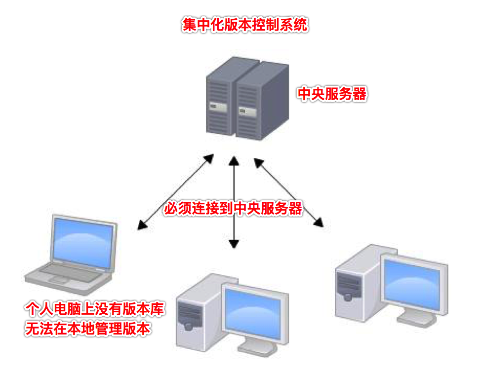

# Git，主讲：汤小洋

## 一、版本控制系统

### 1. 简介

​	Version Control  System，简称为VCS，版本控制系统是一种记录一个或多个文件的内容变化，以便将来查阅特定版本的内容变化情况的系统。

​	简单来说，就是用来保存文件内容变更记录的系统，可以将文件回退到过去某个时间点的状态。

###  2. 作用

- 查阅文件的修改记录，如：修改者、修改时间、修改的文件内容等
- 对比不同版本中文件的变化细节
- 将文件回溯到之前的某个状态

### 3. 种类

​	版本控制系统的种类：

- 本地版本控制系统

  版本库存放在本地磁盘上

  缺点：无法协同开发

- 集中化版本控制系统

  版本库集中存放在中央服务器上，所有参与人员都连接到该服务器，实现协同开发

  缺点：自己电脑上没有版本库，本地无法进行版本管理，必须连接中央服务器才能进行版本控制，如果中央服务器宕机，则无法工作

  代表应用：Subversion（SVN）

  

- 分布式版本控制系统

  每个人的电脑上都是一个完整的版本库，在本地就可以进行版本管理，无需连网

  但一般都会通过远程仓库来交换版本的修改

  代表应用：Git

  

  

## 二、Git简介

### 1. Git是什么

​	Git是一个开源的分布式版本控制系统，用来进行项目版本管理

​	其实就是一个软件， 由一组命令组成，能够对项目代码进行版本控制

### 2. 工作流程

 

基本流程：

1. 使用git命令将远程仓库上的文件克隆到本地仓库中
2. 从本地仓库中检出文件到工作区（一般都自动完成）
3. 将新创建的文件添加到暂存区
4. 将暂存区中的内容提交到本地仓库
5. 将本地仓库中的内容推送到远程仓库上
6. 当远程仓库中的内容被更新时可以拉取新内容到工作区

### 3. 安装Git

​	官网：https://git-scm.com

​	下载：Git-2.22.0-32-bit.exe、Git-2.22.0-64-bit.exe

​	安装：只有Windows系统需要手动安装Git软件，Linux和Mac OS系统都自带Git

​	工具：

- Git命令行工具 `git --version`
- Git图形化客户端

### 4. 初始化

​	对Git进行初始化配置

```shell
# 定义当前系统git的使用者名称和邮箱，提交代码时显示的名字和邮箱
git config --global user.name "tangxiaoyang"
git config --global user.email "1049901079@qq.com"
```

## 三、Git使用

### 1. 常用命令

| 命令                    | 作用                      | 备注                                 |
| --------------------- | ----------------------- | ---------------------------------- |
| git init              | 初始化本地Git仓库（项目）          | 会在当前目录中创建一个.git目录，用于记录所有的版本变更信息    |
| git status            | 查看本地仓储的文件状态             |                                    |
| git add 文件路径          | 将文件添加到跟踪列表（暂存区），交由git托管 | -A 或 --all 或 . 表示添加所有文件，也可以使用*进行匹配 |
| git commit            | 将跟踪列表中的文件提交到本地仓库        | -m指定提交日志                           |
| git log               | 查看提交日志                  |                                    |
| git reset --hard 版本id | 回退到指定版本                 | HEAD表示当前的版本                        |
| git reflog            | 查看所有操作记录                | 包括被回退的版本id、reset操作等                |

**注：所有命令都必须在Git仓库的根目录下执行**

### 2. 文件状态

 "

​	Git文件的四种状态：

- untracked

  未跟踪，表示文件不受git管理， 一般新建的文件处于该状态 `Untracked files`

- staged

  已暂存，表示已对修改的文件做了标记，使之包含在下次要提交的文件跟踪列表中 `Changes to be committed`

- committed

  已提交，表示文件已经被提交到本地仓库

- modified

  已修改，表示文件内容已被修改，但没有做标记 `Changes not staged for commit` 


### 3. 忽略文件

​	可以在git仓库的根目录下添加一个名为`.gitignore`的文件，用于指定需要被git忽略的文件或文件夹

​	注意：

- 文件名必须是`.gitignore`
- 文件必须在项目的根目录下
- 每行指定一个忽略文件
- 以`#`开头的行表示注释

## 四、远程仓库

### 1. 简介

​	基于Git的代码托管平台，常用的Git仓库：

- GitHub https://github.com 
- 码云 https://gitee.com

  GitLab

### 2. 操作

​	步骤：

1. 注册账号、创建仓库

2. 添加远程仓库的地址

   `git remote add origin https://gitee.com/tangyang8942/study.git`

3. 将本地仓库的提交记录推送到远程仓库的master分支
   `git push origin master`

4. 拉取远端master分支的更新记录到本地
   `git pull origin master`

| 命令                           | 作用                 | 备注                                |
| ---------------------------- | ------------------ | --------------------------------- |
| git remote add  仓库别名  远程仓库地址 | 添加远程仓库地址           | 仓库别名可以自定义，一般默认使用origin            |
| git remote -v                | 查看远程仓库信息           | fetch抓取、push推送                    |
| git remote rm  名称            | 删除远程仓库地址           |                                   |
| git push  名称  分支             | 将本地仓库指定分支推送到远程仓库   | 一般为master主分支，默认推送到远程仓库的同名分支，没有则新建 |
| git pull  名称  分支             | 拉取远程仓库指定分支中新的数据到本地 | 会与本地仓库进行merge合并（更新操作，非第一次）        |
| git clone  远程仓库地址            | 克隆远程仓库的项目到本地       | 用于从远端下载git项目（第一次）                 |

​	git clone和git pull区别：

- clone是没有本地仓库时，将远端的整个项目下载过来
- pull是有本地仓库时，将远程仓库里新的数据更新过来，并且与本地代码进行merge合并操作

## 五、分支Branch

###  1. 简介

​	分支就是版本上的更新迭代，默认只有master主分支

​	可以从主分支上分离出其他的分支，各分支间互不干扰

### 2. 操作

| 命令                | 作用     | 备注           |
| ----------------- | ------ | ------------ |
| git branch        | 显示所有分支 | 默认只有master分支 |
| git branch 分支名    | 创建分支   |              |
| git checkout  分支名 | 切换分支   |              |

## 六、静态页面托管

### 1. 简介

​	码云提供了免费的静态网页托管服务，可以托管个人的静态网页，称为码云Pages。

​	两种方式：

- 方式一、带二级目录
- 方式二、不带二级目录

### 2. 操作

​	方式一：带二级目录，步骤：

1. 创建一个仓库，仓库名称自定义

2. 将本地的静态资源推送到远程仓库

   必须提供`index.html`页面，默认访问的就是该页面

3. 选择pages服务

   服务——>Gitee Pages——>选择部署分支master

4. 访问生成的网站地址

   http://tangyang8942.gitee.io/仓库名称


​	方式二、不带二级目录

- 创建一个与个人空间地址同名的仓库，默认与码云账号相同，如tangyang8942
- 通过 http://tangyang8942.gitee.io

## 七、在IDEA中使用Git

### 1. 操作 

​	步骤：

1. 配置Git

   Setting——>Version Control——>Git——>指定git命令的执行路径——>点击Test

2. 检出项目

   VCS——>Checkout from Version Control——>Git——>指定远程仓库的URL和本地存放目录——>点击Clone

3. 提交/推送项目

   VCS——>Commit——>Commit and Push——>输入远程仓库的账号和密码

   VCS——>Git——>Push

4. 解决冲突

   当本地提交的内容和远程仓库的内容有冲突时需要手动解决，进行合并merge

### 2. 颜色提示

​	红色：未加入版本控制 untracked

​	绿色：已加入控制，未提交 staged

​	白色，已加入控制，已提交，无改动 committed

​	蓝色：已加入控制，已提交，有改动 modified

　灰色：版本控制已忽略文件

