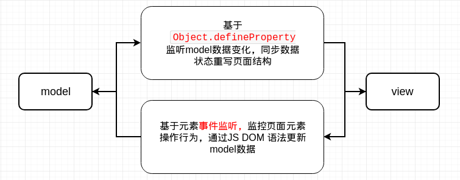
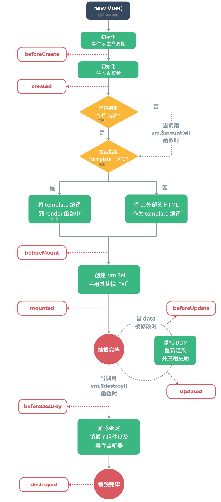

# Vue基础，主讲：汤小洋

## 一、MVVM

### 1. 简介

Model-View-ViewModel  模型-视图-视图模型
- 模型：构成页面内容的相关数据
- 视图：展示数据的页面
- 视图模型：介于模型和视图之间，它是连接view和model的桥梁，也是mvvm设计模式的核心思想

### 2. MVVM框架

实现MVVM设计思想的框架：

- 基本上都高度封装了view-model的交互过程，完成对DOM功能的极限封装
- 开发者几乎不用操作DOM就可以完成页面和数据的关联交换
- 开发者只需关心页面的构成和数据的构成，无需关心页面和数据的状态关系
- Vue、React、Angular等就是实现MVVM设计思想的前端框架


## 二、Vue

### 1. 简介

+ Vue (读音 /vjuː/，类似于 **view**) 是一套用于构建用户界面的**渐进式框架**（入门简单、学习成本低，随着深入学习可以根据需求进行功能扩展）

+ Vue 的核心库只关注视图层，不仅易于上手，还便于与第三方库或既有项目整合

+ 通过简洁的API实现响应的数据绑定和灵活的视图组件      

+ 由个人维护：**尤雨溪**，华人


### 2. 基本使用

Vue的页面使用方式：

+ 即在页面中直接引入Vue核心库的js文件
+ 该方式只是为了让开发者在学习Vue语法时可以快速掌握
+ 实际上Vue并不适合直接使用 页面方式进行语法定义，更推荐使用模块化方式

使用步骤：

1. 获取Vue核心库的js文件

   通过地址 <https://cdn.jsdelivr.net/npm/vue/dist/vue.js> 下载

   使用 npm 下载： `npm install vue`

2. 在页面中引入Vue

   ```html
   <script src="js/vue.js"></script>
   ```


3. 创建Vue实例并应用

### 3. 调试工具

安装vue-devtools插件，便于在Chrome浏览器中调试vue

步骤：

1. 将vue-devtools.zip解压缩
2. 打开Chrome浏览器的更多工具——>扩展程序
3. 将解压后的chrome目录拖放到扩展程序中即可

## 三、基本交互

### 1. 插值表达式

语法： `{{  }}`   由两对大括号组成，称为“Mustache”语法

作用：用于在页面标签中插入值，进行数据的绑定显示，且当值发生变化时标签会重新渲染加载，称为**响应式特性**，即数据状态同步操作

用法：`<标签>{{ Vue对象数据仓库变量|JS表达式|JS内置对象 }}</标签>`   只能用在标签中间的内容位置

可以绑定三种数据：

- 数据仓库中的变量
- 简单的JS表达式
- JS内置对象

### 2. 指令

#### 2.1 简介

指令 (Directives）是用来扩展html标签的功能，以`v-`作为前缀

语法：  `<标签 v-指令名[:参数][.修饰符][="指令值"]></标签>`

- 指令名：指令的名称
- 指令值：指令的取值，可选
- 参数：限制当前指令的操作范围，可选
- 修饰符：限制当前指令的触发条件，可选

特性：无痕迹特性

- 代码开发时的vue语法，在项目运行时会被删除，不会显示
- Vue对象和容器在完成语法解析后，不会在浏览器上保留vue语法定义

#### 2.2 常用指令

| 指令                    | 取值                                   | 作用                                       |
| --------------------- | ------------------------------------ | ---------------------------------------- |
| v-text                | string                               | 更新元素的textContent                         |
| v-html                | string                               | 更新元素的innerHTML                           |
| v-pre                 | 无                                    | 跳过当前元素和子元素的编译过程，不对vue语法进行编译执行            |
| v-once                | 无                                    | 对当前元素和子元素的vue功能只执行一次                     |
| v-cloak               | 无                                    | 在vue实例构建完成前，隐藏未编译的vue语法，**需要配合css样式一起使用** |
| v-on                  | Function \| Object \| Array \| 行内表达式 | 绑定事件监听器，用于事件绑定                           |
| v-show                | any                                  | 根据表达式的boolean结果，切换元素的 `display` CSS 属性，控制元素的显示隐藏 |
| v-if、v-else-if、v-else | any                                  | 根据表达式的boolean结果，执行元素的创建和删除操作，控制元素的显示隐藏   |
| v-for                 | Array \| Object \| number \| string  | 基于数据多次渲染元素或模板块，用于循环数据                    |
| v-bind                | any                                  | 动态的为标签绑定属性，用于属性绑定                        |

#### 2.3 指令详解

v-on事件绑定指令

- 语法：`<标签 v-on[:参数][.修饰符]="取值"></标签>`

- 缩写：可以使用`@`替代`v-on:`

- 参数：指定事件的名称，即事件类型

- 取值：Function | Object | Array | 行内表达式

- 修饰符：

  按键修饰符——>只有当点击对应的按键时才触发

  功能修饰符——>实现特定的功能

  | 修饰符      | 含义                                    |
  | -------- | ------------------------------------- |
  | .capture | 添加事件监听器时使用**事件捕获**模式                  |
  | .stop    | 阻止事件传播，调用 `event.stopPropagation()`   |
  | .self    | 只当事件是元素本身触发时才执行回调，即不是事件传播引起的          |
  | .prevent | 阻止事件的默认行为，调用 `event.preventDefault()` |
  | .once    | 事件只触发一次                               |

v-bind属性绑定指令

- 语法：`<标签 v-bind[:参数]="取值"></标签>`
- 缩写：省略`v-bind`
- 参数：指定要绑定的属性
- 取值：any
- 注意：特殊属性的绑定，如boolean类型属性、class、style


### 3. 响应式原理

响应式的概念：实际上就是所谓的数据状态同步操作，当内存中变量数据发生变化时，页面会及时做出响应，进行页面重构渲染

响应式的基础：：`Object.defineProperty(obj, prop, descriptor)` 用于定义一个对象上的属性以及这个属性的描述符

- obj : 操作的目标对象

- prop：操作的属性名称

- descriptor：属性的详细定义

  get（function）：拦截属性的取值操作，为取值操作提供扩展功能 

  set（function）：拦截属性的赋值操作，为赋值操作提供扩展功能

响应式的原理：

- 数据劫持
- 使用Object.defineProperty()实现，称为JS的**数据劫持**


​	注：Vue 不支持 IE8 以及更低版本浏览器

### 4. 双向数据绑定

v-model双向数据绑定指令

- 语法：`<标签 v-model[.修饰符]="取值"></标签>`

- 取值：随表单控件类型不同而不同

- 限制：仅限于表单中可输入或者可选择的元素，如`<input>`、`<select>` 、`<textarea>`

- 修饰符：

  | 修饰符     | 含义                        |
  | ------- | ------------------------- |
  | .lazy   | 使用 `change` 事件替代`input`事件 |
  | .number | 将输入的值转换为数字                |
  | .trim   | 去除首尾的空格                   |

双向数据绑定：

+ 模型数据变化时重新渲染页面（基于Object.defineProperty）
+ 页面数据变化时自动更新模型数据（基于元素事件监听）




## 四、数据控制

​	对数据进行包装处理和监控

### 1. 计算属性

​	计算属性（computed）也是用来存储属性数据的，但具有以下特点：

- 可以对数据进行逻辑处理操作，实现数据包装
- 计算属性通常依赖于当前Vue对象中的普通属性
- 当依赖的普通属性发生变化时计算属性也会变化，实现数据监控

​    计算属性由两部分组成：

- get 用来获取计算属性
- set 用来设置计算属性

​    默认计算属性只有get，如果需要set，可以自己添加，此时需要以对象的形式配置

### 2. 监视器

监视器（watch）是用来监视数据的变化，对数据进行监控

```js
new Vue({
    watch: {
       	变量:function(newValue, oldValue){}, // 监控方法
      	变量:{
        	handler: function(newValue, oldValue){}, // 监控方法
        	deep: true, // 开启深度监视
          immediate: true // 开启初始化触发
      	}
    },
})
```

## 五、实例属性和方法

### 1. 简介

​	通过Vue实例对象可以直接访问的属性和方法，称为实例属性和实例方法

​	实例属性和方法都以     `$` 开头

### 2. 实例属性

+ vm.$el：当前Vue实例使用的根 DOM 元素
+ vm.$data：当前Vue实例观察的数据对象
+ vm.$options：当前Vue实例的初始化选项
+ vm.$refs：当前Vue实例容器中定义了ref属性的所有 DOM 元素

### 3. 实例方法

+ vm.$mount：手动挂载Vue实例
+ vm.$destroy：销毁Vue实例，只会销毁vue的实例对象，不会销毁与其关联的页面容器
+ vm.$nextTick：在DOM更新完成后再执行回调函数，一般在修改数据之后使用该方法，以便获取更新后的DOM并操作 
+ vm.$set：为对象|数组添加一个属性|元素，并实现响应式，触发更新视图，实时监视，等同于全局方法 `Vue.set` 
+ vm.$delete：删除对象|数组的属性|元素，触发更新视图，等同于全局方法 `Vue.delete`

## 六、模板和渲染函数

### 1. 模板

​	模板（template）就是定义Vue时指定的页面结构构成

- 默认使用`el`选项指定的挂载元素的内容来构成页面模板，同时指定挂载位置
- 可以使用 `template` 选项独立定义页面模板，此时el挂载元素的内容将被忽略

### 2. 渲染函数

​	渲染函数（render）用于通过JavaScript方式定义页面结构模板

- 默认通过el或template方式定义的页面模板也会被render渲染函数执行
- 可以使用 `render` 选项独立定义页面结构的渲染函数，此时template模板将被忽略
- 优先级：render > template > el


### 3. 虚拟DOM


模板转换为视图的过程：

- 将模板template编译成渲染函数render，执行渲染函数就可以得到一个虚拟节点树，即虚拟DOM
- 然后将虚拟节点树转换为真实DOM，映射到视图上
- 当Model数据更新时，Vue能够智能地计算出需要重新渲染的节点并对虚拟DOM进行修改（打补丁），然后再更新到视图上 

虚拟DOM是什么？

- 虚拟DOM（vdom）是一个用JavaScript对象方式描述的页面节点结构树，通过对象的属性来描述节点
- 实际上它只是对真实DOM的抽象，最终会通过一系列操作使这个虚拟DOM变为真实的DOM，显示在页面上

为什么使用虚拟DOM（优点）：

- 提高DOM更新效率，提升渲染性能
- 提供快速的DOM变化比较
- 减少页面中DOM重新渲染的次数（基于diff算法：找出本次DOM需要更新的节点来更新，其他的不更新）

注：JavaScript直接操作真实DOM时效率是比较低的，需要频繁的操作。

## 七、生命周期

### 1. 简介

Vue实例从创建到销毁的过程，称为生命周期，共有八个阶段：

- beforeCreate、created      
- beforeMount 、mounted      
- beforeUpdate、updated      
- beforeDestroy、destroyed

在生命周期的每个阶段都提供了相应的钩子函数，可以在钩子函数中执行操作，控制生命周期的各个阶段  

### 2. 生命周期流程



## 八、自定义指令

分类：全局指令、局部指令

### 1. 全局指令

使用全局方法     `Vue.directive(指令ID,定义对象)`定义的指令，在所有Vue实例中都有效

```js
Vue.directive('指令名称',{
  // 提供了5个钩子函数，在不同时机执行
  bind: function (参数) {},
  inserted: function (参数) {},
  update: function (参数) {},
  componentUpdated: function (参数) {},
  unbind: function (参数) {}
});
```

### 2. 局部指令

在某个Vue实例中定义的指令，只在该Vue实例关联的容器中有效

```js
new Vue({
    directives:{ 
      指令名称:{
		bind: function (参数) {},
        inserted: function (参数) {},
        update: function (参数) {},
        componentUpdated: function (参数) {},
        unbind: function (参数) {}
      }
    }
});
```

